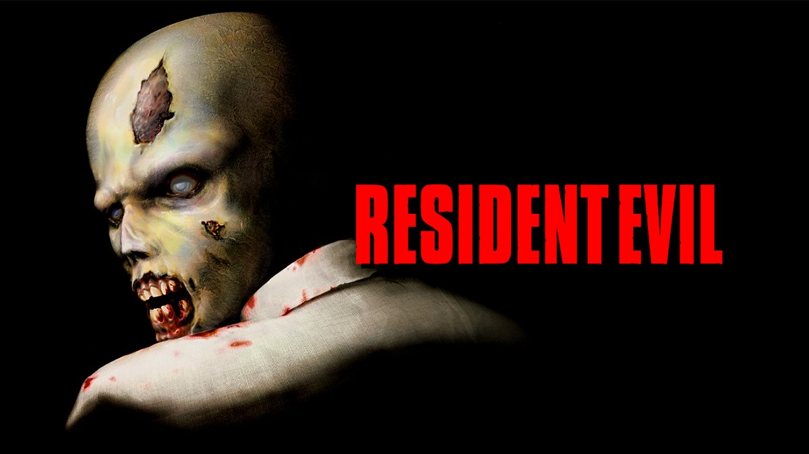

+++
title = "Le premier Resident Evil de retour sur GoG"
date = 2024-06-26T14:00:30+01:00
draft = false
author = "Félix"
tags = ["Actu"]
type = "telex"
+++

Avis aux amateurs de vieilleries : la version originale de *Resident Evil 1* sortie en 1997 est désormais disponible sur GoG [pour 10 €](https://www.gog.com/game/resident_evil). Cette version a été mise à jour pour prendre en charge Windows 10 et 11 et offrir une meilleure compatibilité DirectX. Elle apporte quelques petites améliorations de rendu, des sauvegardes dans le nuage et est jouable avec les manettes Xbox ou PlayStation. Le français est au rendez-vous, en plus de l’audio en anglais d’origine.

GoG en profite pour annoncer que les opus 2 et 3 (sortis en 98 et 99) seront également disponibles plus tard dans l’année avec des améliorations similaires. Un [pack de 3](https://www.gog.com/fr/game/resident_evil_bundle) est d’ores et déjà proposé pour 25 €. Si vous voulez jouer à des versions plus modernes, rappelons que la mouture « HD » du premier est toujours vendue 20 € [sur Steam](https://store.steampowered.com/app/304240/Resident_Evil/), et que les remasters des opus 2 et 3 sont à 40 €.