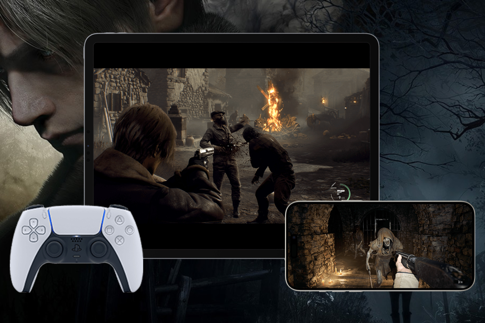
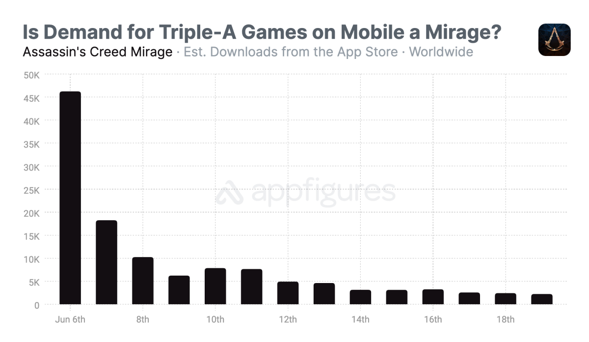
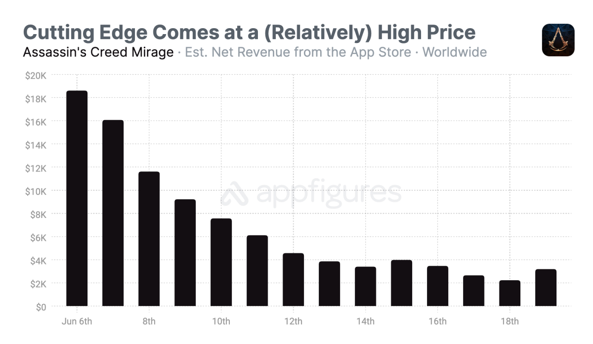

+++
title = "Des gros jeux sur iPhone ? Le flop de la stratégie AAA d'Apple"
date = 2024-06-26T10:47:32+01:00
draft = false
author = "Mickael"
tags = ["XXL"]
type = "une"
image = "https://nostick.fr/articles/vignettes/juin/resident-evil-4-iphone.jpg"
+++

**Qu'Apple se tourne vers les jeux AAA pour refourguer ses iPhone a quelque chose d'assez cynique.** Le constructeur est le premier à avoir tiré le marché vidéo-ludique vers le bas, d'abord en favorisant la guerre des prix dès les premiers mois de l'App Store : les vieux de la vieille se rappellent qu'en 2008, au lancement de la boutique, il n'était pas rare de croiser des jeux vendus 10 $. Très rapidement, les prix ont baissé, à 4,99 $, puis 1,99 $, 0,99 $… Et puis gratuit.

Pour les consommateurs, nul doute que c'était une bonne affaire, pensez-donc, des jeux gratos ! Mais voilà, les éditeurs ne pouvant se permettre de brader leurs gros jeux, il ne fallait pas s'attendre à voir débouler ces franchises, ce d’autant plus que la question de la puissance se posait également. Ils ont alors préféré sortir des versions abâtardies ou tout simplement des « apps compagnon » tout juste bonnes à occuper le terrain.

Et puis, les micro-transactions ont été introduites pour rentabiliser les jeux, ce qui a achevé d'isoler complètement l'iPhone (et plus généralement les plateformes mobiles, Android compris) sur un îlot à part, loin des rivages du jeu pour PC et consoles traditionnels. Ces changements ont été largement favorisés par Apple, pour une excellente raison : le constructeur touche une commission de 30 % sur le moindre achat intégré. Il a donc tout intérêt à promouvoir ce type de modèle économique qui sur la longue traine, lui rapporte bien plus qu'un simple jeu vendu 10 balles une fois et basta.

Alors évidemment, il existe d'excellents jeux mobiles, et les micro-transactions pourrissent aussi bien le secteur mobile que traditionnel. Il faut toutefois reconnaître que l'appât du gain facile a très rapidement tué dans l'œuf les espoirs des développeurs et des éditeurs qui voyaient dans les plateformes mobiles un nouvel eldorado de qualité, où les expériences vidéo-ludiques novatrices rendues possibles par les écrans tactiles pourraient se multiplier à l'infini. 

Ça s'est plutôt transformé en ruée vers l'or, où les propositions originales, et donc fragiles, ont bien peu de chance de survivre. Et maintenant qu'Apple a shooté ses utilisateurs aux jeux mobiles bourrés de pubs et d'achats intégrés, voilà que l'entreprise espère leur faire faire le chemin inverse ! Un sacré pari qui manifestement, n'a pas porté ses fruits.

## Au-delà d'Apple Arcade

Après [le demi-échec d'Apple Arcade](https://nostick.fr/articles/2024/mars/2603_applearcade/), le service sur abonnement aux 200 jeux sans pub ni achats intégrés, le constructeur s'est mis en tête de distribuer des jeux AAA « qualité console » sur les iPhone et les iPad. L'idée est tout autant de vanter les capacités graphiques du silicium maison que de vendre de l'iPhone sur l'air du « *vous ne pourrez jouer à ces jeux que sur nos smartphones* ».

C'est pourquoi, lors de la présentation des iPhone 15 Pro en septembre dernier, Apple a fait miroiter une puce A17 Pro capable de prendre en charge des titres comme *Resident Evil Village*, *Death Stranding*, *Resident Evil 4 Remake* et *Assassin's Creed Mirage*. Non pas des versions mobiles, mais les vrais jeux, tels qu'on les trouve sur consoles ! Bon, ça c'est la théorie, dans la réalité les jeux en question se sont montrés généralement plus à l'aise sur iPad (équipé de puces Mx identiques aux Mac) que sur les iPhone 15 Pro et Pro Max.

 

Mais surtout, le discours marketing a-t-il réellement pris ? Après des années à consommer du *Candy Crush* et du *Genshin Impact*, les joueurs mobiles ont-ils tourné casaque et dépensé les 15 à 50 $ nécessaires à l'achat de ces jeux ? Il y a tout lieu d'en douter, au vu des chiffres publiés par Appfigures et Appmagic, deux sociétés spécialisées dans les outils analytiques pour développeurs mobiles.

En se basant sur les données fournies par Appfigures, 3 000 joueurs auraient acheté *Assassin’s Creed Mirage* plein pot, au prix de 50 $ depuis son lancement le 6 juin. Le jeu est gratuit au téléchargement et propose un prologue sans rien payer. Entre son lancement et le 20 juin, Ubisoft a proposé un rabais de 50 %, ce qui ramène le jeu à 25 $.

En tout, cet épisode de la saga *Assassin's Creed* aurait atteint environ 123 000 téléchargements avec des revenus de 138 000 $. Toujours selon Appfigures, le nombre de téléchargements quotidiens du jeu est sous les 3 000 copies ; pas de quoi générer plus de 4 000 $ par jour. Ubisoft espérait probablement davantage.

Ça n'est guère plus réjouissant pour les autres titres de la sélection : *Resident Evil 4* aurait enregistré 357 000 téléchargements pour des ventes estimées à 208 000 $. En se basant sur son prix de lancement de 30 $, cela signifie qu'environ 7 000 joueurs ont payé ce tarif. *Resident Evil Village* compte 370 000 téléchargements et 92 000 $ de ventes (!), soit quelque chose comme 5 750 joueurs qui ont payé les 15 $ du prix de lancement.

Quant à *Death Stranding*, le jeu n'apparait pas dans les données de téléchargements d'Appfigures. Néanmoins, *MobileGamer.biz* [estime](https://mobilegamer.biz/those-assassins-creed-resident-evil-and-death-stranding-ports-have-bombed/) que le titre a atteint 212 000 $ de revenus pour 10 600 téléchargements.

 

Appmagic se fait un peu plus optimiste, mais pas tellement plus : 221 000 $ de revenus pour *Assassin’s Creed Mirage* avec 279 000 téléchargements (5 750 joueurs ont payé le jeu au complet) ; 710 000 téléchargements pour *Resident Evil 4*, pour un total de 347 000 $ de ventes (15 000 joueurs) ; 817 000 téléchargements pour *Resident Evil Village*, qui a généré 420 000 $ (et attiré 34 000 jours). Enfin, *Death Stranding* aurait atteint les 23 000 téléchargements et 348 000 $ de revenus.

## Difficile de changer les habitudes

Visiblement, les joueurs n'ont pas été au rendez-vous de ces jeux sur iPhone. « *Cela suggère que ces jeux ont déjà généré une grande partie de leur revenu potentiel [sur les autres plateformes]* », explique Andrei Zubov, responsable du contenu chez Appmagic. Ces titres rencontrent une concurrence particulièrement affûtée, celle des jeux mobiles qui se sont pleinement adaptés à la plateforme, en ce qui concerne la jouabilité mais aussi les sessions de jeu, plus courtes.

Autre explication : les joueurs qui peuvent se permettre d'acheter un iPhone ou un iPad dernier cru ont aussi, probablement, les moyens de s'offrir un PC ou une console. Les joueurs plus modestes n'ont pas nécessairement les moyens d'un iPhone 15 Pro, ni d'un achat unique à 50 €.

« *Convaincre le propriétaire d'un iPhone 15 de l'intérêt d'acheter un jeu au prix fort, même s'il fonctionne aussi sur iPad et sur Mac, est clairement un problème* », enchérit Randy Nelson d'Appfigures. Et pourtant, Capcom va continuer de lancer des *Resident Evil* sur les appareils d'Apple, et le très attendu *Assassin's Creed Shadows* sortira sur Mac et iPad en même temps que sur les autres plateformes. Ce n'est pas tellement que ces éditeurs y trouvent leur compte : il est plus que probable qu'Apple ait sorti le chéquier pour s'offrir quelques grands noms à jeter en pâture durant les keynotes…

 
