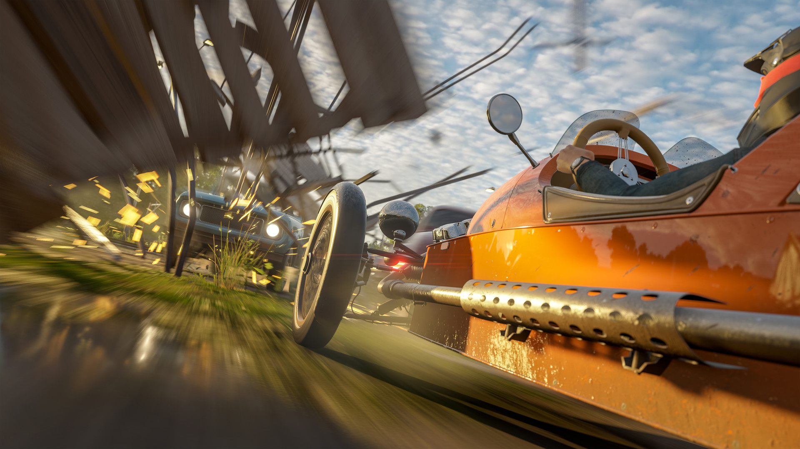

+++
title = "Sortie de piste pour Forza Horizon 4"
date = 2024-06-26T08:44:32+01:00
draft = false
author = "Mickael"
tags = ["Actu"]
type = "telex"
+++
Six ans seulement après sa sortie du garage en trombe, *Forza Horizon 4* va prendre une voie de garage, en raison de licences échues. Le jeu de bagnoles foufou de Playground Games (un studio Xbox), ne sera [plus disponible](https://forza.net/news/forza-horizon-4-delisting) à l'achat sur Steam ni sur le Xbox Store à partir du 15 décembre. Ça laisse un peu de temps pour en profiter, ce d'autant que le jeu restera accessible aussi bien hors connexion que pour ses modes multi et en ligne : les serveurs restent branchés y compris après la date fatidique.

Les DLC ne sont d'ores et déjà plus disponibles sur ces boutiques, seules les versions standard, Deluxe et Ultimate sont encore vendues (grosses promos sur Steam en ce moment). Et les abonnés Game Pass qui ont acheté un DLC recevront un code qui leur permettront de continuer à jouer au jeu au complet. La FAQ est lisible à cette [adresse](https://support.forzamotorsport.net/hc/en-us/articles/30662484986387-Forza-Horizon-4-Delisting-FAQ), c'est chaudement recommandé car l'affaire est tout de même compliquée. Six ans, c'est court tout de même : espérons que *Forza Horizon 5*, sorti en 2021, tiendra plus longtemps la route.

