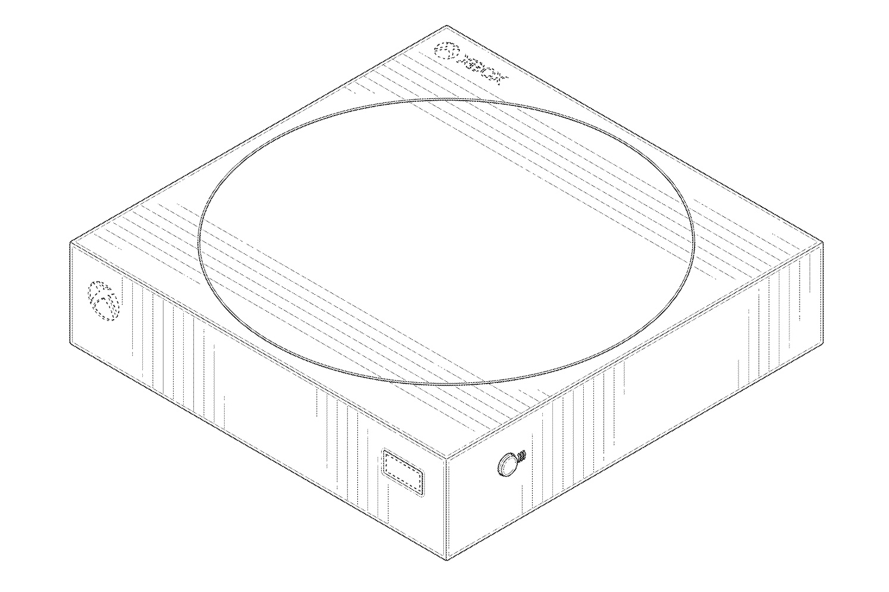
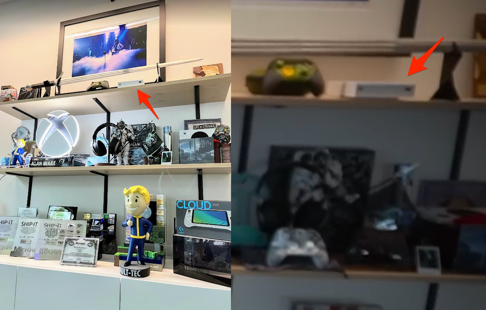
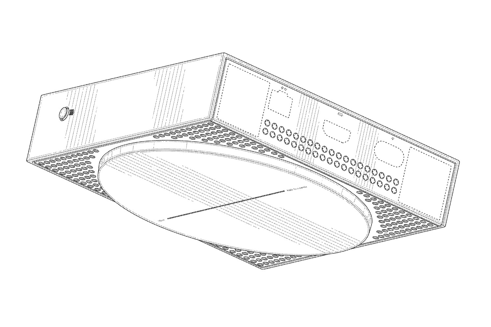

+++
title = "La console de cloud gaming de Microsoft ressemblait bien à une Xbox toute plate"
date = 2024-06-27T09:47:32+01:00
draft = false
author = "Mickael"
tags = ["Actu"]
image = "https://nostick.fr/articles/vignettes/nostick.jpg"
+++

 

Jouer partout, tout le temps, sur n'importe quoi et si possible à des jeux Xbox, c'est le mantra de Microsoft qui a commencé à porter ses exclusivités sur PlayStation — et cela fait bien longtemps que le constructeur s'intéresse au streaming de jeux. Pensez donc, grâce au service Xbox Cloud Gaming, on peut même jouer à *Starfield* sur un iPhone[^1] !

Pendant quelques mois, Microsoft a aussi caressé l'espoir d'installer une petite box à côté de la télé. Non, pas une Xbox, mais un boîtier de streaming façon Apple TV, capable de diffuser des jeux en streaming et doté aussi de fonctions multimédia. Ce projet, nom de code Keystone, a suscité pas mal d'intérêt quand il trainait dans la rumeur, tout au long de l'année 2022.

Phil Spencer, le grand manitou de Microsoft Gaming, n'a d'ailleurs jamais caché l'appareil, littéralement : en octobre 2022, il [partageait](https://x.com/XboxP3/status/1579495370786496512) une photo de son bureau (ci-dessous, à gauche) avec un prototype de Keystone bien en place. Rebelote en avril 2023, cette fois dans une [vidéo](https://www.youtube.com/watch?v=lenhYixuRy0) YouTube (capture à droite), où on peut voir distinctement l'appareil.

 

Malheureusement, au moment de cette vidéo, ce projet était déjà tombé à l'eau. En novembre 2022, dans une interview avec *The Verge* , le même Spencer [regrettait](https://www.theverge.com/23459189/phil-spencer-microsoft-activision-call-of-duty-xbox-playstation-candy-crush-apple-fortnite-vr) que Microsoft n'était pas parvenu à réduire suffisamment le coût de l'appareil pour atteindre les 99 $ ou 129 $ espérés (le boîtier ne venait pas seul, il était accompagné d'une manette).

Finalement, Xbox a préféré concentrer ses efforts et ses ressources sur l'application de cloud gaming pour les téléviseurs connectés. Keystone n'est pourtant pas complètement oublié, « *nous attendons de voir quand nous pourrons obtenir le bon coût* ». Rien n'est perdu !

En attendant, on peut avoir une bonne idée de la tête de l'appareil, grâce à un [brevet](https://ppubs.uspto.gov/dirsearch-public/print/downloadPdf/D1009161) déposé en juin 2022 et [déniché](https://www.windowscentral.com/gaming/xbox/the-xbox-that-never-was-our-first-detailed-look-at-the-keystone-cloud-streaming-console-design) par *Windows Central*. Sans surprise, les visuels confirment les « fuites » de Phil Spencer : il s'agit d'un boîtier rectangulaire, avec une forme circulaire sur le dessus qui ressemble pas mal à la grille d'aération de la Xbox Series S.

Le produit comprend un port USB-A à l'avant, un bouton de jumelage sur le côté pour la manette, ainsi que des ports HDMI, Ethernet et l'alim à l'arrière. Ce que le brevet ne dit pas, c'est ce qu'on y trouve à l'intérieur. La nature des composants est inconnue, tout comme le système d'exploitation ; pourrait-il s'agir de celui de la Xbox, expurgé du support du jeu en local ? Que de mystère.

Si le projet Keystone a été mis en sommeil, Microsoft continue de creuser le sillon du matos. D'abord pour la future génération de Xbox bien évidemment ([et aussi la Xbox Series X sans disque optique](https://nostick.fr/articles/2024/juin/0906-microsoft-revoit-sa-gamme-xbox/)), mais aussi pour cette fameuse console PC portable que [Spencer n'arrête pas de teaser](https://nostick.fr/articles/2024/juin/1006-microsoft-veut-xbox-portable/). Il va falloir surveiller son étagère…

[^1]: Depuis le navigateur Safari, pas depuis une application native… Merci les restrictions d'Apple.