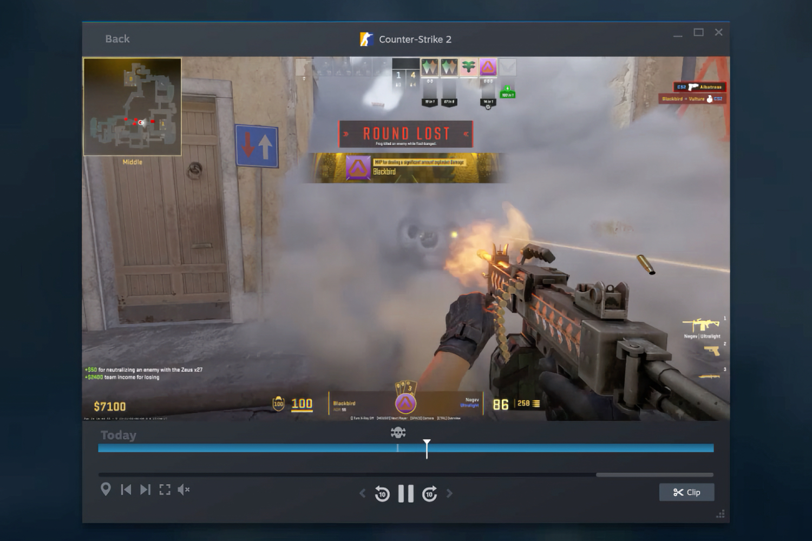
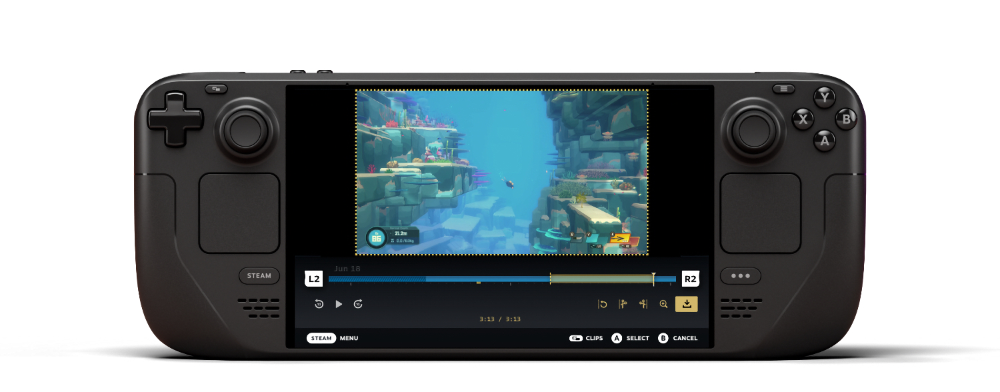

+++
title = "Steam enregistre automatiquement les parties en vidéo pour mieux partager ses exploits"
date = 2024-06-27T08:10:00+01:00
draft = false
author = "Mickael"
tags = ["Actu"]
image = "https://nostick.fr/articles/vignettes/juin/steam-enregistrement-partie-2.jpg"
+++

C'est à se demander pourquoi Steam n'y avait pas songé plus tôt. La boutique en ligne propose finalement un outil qui permet d'enregistrer automatiquement la vidéo d'une partie, et voyez comme les choses sont bien faites, ça s'appelle « [Enregistrement de parties](https://store.steampowered.com/gamerecording) ».

Ce système, encore en bêta, enregistre la vidéo de la partie en arrière-plan en pompant un minimum de ressources. La vidéo est stockée sur l'espace sélectionné, et il y a des options pour limiter le poids et la durée de l'enregistrement. Il est aussi possible de lancer (et d'arrêter) manuellement un enregistrement. Des repères temporels peuvent être placés sur la timeline de la vidéo pour remettre la main sur les moments clé.

L'outil se complète de fonctions d'ajustement : pas besoin de partager avec le reste du monde une mort ridicule ! Évidemment, le partage de la vidéo (en MP4) avec ses amis, dans un chat ou sur les réseaux sociaux fait partie des fonctions de base, mais Steam a aussi imaginé cet enregistrement pour améliorer ses skills en revisionnant la manière dont est misérablement passé de vie à trépas.

En termes de sécurité et de confidentialité, l'enregistrement permet de sélectionner les canaux audio à inclure, et puis elles sont stockées uniquement en local jusqu'au moment du partage.

Bien sûr, l'outil d'enregistrement est compatible avec le Steam Deck, sur lequel il sera possible de visionner les vidéos de ses amis et d'envoyer vos propres extraits. S'il s'agit d'une version bêta, la fonction n'en reste pas moins compatible avec tous les jeux, y compris les titres non Steam tant que le titre permet de lancer l'overlay Steam (sauf ceux vraiment anciens). 

Les développeurs peuvent néanmoins s'emparer du SDK pour intégrer au mieux tous ces outils dans leurs jeux. Notamment les repères de timeline pour souligner les moments importants et donner des détails supplémentaires : Valve donne l'exemple avec *Dota 2* et *Counter-Strike 2*.

« Enregistrement de parties » est donc un gros morceau pour Steam, qui tombe quelques mois après [le ravalement de façade complet du partage familial](https://nostick.fr/articles/2024/mars/1903_steam/).