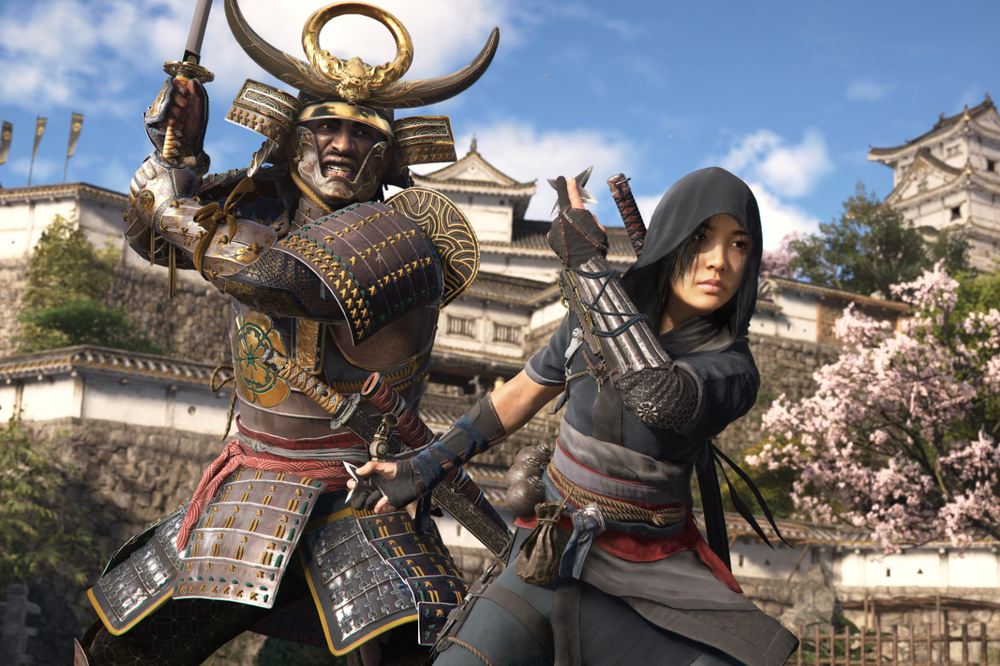

+++
title = "Ubisoft annonce des tas de remakes d'Assassin's Creed"
date = 2024-06-28T11:00:00+01:00
draft = false
author = "Mickael"
tags = ["Actu"]
image = "https://nostick.fr/articles/vignettes/juin/assassin-creed-shadows.jpg"
+++

Les fans d'*Assassin's Creed* sont plutôt bien servis ces derniers temps, avec *Mirage* l'an dernier, et *Shadows* qui va débouler le 15 novembre. Ils ne sont pas au bout de leur peine : en plus des épisodes inédits actuellement en développement, des remakes sont bel et bien dans les tuyaux d'Ubisoft !

« *Les joueurs vont pouvoir se réjouir avec plusieurs remakes qui nous permettront de revisiter et de moderniser certains des jeux [Assassin's Creed] que nous avons créés dans le passé* », a déclaré le patron d'Ubisoft, Yves Guillemot, à l'occasion d'une [interview](https://news.ubisoft.com/en-us/article/E1e8T9q8rjZ4arsPNT1Xd/ceo-yves-guillemot-on-ubisofts-upcoming-portfolio-the-future-of-assassins-creed) menée… par le site Ubisoft. Après tout, on n'est jamais aussi bien servi que par soi-même, et puis comme ça, on s'évite de répondre à des questions embarrassantes.

Cela fait quelques années qu'Ubisoft a pivoté sa stratégie AAA vers ses grosses franchises ultra populaires, en les revitalisant comme *Splinter Cell* — dont le remake est dans les cuisines d'Ubi Toronto — et *Prince of Persia*, ou en appuyant à fond sur le champignon à l'image d'*Assassin's Creed*. Le studio prend ainsi moins de risques en misant sur ses têtes connues, même si cela pourrait lasser assez vite les joueurs (à peine 5 mois se sont écoulés entre *Prince of Persia: The Lost Crown* et *The Rogue Prince of Persia*).

« *L'objectif est de sortir des jeux Assassin's Creed plus régulièrement* », confirme Guillemot, qui ajoute tout de même que tous n'offriront pas la même expérience pour ne pas lasser. Le remake de *Black Flag* serait dans les tuyaux, espérons qu'il ne mette pas 7 ans à sortir comme son spin-off officieux, *Skull & Bones* !

Bien sûr, Ubisoft a déjà sorti des remakes de sa saga fétiche, comme *Assassin’s Creed II*, *Brotherhood* et *Revelations* regroupés dans la collection Ezio, en 2016. Et au rayon des nouveautés, Ubisoft a déjà annoncé *Assassin's Creed Hexe* (anciennement *Neo*), « *qui sera un jeu très différent d'Assassin's Creed Shadows* », indique le boss. Ce titre, développé à Montréal, se déroulerait durant l'Empire romain et se montrerait bien plus sombre que les épisodes précédents.