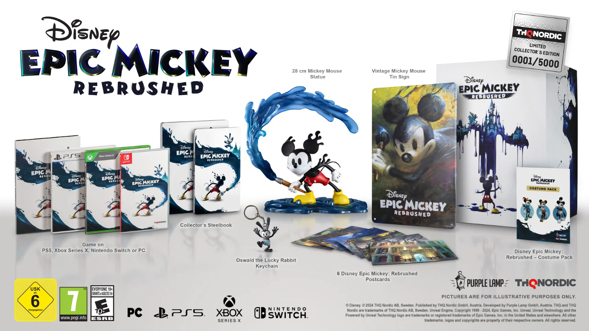
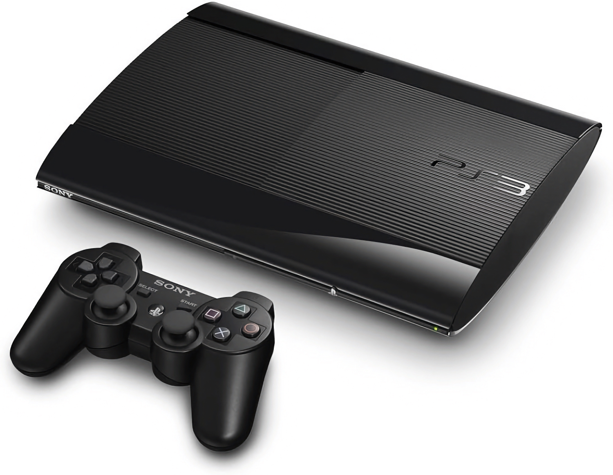
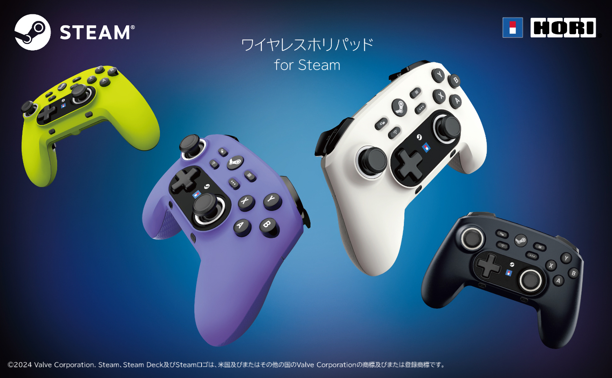
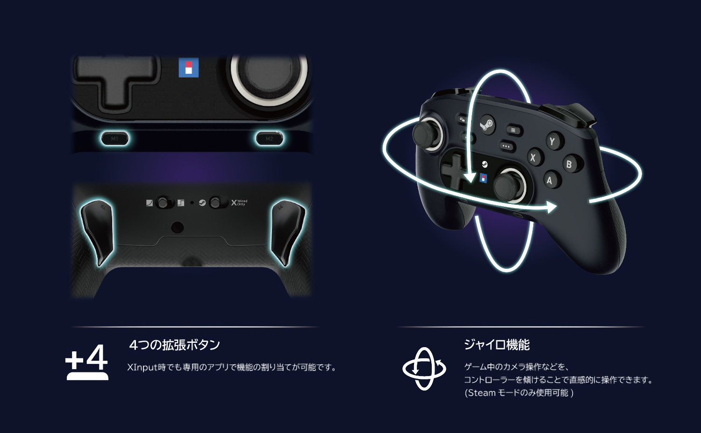
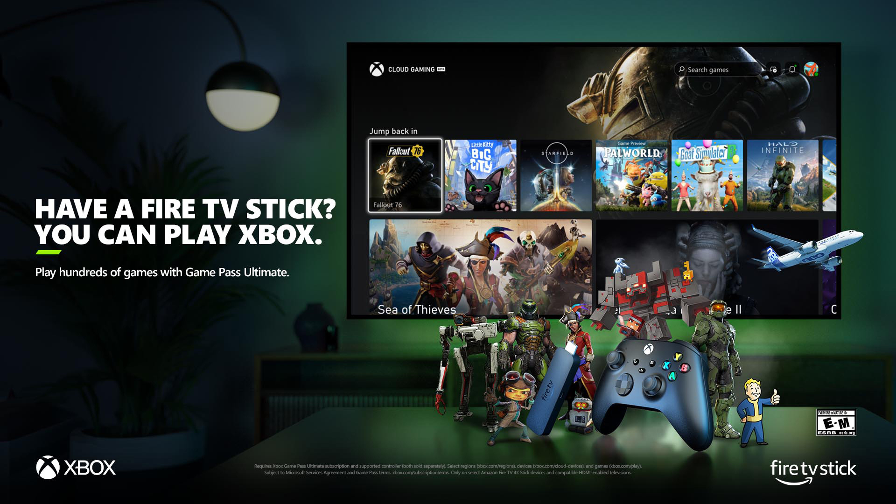

+++
title = "On vide le backlog de la semaine : Epic Mickey, émulation PS3, Palworld, manette Steam…"
date = 2024-06-29T07:00:32+01:00
draft = false
author = "Mickael"
tags = ["XXL"]
image = "https://nostick.fr/articles/vignettes/juin/ps3-baby.jpg"
+++

L’actualité du jeu vidéo ne s’arrête pas à la poignée d’articles publiés sur *Nostick* ! Histoire de rattraper le retard accumulé, voici un retour rapide sur quelques unes des infos les plus importantes (ou insignifiantes) de la semaine.

## Une édition épique pour Disney's Epic Mickey: Rebrushed 

L'heure est aux vieilleries (il n'y a qu'à lire la prochaine actu de ce résumé), alors quoi de plus naturel que de voir débouler *Disney's Epic Mickey: Rebrushed*, un remake du jeu Wii de 2010 cette fois-ci pour toutes les consoles, y compris la Switch ! On y retrouvera Mickey au Wasteland, un endroit triste et désespéré (je ne parle pas de la France d'aujourd'hui) où les personnages Disney oubliés errent sans but.

 

Pour redonner un peu de sourire dans ce monde, Mickey peut utiliser ~~son bulletin de vote NFP~~ un pinceau magique pour répandre de la peinture pour en restaurer des éléments (ou pour les effacer). Le jeu développé à l'époque par les studios Junction Point est désormais entre les mains de THQ Nordic, qui a annoncé la date de sortie : ce sera pour le 24 septembre.

Mais ce qui vaut surtout le coup, c'est l'édition Collector qui certes, coûte la peau des fesses d'une souris ([200 €](https://eu.store.thqnordic.com/en/272/disney-epic-mickey-rebrushed-collectors-edition) !), mais qui contient entre autres une superbe statuette haute de 28 cm représentant Mickey et son pinceau, un porte-clé d'Oswald le Lapin, des cartes postales, des trucs et des bidules. Et le jeu, aussi.

## Sony aurait trouvé la martingale pour émuler la PS3

La PS3 était une console notoirement difficile pour les développeurs de jeux, Sony ayant choisi de leur compliquer la vie avec des technologies certes très évoluées pour l'époque (le fameux processeur Cell et ses huit co-processeurs spécialisés, entre autres), mais ardues à exploiter et à maîtriser. La complexité de cette architecture a toujours représenté un casse-tête pour les développeurs d'émulateurs.

Aujourd'hui, il existe certes des émulateurs PS3, dont le fameux [RPC3](https://rpcs3.net)… qui affiche un taux de compatibilité « jouable » de 70 % seulement avec la ludothèque de la console. La meilleure solution reste de débusquer une vieille PS3 sur le marché aux puces ! Sony propose de son côté du streaming de jeux PS3 via son service PlayStation Plus, la PS5 n'étant pas en mesure d'émuler matériellement des jeux PS3.

Mais un petit rayon de soleil a pointé au travers de l'orage déchaîné cette semaine, en la personne de Jeff Grubb (tu parles d'un rayon de soleil…). Le fameux fouineur a [affirmé](https://www.youtube.com/watch?v=d7VhpUERtTk&t=3577s&ab_channel=GiantBomb) au podcast *Game Mess Mornings* que Sony travaillait sur l'émulation PS3 « *depuis un petit moment* ». Il a entendu parler de cette initiative un peu plus tôt cette année, et Grubb pensait même que le constructeur allait faire une annonce. « *Évidemment, ça n'est pas arrivé, mais ça ne veut pas dire que ça n'arrivera jamais* », ajoute-t-il. L'espoir fait vivre (ou rend fou, c'est selon).

## Palworld n'a jamais été embêté par Nintendo

Nintendo est une entreprise procédurière, comme peuvent le constater les développeurs d'émulateurs. C'est donc d'autant plus étonnant de voir qu'absolument rien n'a été tenté contre *Palworld* dont les petits monstres sont clairement inspirés, voire carrément pompés, sur les Pokémon.

« *Nintendo et la Pokemon Company ne nous ont rien dit* », a [expliqué](https://www.gamefile.news/p/palworld-pocketpair-takuro-mizobe-interview) Takuro Mizobe, le boss du studio Pocketpair, à *Game File*. Qui ajoute, histoire d'être très clair : « *Bien sûr que j'aime les Pokémon et que je les respecte. J'ai grandi avec, c'est ma génération* ». Un amour qui se voit pas mal dans *Palworld* !

Le jeu, qui mêle chasse aux bestioles, crafting et baston, a été la sensation de ce début d'année. Il a atteint 2 millions de joueurs en simultané, 15 millions de copies PC ont été vendues le premier mois de lancement, et il a attiré 10 millions de joueurs Xbox (le titre est dispo sur le Game Pass). De quoi attirer l'attention de la Pokemon Company, qui fin janvier publiait un communiqué indiquant ne pas avoir donné l'autorisation d'exploiter la propriété intellectuelle des Pokémon.

« *Nous avons l'intention d'enquêter et de prendre les mesures appropriées pour remédier à tout acte portant atteinte aux droits de propriété intellectuelle liés aux Pokémon* », menaçait  alors l'entreprise. Mais manifestement, l'enquête n'a rien donné, et *Palworld* peut donc continuer son bout de chemin ! Cela passe par la première grosse mise à jour (0.3.1) baptisée Sakurajima, du nom de la nouvelle île où les joueurs trouveront de nouveaux Pal, de nouvelles technologies et armes, et un mystérieux événement « météorite ».

Si le jeu est réservé au PC et à la Xbox, cela pourrait évoluer à l'avenir : Pocketpair a [laissé](https://x.com/Bucky_cm/status/1804632202501919168) entendre qu'une version PlayStation était dans ses tuyaux. En revanche, toujours rien pour la Switch, mais si le studio veut s'éviter les problèmes, c'est peut-être un mal pour un bien.

## Une manette officielle pour Steam, mais pas chez Valve

Emporté par le succès du Steam Deck, Valve aurait pu enchaîner sur de nouveaux matos comme par exemple… une manette. Oui, comme le Steam Controller par exemple, qui a été abandonné il y a quasiment cinq ans, avant que la console PC portable ne balaie tout sur son passage. Peut-être est-ce un moyen de remettre un pied dans la porte, toujours est-il que Valve a donné son blanc-seing et une licence à Hori pour commercialiser le [Wireless Horipad for Steam](https://horistore.com/shop/g/gHPC-055/), une manette pour PC avec des boutons qui reprennent ceux du Steam Deck.

Au dos, on trouve deux palettes programmables (il y en a quatre sur le Steam Deck), plus deux boutons tout aussi programmables en façade. Le contrôleur intègre également un gyroscope, on peut le brancher en filaire et en Bluetooth (hélas, aucun dongle sans fil n'est fourni alors que le Bluetooth des PC n'est en général pas foufou).

Pour le moment, cette manette n'est vendue qu'au Japon, au prix de 7 890 yens soit quelque chose comme 50 €. Bon alors maintenant, si Valve pouvait s'activer sur la relance des [Steam Machines](https://fr.wikipedia.org/wiki/Steam_Machine)…

## Le Fire TV est une Xbox comme une autre

Allez, on va rester encore un instant au rayon matos avec une nouveauté qui va vous permettre de jeter votre Xbox toute pourrie à la poubelle (ne faites pas ça) ! Le service Xbox Cloud Gaming va être [proposé](https://www.aboutamazon.com/news/devices/xbox-gaming-on-amazon-fire-tv) sous la forme d'une application pour les sticks TV d'Amazon. Deux modèles sont compatibles : le Fire TV 4K à 69,99 €, et le Fire TV 4K Max à 79,99 €.

L'app, qui sera disponible en juillet, pourra être téléchargée depuis l'Appstore d'Amazon. Il suffira de jumeler une manette et de se connecter à son compte Game Pass Ultimate et roule ma poule, à vous le bonheur de jouer à *Starfield* (🤔) ou *Redfall* (😰) dans le salon, qui ne sera pas souillé par une Xbox. Bien sûr, il faudra aussi un solide réseau Wi-Fi.

Cette annonce tombe la semaine où [un brevet a confirmé le design de Keystone](https://nostick.fr/articles/2024/juin/2706-console-xbox-cloud-gaming-microsoft-keystone/), ce projet avorté de boîtier Xbox de cloud gaming. Microsoft a de la suite dans les idées ! Les téléviseurs connectés de Samsung ont eux aussi droit à une app xCloud depuis un moment, et il y a fort à parier qu'elle va essaimer sur d'autres plateformes aussi.

## Dans le reste de l'actu déchaînée

- Les créateurs de Pokémon ne sont pas pieds et poings liés à Nintendo ! Game Freak a lancé cette semaine un jeu mobile, *Pand Land*, qui a l'air… heu… bien ? [Faites vous une idée par ici.](https://nostick.fr/articles/2024/juin/2406-pand-land-pokemon/)
- Sega a peut-être abandonné sa Neptune en rase campagne, mais pas les passionnés (ou les dinguos). Une nouvelle console capable d'émuler matériellement les jeux 32X va voir le jour et [ça fait envie.](https://nostick.fr/articles/2024/juin/2406-bouee-sauvetage-neptune-sega/)
- Ouin ouiiiiin ! Alors les bébés, on a du mal avec *Shadow of the Erdtree* ? Visiblement oui, le DLC d'*Elden Ring* s'est [pris une tarte dans Steam.](https://nostick.fr/articles/2024/juin/2506-shadow-of-the-erdtree-trop-difficile/) À tel point que FromSoft a [lâché une mise à jour](https://nostick.fr/articles/2024/juin/2606-shadow-of-the-erdtree-moins-difficile/) pour aider les joueurs en sueur !
- Mais qui a développé *Mario & Luigi*, bon sang de bois ?! Nintendo ne veut rien dire, mais a tout de même [glissé quelques indices…](https://nostick.fr/articles/2024/juin/2506-mystere-developpeurs-mario-luigi/)
- La saison 5 de *Diablo 4* se précise et surprise, on y trouvera un mode roguelike bien velu ! [Plus d'infos par ici.](https://nostick.fr/articles/2024/juin/2506-diablo-4-roguelike/)
- Toujours à la pointe de l'actualité, Nostick a testé cette semaine *Katana Zero*, un jeu… de 2019. [Il était temps !](https://nostick.fr/articles/2024/juin/2504-test-de-katana-zero/)
- C'est bientôt la fin de la piste pour *Forza Horizon 4*, sorti en 2018 et qui doit rentrer au garage faute de licences. Xbox a cependant fait les choses aussi bien que possible, [c'est à découvrir ici.](https://nostick.fr/articles/2024/juin/2606-sortie-piste-forza-horizon-4/)
- Surprise (non), les jeux iPhone qui coûte 20, 30 ou 50 € ne trouvent pas preneur ! La stratégie AAA d'Apple prend l'eau, alors [écopez par ici.](https://nostick.fr/articles/2024/juin/2606-gros-jeux-iphone-strategie-apple-flop/)
- Les vieux de la vieille seront ravis de retrouver *Resident Evil* 1, 2 et 3 dans leur jus d'origine (mais tout de même adaptés aux machines modernes) sur GOG et [dans cette actu](https://nostick.fr/articles/2024/juin/2604-premier-resident-evil-de-retour-sur-gog/) ! Et ceux qui ne juraient que par *Dead Rising* auront droit à un remake du remaster, [c'est à lire par là.](https://nostick.fr/articles/2024/juin/2606-dead-rising-revient-dentre-les-morts/)
- Steam facilite la vie des joueurs qui veulent se la raconter auprès des potes, avec une nouvelle fonction d'enregistrement vidéo des parties ! [À découvrir ici.](https://nostick.fr/articles/2024/juin/2706-enregistrement-parties-steam-partage-video/)
- Ce n'est un secret un personne, Microsoft a planché un moment sur un box de cloud gaming. Grâce à un brevet, on sait à quoi [ce machin ressemblait.](https://nostick.fr/articles/2024/juin/2706-console-xbox-cloud-gaming-microsoft-keystone/)
- Fallout 3, tout le monde connait évidemment, mais le jeu de Bethesda aurait pu être très différent… [Voici pourquoi.](https://nostick.fr/articles/2024/juin/2806-fallout-3-projet-van-buren/)
- Cachez votre joie, Ubisoft va nous assommer de remakes d'*Assassin's Creed* ! Oui, [ça fait envie.](https://nostick.fr/articles/2024/juin/2806-ubisoft-remakes-assassins-creed/)