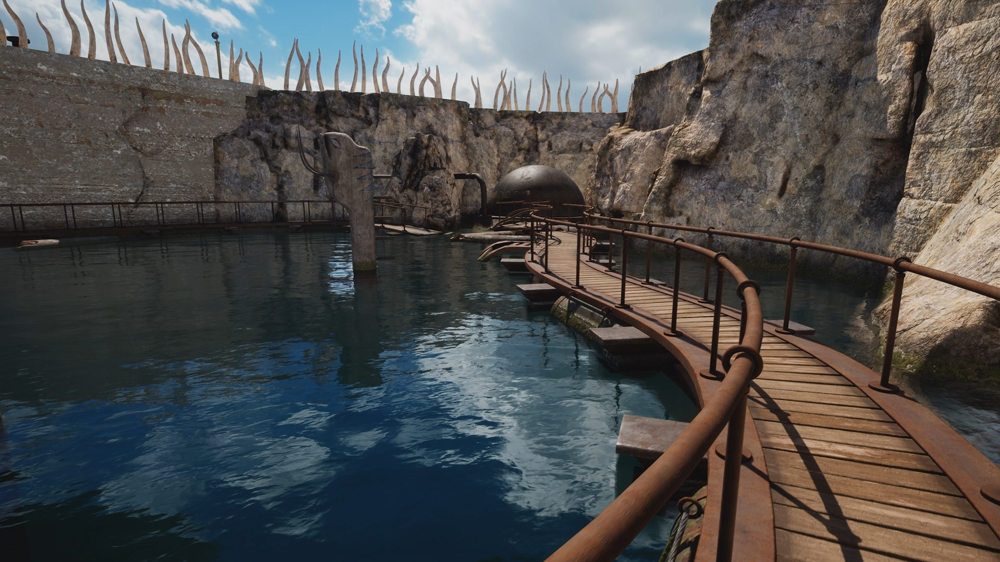

+++
title = "Luigi's Mansion 2 HD, Riven : le récap des sorties de la semaine (30/06)"
date = 2024-06-30T08:00:01+01:00
draft = false
author = "Félix"
tags = ["C’est dispo"]
image = "https://nostick.fr/articles/2024/juin/3006-les-sorties-de-la-semaine/luigi.jpg"
+++

.")

Entre le boulot, les courses et cette satanée carte électorale que vous avez rangé on ne sait où, vous n’avez peut-être pas eu le temps de vous intéresser aux nouveautés du moment. Qu’à cela ne tienne : voici les sorties de ces derniers jours qui ont retenu notre attention.

## Dysonored 

Nintendo a dépoussiéré cette semaine ***Luigi's Mansion 2***, initialement sorti sur 3DS en 2013 et qui avait été plutôt bien accueilli par la critique. Le pitch est plus ou moins le même que dans le premier épisode, à savoir qu’on va partir à la chasse aux fantômes armé d’un aspirateur dans des décors variés avec cette fois-ci plusieurs manoirs. L’intrigue est assez simple (il faut récolter X fragments d’un truc), et la franchise abandonne son côté ouvert en inaugurant un système de missions. Le jeu a eu droit à eu un bon coup de peinture pour cette mouture Switch avec des textures plus belles, des éclairages revus, et… c’est tout. Plusieurs tests expliquent que « *Nintendo a gardé l’esprit de l’original* », ce qui signifie surtout qu’ils ne se sont pas emmerdés à ajouter de fantômes inédits, de nouvelles zones ou à renouveler le gameplay. Bref, c’est chouette de pouvoir y jouer dans de bonnes conditions en 2024, mais payer [60 €](https://www.nintendo.com/fr-fr/Jeux/Jeux-Nintendo-Switch/Luigi-s-Mansion-2-HD-2442032.html) pour ça, pfff…

## Mystic Riven

Vieilleries toujours avec ***Riven***, qui nous est revenu tout droit des années 90 cette semaine. Il s’agit de la suite de *Myst*, le célèbre point & click en vue FPS que j’ai toujours trouvé chiant comme la pluie mais bon, les goûts et les couleurs, tout ça. Contrairement à Nintendo, les développeurs se sont sorti les doigts pour nous offrir un vrai remake, troquant les plans précalculés en 640x480 pour un vrai jeu 3D en vue FPS carburant à l’Unreal Engine 5. Forcément ça en jette, surtout pour les joueurs qui connaissent l’ancien sur le bout des doigts et qui pourront savourer tous les détails. Les retours sont excellents, donc vous pouvez foncer sans crainte. Attention tout de même car ça reste un jeu de casse-têtes assez difficile qui pourrait vous laisser sur le banc de touche si vous n’aimez pas prendre des notes et vous remuer les méninges, d’autant plus que ce remake n’apporte pas de système d’aide. Dispo sur Mac, [PC](https://store.steampowered.com/app/1712350/Riven/) et même [Meta Quest](https://www.meta.com/fr-fr/experiences/6499813506711202/) pour 34 €, soit quasiment moitié moins que *Luigi's Mansion 2*. Pas bravo, Nintendo.

## En roue libre

J’allais coller ***Super Monkey Ball Banana Rumble*** dans la rubrique « En rab’ » (surnommée « La poubelle de l’actu » en interne) avant de voir que c’était développé par Ryu Ga Gotoku Studio, le studio qui s’occupe des *Yakuza*, alors on va en parler vite fait. Vous connaissez la chanson : on incarne un mignon petit singe dans une boule qui va devoir venir à bout de niveaux bardés de plateformes, de précipices et autres accélérateurs. On nous propose ici d’explorer 10 mondes divisés en autant de niveaux, le jeu se payant même le luxe d’offrir une centaine de tableaux bonus plus corsés après le générique de fin. C’est visiblement plutôt réussi avec une majorité de niveaux intéressants, bien que la plupart des testeurs regrettent un mode multi moyen et des performances pas top pour une Switch en fin de vie. Pas le jeu de l’année, mais le mode solo devrait faire l’affaire pour vous vider la tête après une journée de boulot. [50 balles](https://www.nintendo.com/fr-ch/Jeux/Jeux-Nintendo-Switch/Super-Monkey-Ball-Banana-Rumble-2528573.html) tout de même, donc vous pouvez aussi attendre une promo.



## Plein aux as 

Oui, je sais, ***Fallen Aces*** est sorti le 14 juin donc je suis à la bourre, mais j’étais un peu méfiant face à cette « immersive sim » au style de bande dessinée vendue seulement 13 balles. On y incarne un détective privé qui se retrouve mêlé à une conspiration impliquant tout un tas de gangsters et de trahisons. L’univers est celui des films noirs des années 40, avec des scènes de gameplay entrecoupées de cinématiques format planche de BD. Comme d’habitude dans ce type de jeu, on pourra traverser les niveaux en tabassant tout le monde ou en mode infiltration. *Fallen Aces* n’est pas très long étant donné qu’il s’agit d’une early-access (comptez 3-4 h pour voir la fin du seul épisode dispo), mais les développeurs ont promis d’ajouter des tonnes de contenu au fil du temps. C’est fait par les gens de chez New Blood qui ne sont pas mauvais dans l’exercice, et le jeu [est facturé 12,79 €](https://store.steampowered.com/app/1411910/Fallen_Aces/) donc vous ne devriez pas regretter votre investissement. Et regardez-moi ce trailer, si c’est pas mignon :



## En rab

Cette semaine est aussi sorti l’édition anniversaire de **Beyond Good & Evil**, dont on avait parlé [ici](https://nostick.fr/articles/2024/juin/2006-une-edition-anniversaire-pour-beyond-good-evil-le-25-juin/) et qui est [vendue 20 €](https://store.steampowered.com/app/2556990/Beyond_Good__Evil__20th_Anniversary_Edition/) sur PS5/PS4, Xbox, Xbox One, Switch et PC. C’est visiblement une version remise au gout du jour correcte, mais ne vous attendez pas à des miracles non plus (ça reste un super jeu si vous ne l’avez jamais fait). Le visual-novel **Until Then** a fait pas mal parler de lui : l’histoire se concentre sur la vie d’un groupe d’adolescents aux Philippines et aborde des thèmes comme « *l’amour, le deuil et l’amitié* » avec tout de même une dose de mystère pour tenir le joueur en haleine. Les critiques sont assez bonnes, il y a une démo [sur Steam](https://store.steampowered.com/app/1574820/Until_Then/) et ça coûte 20 €, alors pourquoi pas. Notons que c’est aussi dispo sur PlayStation. Enfin, bouclons la semaine avec **[Spy x Anya : Operation Memories](https://en.bandainamcoent.eu/spy-x-family/spyxanya-operation-memories)** qui n’a pas l’air franchement terrible d’après les tests, mais qui pourra amuser un môme fan de la série quand il sera à 5 € dans le bac à promos en fin d’année. En attendant, vous pourrez peut-être l'occuper avec le sympathique **Tchia**, qui est arrivé cette semaine [sur Switch](https://www.nintendo.com/fr-fr/Jeux/Jeux-a-telecharger-sur-Nintendo-Switch/Tchia-2559216.html).

