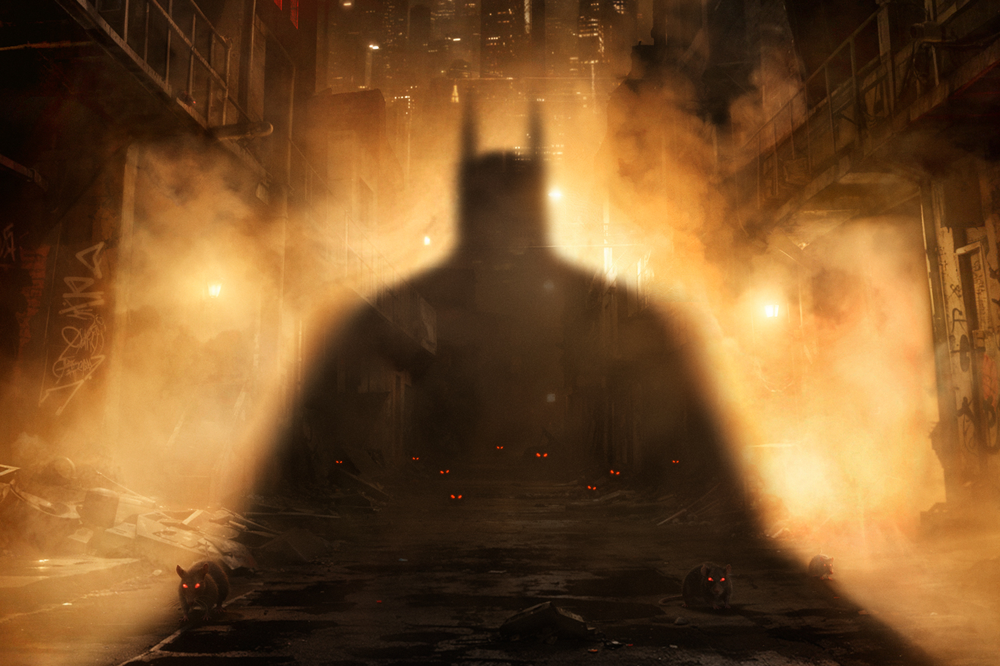

+++
title = "Batman: Arkham Shadow, une exclu Quest 3 qui redonne vie à l'Arkhamverse"
date = 2024-05-01T10:47:32+01:00
draft = false
author = "Mickael"
tags = ["trailer"]
vignette = "https://nostick.fr/articles/vignettes/Batman.jpg"
+++

L'univers Arkham n'est pas mort, malgré un enterrement de première classe dans *Suicide Squad: Kill the Justice League*. À la surprise générale, Meta (!) a annoncé un jeu VR (!!) exclusif au Quest 3 (!!!), *Batman: Arkham Shadow*. Le jeu a été [développé](https://www.camouflaj.com) par Camouflaj, un studio racheté par le géant des réseaux sociaux l'an dernier, et à qui l'on doit *République* et *Iron Man VR*.

Le jeu a été conçu de près avec [les horribles de Warner Bros.](https://nostick.fr/articles/2024/mars/warnerbros/) et DC Comics, avec dans l'idée de proposer quelque chose qui puisse rappeler aux millions de fans les grandes heures de la saga de Rocksteady. 

 

Si le titre sortira d'ici la fin de l'année, la bande annonce ne révèle rien du gameplay. Mais l'idée d'enfiler la défroque de l'homme chauve-souris en réalité virtuelle a de quoi sérieusement émoustiller les sens. Et puis on n'aura pas à attendre trop longtemps pour savoir de quel bois se chauffe ce Batman, sachant que le jeu sera révélé en long, en large et en travers le 7 juin à l'occasion du Summer Game Fest.

Cette exclusivité est mine de rien un gros coup pour Meta et pour son Quest 3, qui creuse un peu plus le fossé de plus en plus large avec la concurrence (comprendre : le Vision Pro) qui ne prend pas les jeux très au sérieux. Dans le même genre, *Asgard's Wrath 2*, également une exclusivité Quest, est vraiment un super jeu VR. 

L'annonce de *Batman: Arkham Shadow* a aussi de quoi rassurer les déçus de l'univers Arkham après *Suicide Squad*, [un gros four pour WB et Rocksteady](https://nostick.fr/articles/2024/mars/suicidesquad/).