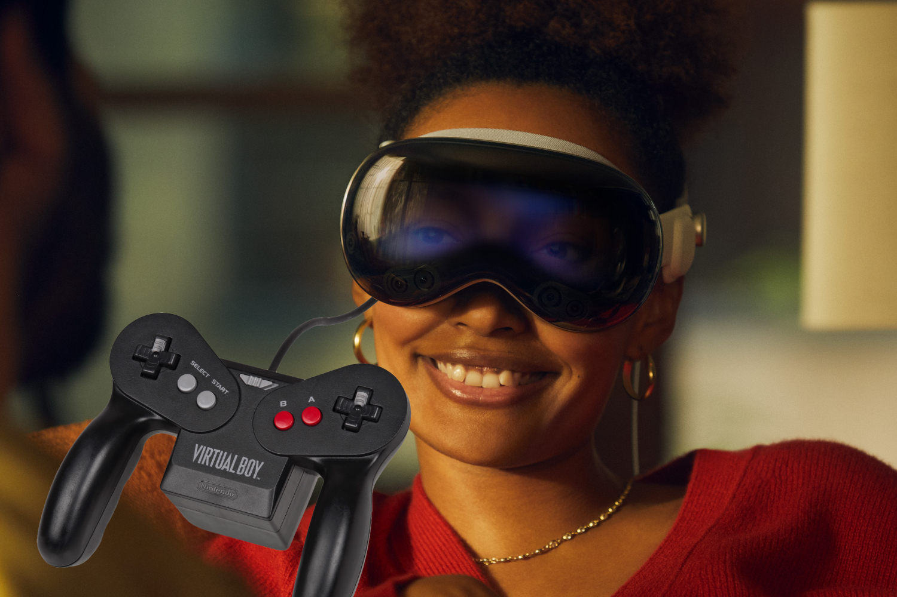
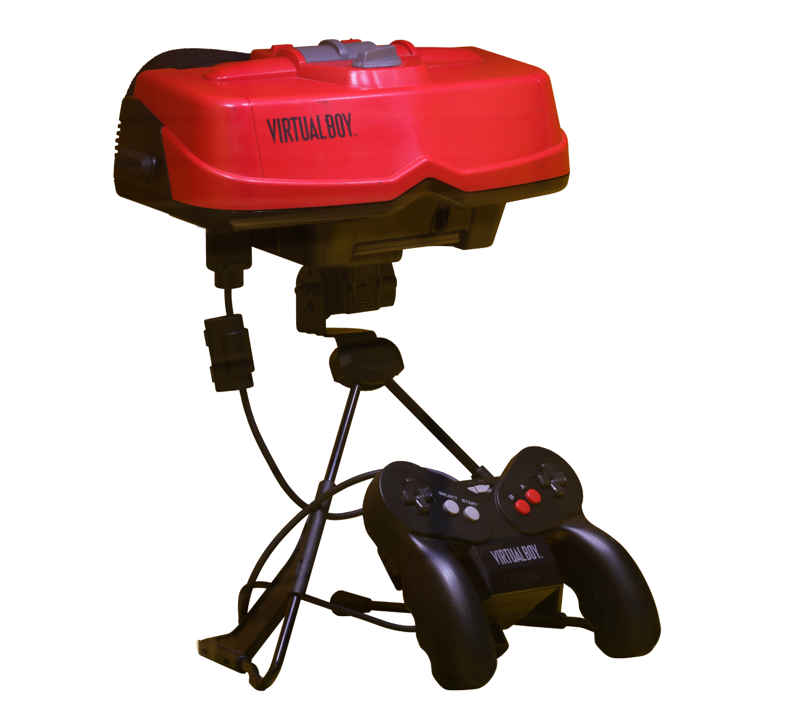
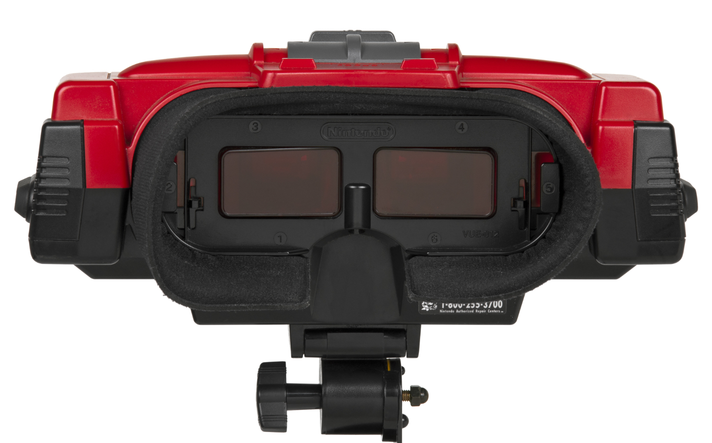
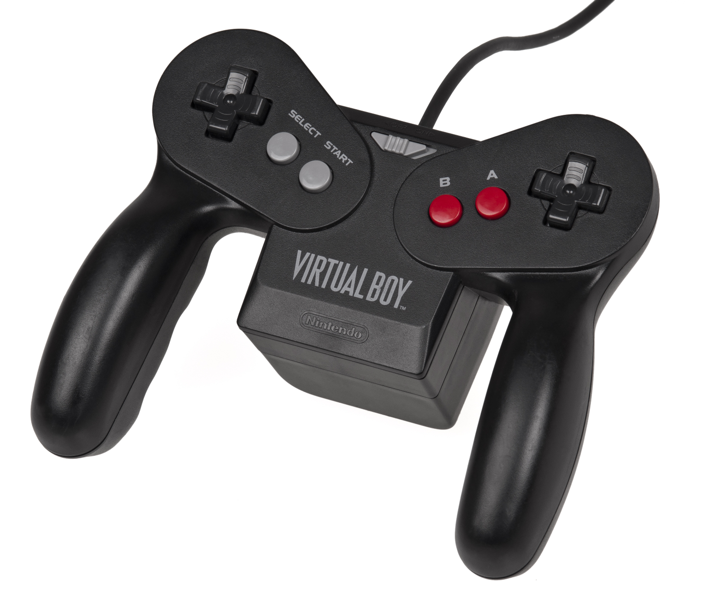
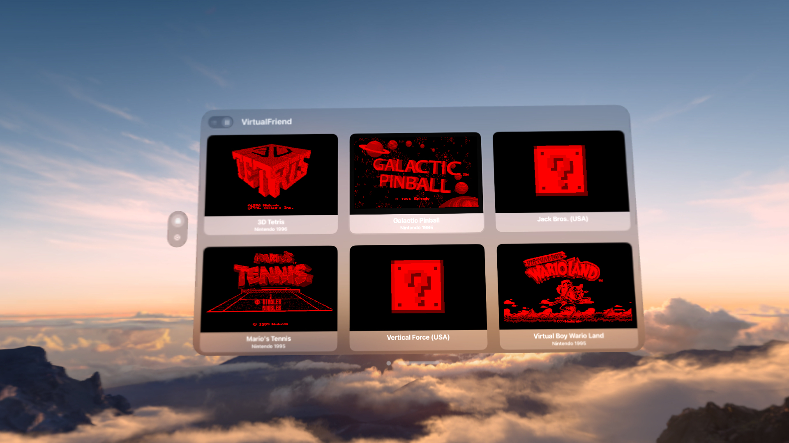
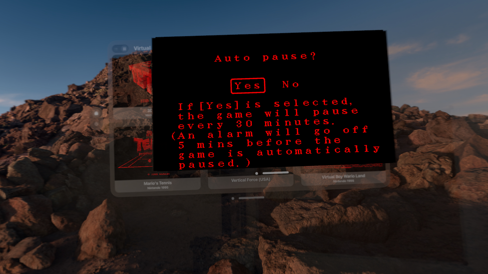
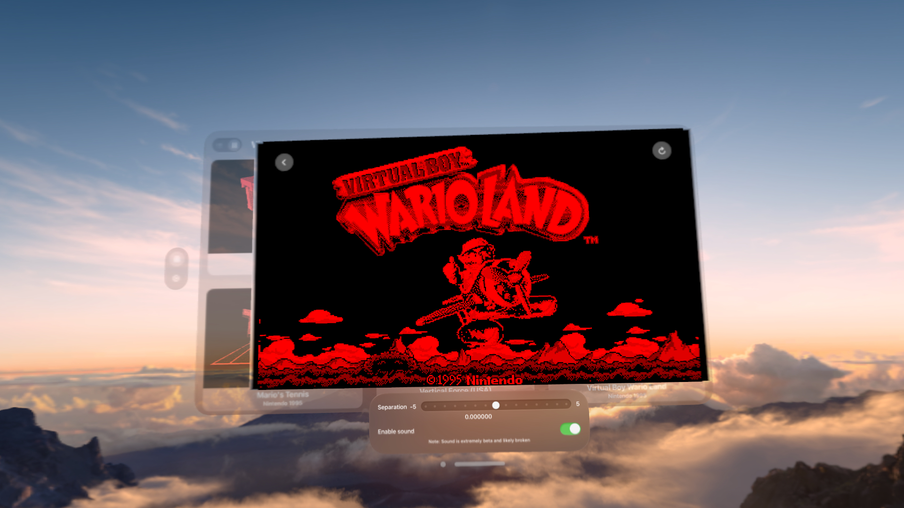

+++
title = "Les yeux dans les jeux 3D : aperçu de l'émulateur Virtual Boy pour l'Apple Vision Pro"
date = 2024-05-02T09:00:00+01:00
draft = false
author = "Mickael"
tags = ["XXL"]
type = "une"
vignette = "https://nostick.fr/articles/vignettes/VisionPro.jpg"
+++

**VirtualFriend 3D ne sauvera pas le Vision Pro des abîmes de la médiocrité vidéo-ludique dans lesquelles Apple a plongé son casque de réalité mixte. Mais cet émulateur Virtual Boy a déjà une sacrée allure malgré son statut de bêta. Plongeons nous avec délice dans les délires 3D de Nintendo des années 90 avec la dernière merveille d'Apple.**

Personne ne vous en voudra d'avoir oublié non seulement que l'on pouvait jouer sur le Vision Pro, et l'existence du Virtual Boy ! L'indigence des jeux sur le casque de réalité mixte d'Apple mériterait un article à part entière (ce qui finira bien par arriver !), mais évoquons plutôt cette étrange console éphémère lancée par Nintendo durant l'été 1995… pour mieux mourir discrètement quelques mois plus tard !

## La console qui fait mal aux yeux

Bien avant la 3DS et le Toy-Con VR Kit pour la Switch (ne l'oublions pas !), le Virtual Boy était une première incursion assez ratée de Nintendo dans l'univers de la 3D. Le développement de cette console 32 bits au design pour le moins surprenant, sorte de [View Master](https://fr.wikipedia.org/wiki/View-Master) posé sur un trépied, a demandé quatre ans de boulot. 

Nintendo s'est appuyé sur une technologie éprouvée pour l'effet de relief, la stéréoscopie 3D, une technique qui crée l'illusion de la profondeur dans une image en présentant deux images légèrement différentes à chaque œil. C'est d'ailleurs la même technologie qui sert à l'écran parallaxe de la 3DS.

Mais voilà, à l'époque les capacités de calcul sont ce qu'elles sont, Nintendo ayant en plus décidé de réduire la voilure du Virtual Boy alors que la N64 était aussi dans les tuyaux. La console ne peut pas faire mieux que d'afficher des images en monochrome noir et (trois niveaux de) rouge, la couleur de la LED la moins chère ; le système de suivi des mouvements de la tête a été abandonné en cours de route.

« *Le Virtual Boy utilisait des rendus en fil de fer pour simuler un espace en 3D* », expliquait Shigeru Miyamoto dans une interview [publiée](https://www.nintendo.com/fr-fr/Iwata-demande/Iwata-Demande-Nintendo-3DS/Vol-1-Et-c-est-ainsi-que-la-Nintendo-3DS-vit-le-jour/1-Shigesato-Itoi-essaie-la-Nintendo-3DS/1-Shigesato-Itoi-essaie-la-Nintendo-3DS-229348.html) sur le site de Nintendo au début des années 2010. « *Cela paraît logique lorsque vous pensez à la puissance des processeurs de l’époque. Rares étaient les jeux qui utilisaient cette méthode de représentation visuelle* ». 

Satoru Iwata, le président de Nintendo, expliquait dans la même interview que « *ces graphismes en rouge et noir ne jouèrent pas en notre faveur à une époque où les graphismes des jeux vidéo gagnaient rapidement en richesse* ». La N64, qui mettait aussi l'accent sur les graphismes en 3D, allait montrer la voie.

Le Virtual Boy sort dans un état technique pas formidable au prix de 179 $, avec plusieurs jeux au compteur (aux États-Unis, la console est fournie avec la cartouche de *Mario's Tennis*, un des meilleurs titres du maigre catalogue). Nintendo a des ambitions démesurées : des ventes à hauteur de 3 millions d'unités et 14 millions de jeux écoulées.

 

En juin 1996, Nintendo annonce avoir vendu 770 000 Virtual Boy. Le constructeur avait arrêté les frais dès le mois de décembre 1995 au Japon, et en août 1996 aux États-Unis. Fermez le ban ! « *Le Virtual Boy fut, selon moi, un échec commercial* », admettait Satoru Iwata qui voyait l'appareil davantage comme un jouet plus que comme une plateforme de jeu. 

Après ce détour par [Wikipedia](https://en.wikipedia.org/wiki/Virtual_Boy), que vient faire le Vision Pro là-dedans ? On y arrive ! 

## La 3D en noir et rouge dans le Vision Pro

Le casque de réalité mixte d'Apple n'est pas très fortiche en jeu vidéo, le constructeur ayant manifestement décidé de s'en tenir à ce qu'il fait de mieux en matière vidéo-ludique : se contenter du strict minimum en espérant que la sauce prenne toute seule. Après tout, cette stratégie a permis de transformer l'iPhone en plus grande plateforme de jeu au monde ! En l'état, ça n'aidera pas le Vision Pro auprès des joueurs.

On peut heureusement compter sur d'ingénieux développeurs pour donner un supplément d'âme au Vision Pro, à l'instar d'Adam Gastineau, spécialiste reconnu de l'émulation à qui l'on doit les *cores* Game & Watch et PC Engine de la Pocket, la petite console d'Analogue. Il s'est penché sur un émulateur Virtual Boy pour le Vision Pro qui conserve l'effet 3D des jeux !

Ne cherchez pas VirtualFriend 3D sur l'App Store : le développeur ne la distribue actuellement qu'au travers de TestFlight ([à cette adresse](https://t.co/ceLlRi43x2)), la plateforme de distribution de bêtas d'Apple. Vous aurez peut-être la chance de choper un slot, mais il vous faudra aussi un Vision Pro, car évidemment le téléchargement et l'installation de l'app se déroule dans le casque.

Il s'agit d'une bêta qui souffre encore de pas mal de bugs, notamment au niveau audio. Mais il est tout de même possible de lancer et de jouer aux titres Virtual Boy ! Il en existe très exactement *22*, et pas que des chefs d'œuvre. Les archéologues du jeu vidéo et les tordus comme moi ont établi un palmarès qui se compose entre autres de *Mario's Tennis* donc, *Virtual Boy Wario Land*, *Jack Bros.*, *3D Tetris*, *Red Alarm* ou encore *Vertical Force*.

La 3D est rudimentaire, et elle fait rapidement mal aux yeux. D'ailleurs, au lancement de chaque jeu il est recommandé au joueur d'autoriser le système qui active automatiquement une pause toutes les 30 minutes ! VirtualFriend 3D comprend une réglette pour affiner l'effet de relief, mais nul doute qu'on mettra un peu de temps avant de trouver un bon équilibre visuel.

Passée cette petite période d'adaptation — il sera plus ou moins pénible selon les capacités oculaires de chacun —, il faut tout de même reconnaitre que les quelques jeux que j'ai pu tester avec l'émulateur et le Vision Pro sont assez rigolos. Le Vision Pro est compatible avec les principales manettes du marché, pas besoin de faire les brocantes pour dénicher celle du Virtual Boy.

 

*Virtual Boy Wario Land* (Nintendo) est probablement la pépite de la sélection. Ce jeu de plateformes met en scène l'alter-ego maléfique de Mario qui, au fil des niveaux, peut se déplacer à l'arrière plan (ce qui n'est pas sans rappeler *Kirby: Planet Robobot* sur 3DS).

 

*Mario's Tennis* (Nintendo) tire aussi logiquement profit de la 3D stéréoscopique, même s'il faut tout de même un peu d'entraînement pour ne pas se faire humilier. Le jeu propose des matchs en solo et en double, mais un seul joueur humain pourra taper dans la balle. Ce jeu a aussi été le tout premier d'une longue lignée de *Mario Tennis*.

 

*Vertical Force* (Hudson Soft) est un shoot'em up vertical tout ce qu'il y a de plus classique, mais qui utilise la 3D de manière amusante : les ennemis sont présents aussi bien au premier plan qu'à l'arrière plan. Pour le reste, c'est vrai qu'il n'est pas spécialement original, et que les ennemis sont parfois difficiles à repérer dans tous ces sprites rouges.

 

*Jack Bros.* (Altus) a de quoi faire monter la température, puisqu'il s'agit d'un spin-off de Megami Tensei ! Le joueur doit ramasser des clés et bananer des méchants dans des niveaux empilés les uns sur les autres. Si la 3D est assez anecdotique dans le gameplay, il reste tout de même des effets de projection sympas.

Il n'y a pas de quoi se réveiller la nuit pour se faire une petite partie de Virtual Boy (surtout que ça fait mal aux yeux au bout d'un moment), mais les amateurs de curiosités voudront certainement jeter un œil sur cette proposition étonnante de Nintendo qui fonctionne très bien dans le Vision Pro grâce à VirtualFriend 3D. Et ceux qui n'ont pas ni Vision Pro, ni les sous ni l'envie d'acheter le Vision Pro, il existe un émulateur Quest à installer en sideloading, [Virtual Boy Go](https://sidequestvr.com/app/125/virtualboygo) !


