+++
title = "Installer GeForce Now sur Steam Deck, c'est maintenant tout simple"
date = 2024-05-03T09:00:00+01:00
draft = false
author = "Mickael"
tags = ["Actu"]
+++

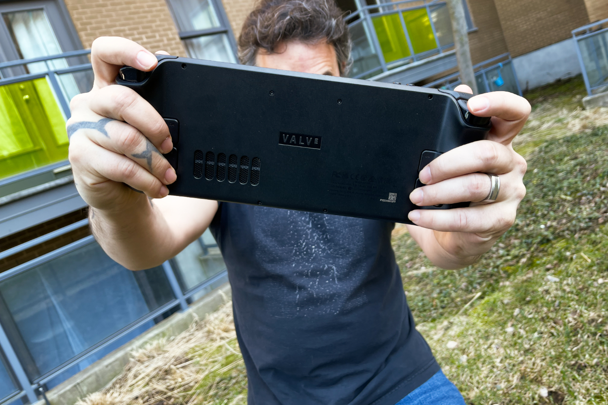

Y a t-il quelque chose que [le Steam Deck ne sache pas faire](https://nostick.fr/articles/2024/avril/2604-6-mois-avec-le-steam-deck-oled/) ? OK, bon le café pas encore, mais pour le reste la ~~petite~~ console de Valve offre un vaste terrain de jeu qui n'est pas limité à la seule boutique de Valve. Le hic par contre, c'est qu'il faut aimer la bidouille.

Certes, on peut évidemment jouer aux jeux Steam sur la console de Valve, après tout c'est sa fonction première. Mais [l'appareil est aussi ouvert à tous les vents](https://nostick.fr/articles/2024/avril/installez-diablo-iv-sur-le-steam-deck/), pour peu qu'on lui en laisse l'opportunité. Nvidia n'a pas manqué de la saisir en proposant un script qui installe GeForce Now dans la bibliothèque du joueur ; il suffit de cliquer dessus pour accéder au service de streaming.

S'il était déjà possible d'installer GeForce Now sur le Steam Deck, le script tout prêt de Nvidia facilitera la vie des joueurs. La principale difficulté est de basculer sur le mode Bureau (à lancer depuis le menu *Marche/arrêt*), puis d'ouvrir le navigateur web sur le site de [GeForce Now](https://www.nvidia.com/en-us/geforce-now/download/). Fouinez en bas de la page, vous y trouverez le lien « Steam Deck (BETA) » pour télécharger le script.

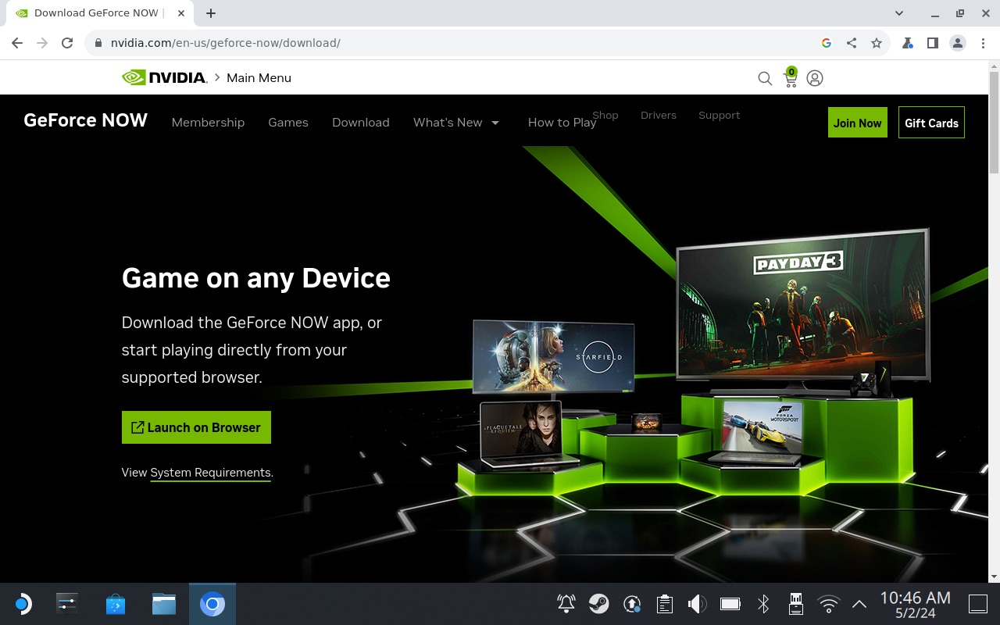

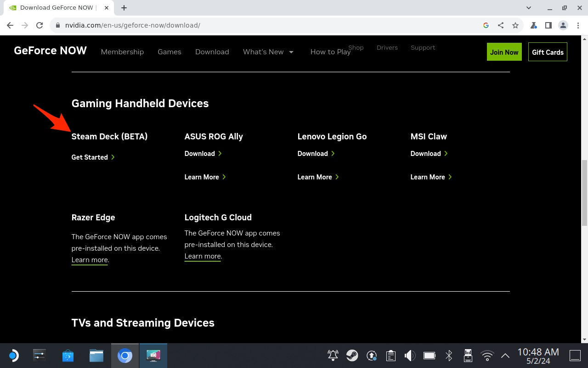

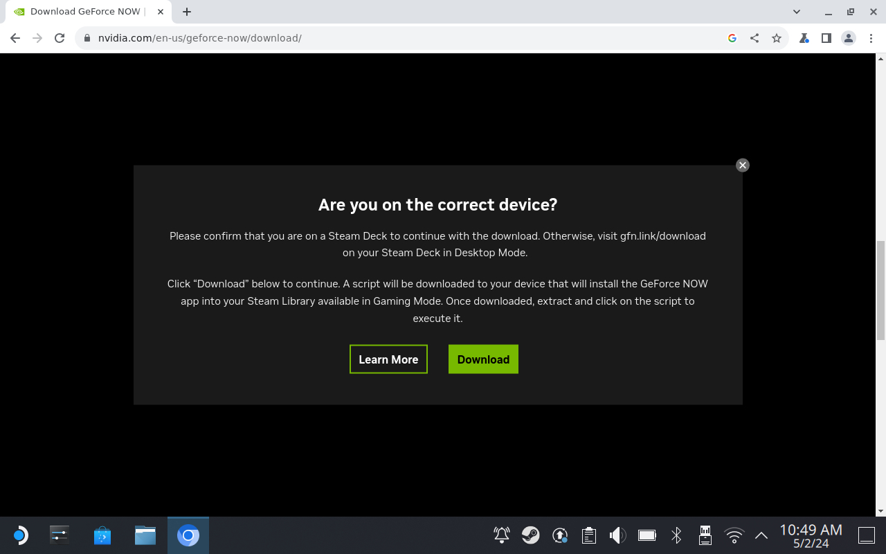

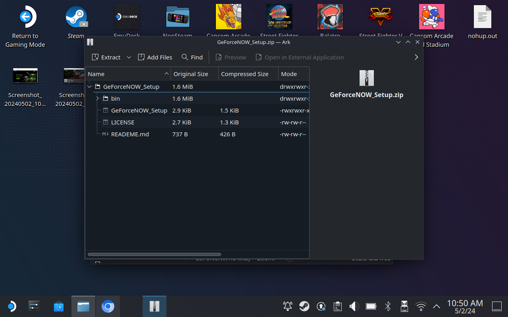

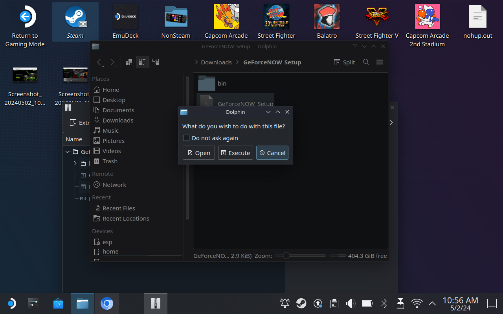

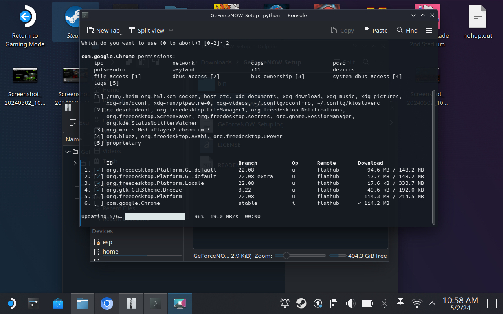

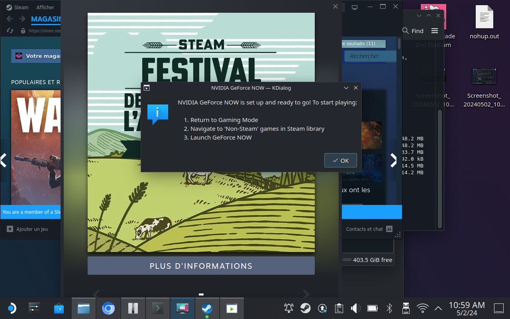

Décompressez ensuite le dossier, exécutez le script, et si tout va bien il va télécharger Chrome — qui va servir de « fenêtre » vers GeForce Now — et configurer le tout dans la bibliothèque Steam. Vous pouvez vous assurer en relançant le mode Gaming, puis en vous rendant dans l'onglet « non Steam » de la bibliothèque. 

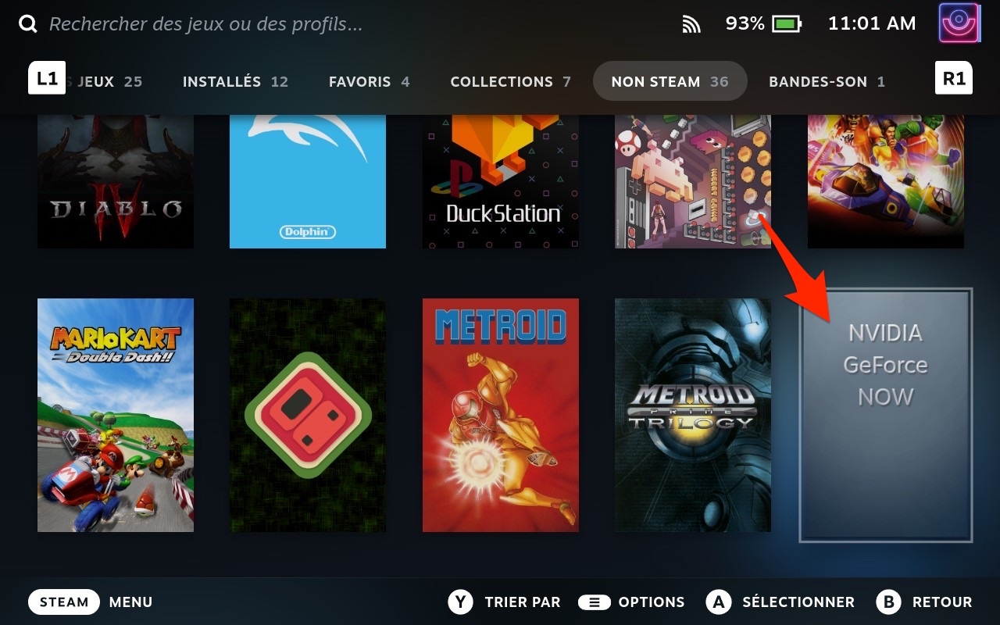

GeForce Now sur le Steam Deck, c'est tout simplement une vue web dans Chrome. L'interface du navigateur est masquée, on n'y trouvera que l'accès au service de streaming et aux différents jeux que vous possédez sur d'autres boutiques. Avant d'y accéder, il faudra se connecter à son compte GeForce Now bien sûr.

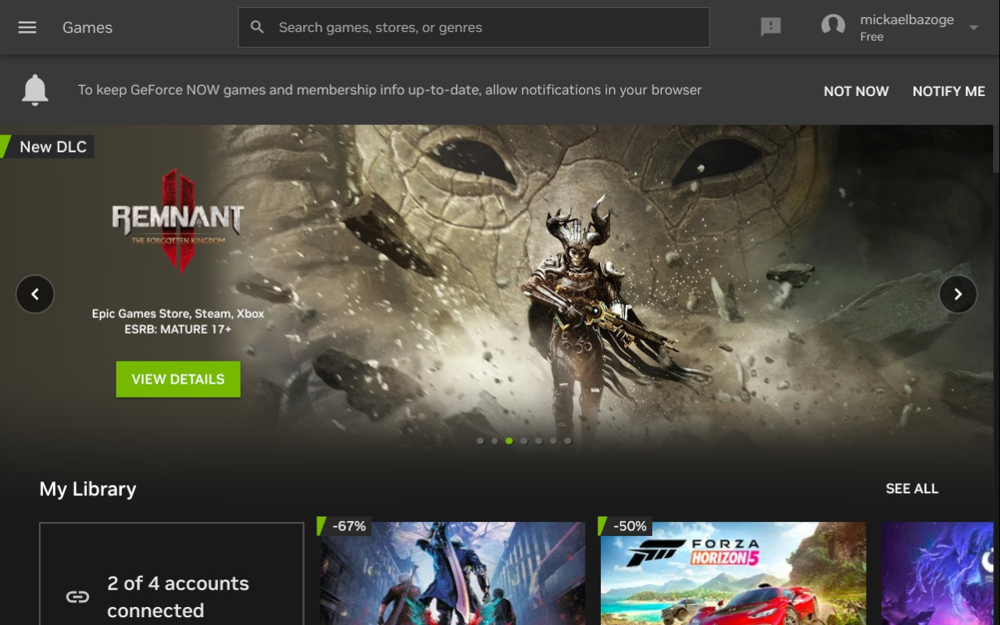

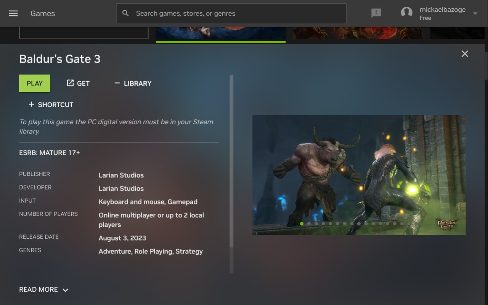

Contrairement au Game Pass qui peut se comparer à un « Netflix du jeu vidéo », GeForce Now permet de jouer aux jeux que l'on a achetés sur Steam, chez Ubisoft Connect, l'Epic Games Store, GOG, Origin, et aussi sur le Game Pass. Tous les jeux ne sont pas compatibles, mais il y en a un bon paquet. Le principal intérêt, c'est d'avoir sous la main un rig de joueur autrement plus puissant que ce que peux proposer le Steam Deck !

La version gratuite du service est limitée à des sessions d'une heure, avec une file d'attente et il y a même de la pub pendant qu'on poireaute. Et la qualité graphique est correcte, sans plus (c'est l'équivalent d'une RTX 2080).

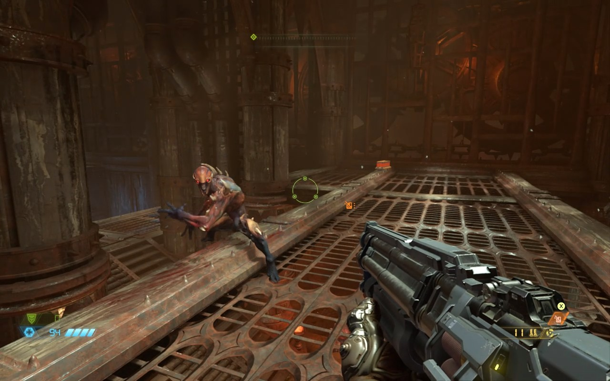

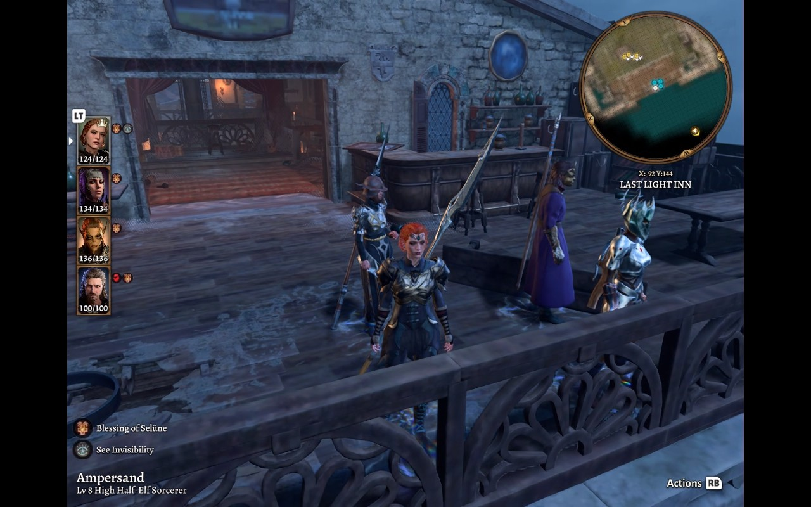

C'est tout de suite plus intéressant avec la formule Prioritaire à 10,99 € par mois (54,99 € pour six mois) : on a alors accès à une RTX 3080 avec ray-tracing et à des sessions pouvant aller jusqu'à 6 heures. Enfin, l'abonnement Ultimate à 21,99 € par mois (109 € pour six mois) offre le streaming avec une RTX 4080 (et ray-tracing, bien sûr), des sessions de 8 heures, ainsi que la 4K à 120 i/s ! On n'en profitera malheureusement pas sur le Steam Deck, Chrome limitant la fréquence d'images à 60 i/s.

Des quelques minutes que j'ai pu passer sur GeForce Now dans cette configuration Steam Deck, le tout a plutôt bien fonctionné même si les temps d'attente pour lancer le jeu m'ont semblé bien long (en particulier pour *Baldur's Gate 3* depuis Steam). La latence en particulier était imperceptible, ce qui est à mon sens le plus important mais tout dépend de la qualité de votre connexion Wi-Fi (Nvidia recommande au moins 15 Mbit/s pour du 720p à 60 i/s).

C'est une solution qui exige tout de même d'avoir un bon Wi-Fi sous la main, et aussi de souscrire à une des offres payantes (un Day Pass à partir de 4,39 € est aussi disponible pour se faire une idée) pour en prendre vraiment plein les yeux.