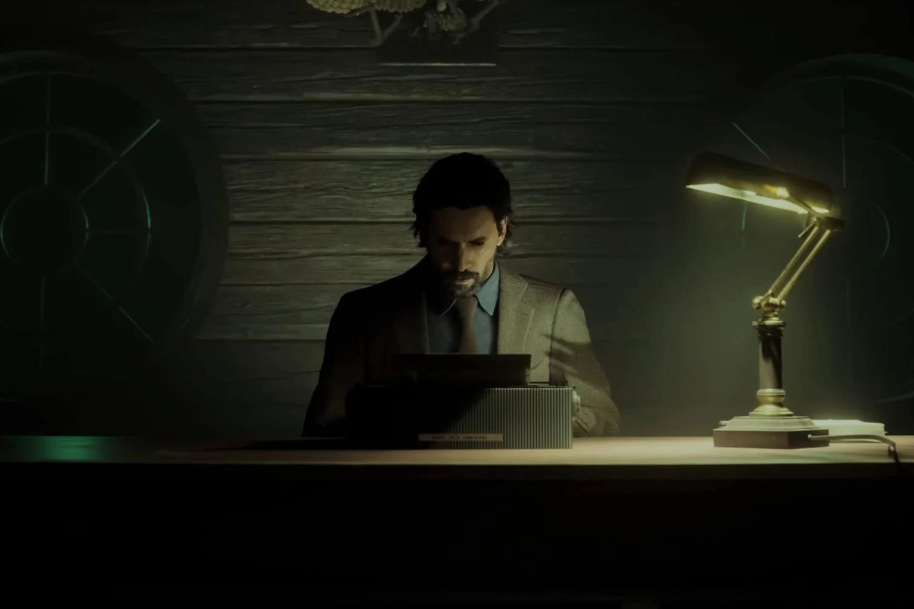
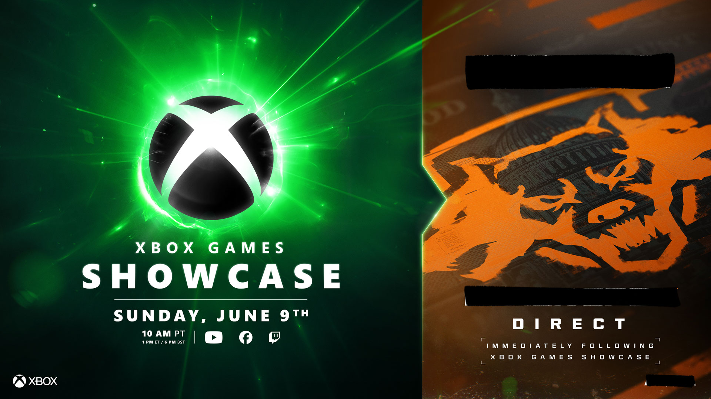

+++
title = "Admirable, formidable, un peu irresponsable : la folle semaine du jeu vidéo (04/05)"
date = 2024-05-04T08:00:02+01:00
draft = false
author = "Mickael"
tags = ["Actu"]
+++

L’actualité du jeu vidéo ne s’arrête pas à la poignée d’articles publiés sur *Nostick* ! Histoire de rattraper le retard accumulé, voici un retour rapide sur quelques unes des infos les plus importantes (ou insignifiantes) de la semaine.

## Alan Wake 2 n'est pas bien riche

*Alan Wake 2* a été le succès critique de 2023, et ça n'était pas évident au milieu de la foule de bangers auxquels on a eu droit l'an dernier. Mais la reconnaissance des testeurs et des joueurs n'est pas nécessairement synonyme de carton commercial. Le développeur Remedy a [publié](https://investors.remedygames.com/app/uploads/2024/04/remedy-q1-2024-business-review.pdf) ses résultats pour le premier trimestre et surprise : le jeu n'est toujours pas rentable.

Avec 1,3 million de copies vendues, ce nouvel opus a recouvré « *une partie significative des dépenses de développement et de marketing* » mais pas la totalité des dépenses. Plutôt raide pour un jeu de l'année, mais il est vrai que Remedy a été pris au piège de son éditeur Epic, qui sur PC force le jeu à n'être distribué que sur sa propre boutique. On imagine que ça aiderait pas mal si *Alan Wake 2* était aussi vendu sur Steam…

Malgré tout, Remedy a engrangé une hausse sympathique de son chiffre d'affaires qui s'établit pour le trimestre à un peu moins de 11 millions d'euros, soit une augmentation de 56 % sur un an. L'annonce des résultats a surtout permis au studio de faire le point sur ses différents projets, à commencer par *Condor*. Le spinoff de *Control*, qui sera un jeu service en multi, est entré dans sa phase de développement final, un lancement est donc dans les tuyaux.

*Control 2*, la suite du hit de 2019, avance bien lui aussi et s'il faudra attendre encore un moment avant de mettre la main dessus, la production est en bonne voie. Les remakes de *Max Payne* seront en mode « full production » cette année. Quant à *Codename Kestrel*, développé en tandem avec Tencent, il en est encore au niveau de l'affinage du concept. 

## Square Enix dans le rouge

Et puisqu'on parle gros sous, évoquons ceux de Square Enix qui ne sont pas spécialement glorieux. L'éditeur a [annoncé](https://www.hd.square-enix.com/eng/ir/pdf/20240430_01_en.pdf) avoir inscrit une perte de 22 milliards de yens, soit quelque chose comme 141 millions de dollars, pour son dernier trimestre fiscal (qui s'est achevé fin mars 2024). Il s'agit d'éponger ce que l'entreprise appelle une « *perte liée à l'abandon de contenus* » dans son activité de « *jeux vidéo HD* ».

Si Square ne donne pas de précisions sur la nature de ces contenus abandonnés, on peut penser que les jeux sortis sur PC et consoles n'ont pas atteint leurs objectifs de ventes, sans donner de noms. A priori, *Final Fantasy 7 Rebirth* ne serait pas le carton commercial espéré par le studio ; ce dernier a tout misé sur un lancement exclusif sur PS5, limitant ainsi ses chances de succès. 

*FF7 Remake* avait connu un meilleur sort : le jeu était sorti sur PS4 (plus de 100 millions d'unités vendues) en pleine crise sanitaire, ce qui lui avait permis d'engranger des chiffres de vente rondelets. *FF16* aussi a semble-t-il enregistré une meilleure fortune malgré son statut d'exclusivité PS5. Mais l'attrait de la nouveauté a certainement fait son effet. La société veut désormais se montrer « *plus sélective* » dans l'allocation de ses ressources de développement. Du moment que ces ressources sont tournées vers des versions PC, je dis ça je dis rien.

## Les posters 🥵 de Lara vont revenir !

Gros ouf de soulagement chez les incels. Aspyr a confirmé que la disparition des posters montrant Lara dans des positions coquines était un accident dans le remaster de *Tomb Raider 1-3*. Le patch 2 livré il y a quelques jours avait malencontreusement supprimé ces fameux posters apparaissant dams le niveau « Sleeping with the Fishes » de *Tomb Raider 3*, provoquant une montée de lait chez les joueurs adeptes du complet mondialisé woke.

Aspyr s'est [confondu](https://support.aspyr.com/hc/en-us/articles/26244383712269-Tomb-Raider-I-III-Remastered-Patch-2-Posters) en excuses, expliquant que les nouvelles textures HD et les mises à jour graphiques du correctif avaient provoqué la malheureuse suppression des images. Rassurons-nous : ces images seront de retour avec le patch 3, il ne s'agissait donc pas d'une censure (mais d'une mauvaise communication du studio, certes).

## Starfield repart vers les étoiles

Les trois joueurs et demi qui font encore tourner *Starfield* sur leur Xbox et leur PC seront heureux de savoir qu'ils n'ont pas été oubliés. Une mise à jour va leur être proposée le 15 mai (elle est déjà [disponible](https://bethesda.net/en/game/starfield/article/174M0cdUyxhn9mI0AvkcN9/starfield-update-1-11-33-may-1-2024) sur Steam, en bêta) avec, attention les yeux, des maps plus détaillées ! 

De nouvelles options de difficulté font aussi leur apparition, l'intérieur des vaisseaux est bien plus personnalisable, et attention les yeux sur Xbox Series X le jeu pousse à 60 FPS (mais pas sur la Series S).

 

Dans *Starfield*, quand on atterrit sur une planète vierge, il faut se taper l'exploration à pinces. Ce sera bientôt de l'histoire ancienne puisque des véhicules sont en développement ! Todd Howard, le patron de Bethesda, a aussi [annoncé](https://www.youtube.com/watch?v=7wvqF41_Bgw) que la première extension *Shattered Space* est bien programmée pour cet automne, probablement pour le mois de septembre. 

Un autre gros morceau est attendu probablement pour cette année, il s'agit du Creation Kit qui est d'ores et déjà en phase de test chez des moddeurs (même s'ils n'n'ont pas attendu pour bidouiller le jeu). Seront-ils capables de relancer l'intérêt autour de *Starfield* ?

## Le gros showcase Xbox

Le reste de l'année s'annonce calme du côté de Sony et de Nintendo. Une occasion en or pour Microsoft, qui semble enfin être en mesure de cracher les gros jeux que les joueurs Xbox et PC sont désespérés d'installer sur leurs bécanes. Le 9 juin se tiendra le [Xbox Showcase](https://news.xbox.com/en-us/2024/04/30/xbox-games-showcase-2024-redacted-direct/) qui, surprise, sera suivi d'un direct : a priori, il s'agira de lever un coin du voile sur le prochain *Call of Duty*.

Ce showcase sera le premier qui présentera des jeux développés par les studios de Microsoft, Activision Blizzard et Bethesda, alors il va falloir mettre les petits plats dans les grands ! D'après le toujours bien renseigné [Tom Warren](https://www.theverge.com/2024/4/30/24145262/xbox-games-showcase-summer-2024-call-of-duty-direct), l'événement sera l'occasion d'une première annonce pour *Gears of War 6*, et de présenter le calendrier pour les prochains titres très attendus.

En septembre, on en parlait plus haut, *Starfield* devrait accueillir sa première extension *Shattered Space*. Le *Call of* annuel tomberait en octobre, suivi par *Avowed* et *Microsoft Flight Simulator 2024* en novembre. Pour finir l'année en beauté, *Indiana Jones et le Cercle ancien* ferait son apparition sous le sapin en décembre.

## Menaces sur la démocratie

Le capital sympathie de *Helldivers 2* en a pris un coup derrière la cravate après l'annonce de Sony qui va [exiger](https://store.steampowered.com/news/app/553850?emclan=103582791473678397&emgid=4196868529806518741) des joueurs PC de se connecter au jeu avec un compte PSN afin de le relier au compte Steam. Cette exigence sera mise en place à partir du 6 mai et évidemment, ça n'est pas la joie.

.")

Certes, la création d'un compte PlayStation Network est gratuite, mais bon nombre de joueurs craignent l'exploitation de leurs données par Sony — ils n'oublient pas non plus les gros problèmes de sécurité récents qui ont permis à des pirates de plonger leurs gros doigts dans les serveurs de l'entreprise.
 
Le jeu PlayStation, sorti en même temps sur PC le 8 février, est un véritable carton qui continue d'attirer les joueurs en masse, bien décidés à imposer les valeurs de la démocratie contre les foutus insectes aliens. Mais si *Helldivers 2* a tout réussi depuis le début, cette obligation de connexion à un compte PSN représente un premier accroc.

En même temps, Sony ne prend personne en traître : la page Steam du jeu indique depuis son lancement qu'un compte PSN est nécessaire pour jouer. Un problème technique a cependant forcé l'éditeur à reporter la mesure, qui allait forcément revenir un jour sur le tapis. Elle va lui permettre de « *protéger les joueurs contre l'anti-jeu et les abus* » et de bannir les tricheurs. Les nouveaux joueurs devront lier leur compte PSN dès le 6 mai, les joueurs actuels ayant jusqu'au 4 juin pour le faire.