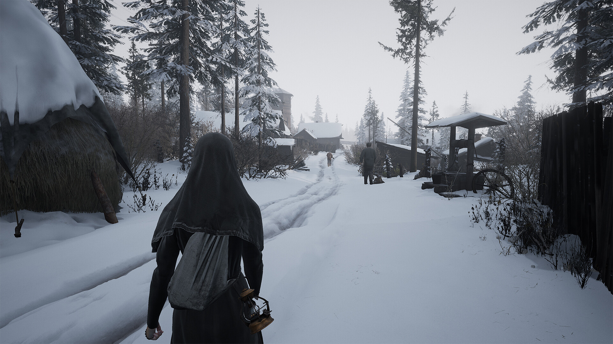
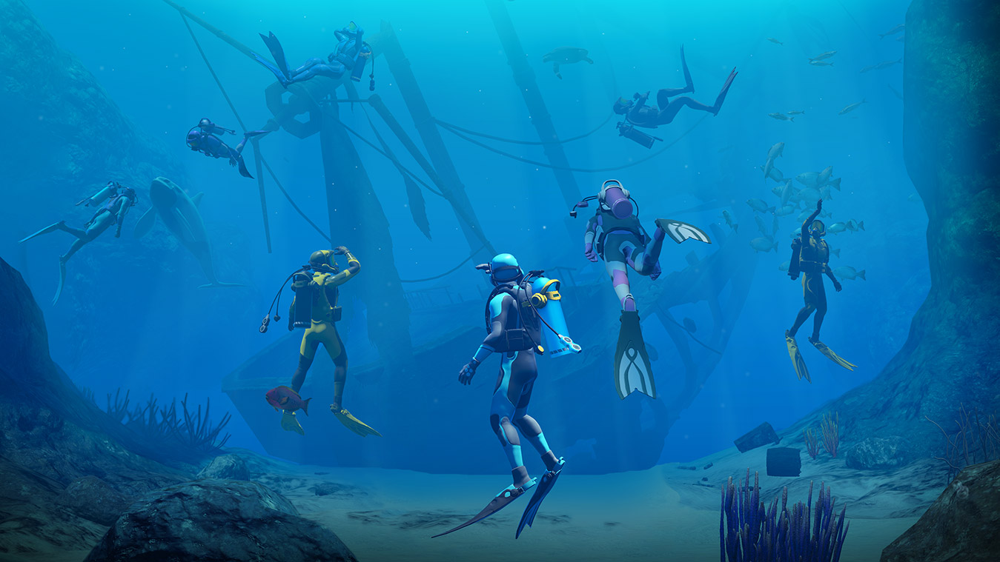

+++
title = "Les sorties de la semaine (05/05)"
date = 2024-05-04T09:00:00+01:00
draft = false
author = "Félix"
tags = ["C’est dispo"]
+++ 

Entre le boulot, les courses et ce mercredi férié passé à végéter devant Netflix, vous n’avez peut-être pas eu le temps de vous intéresser aux nouveautés du moment. Qu’à cela ne tienne : voici les sorties de ces derniers jours qui ont retenu notre attention.

## Nonne à tout faire

Attaquons tout de suite avec ***Indika***, la grosse sortie de la semaine qui propose d’incarner une jeune nonne dans une Russie alternative de la fin du XIXe siècle. Si ce pitch de film d’auteur un peu chiant ne vous a pas séduit, sachez qu’il y a un twist : elle entend le diable en personne dans un jeu mélangeant des énigmes à la *Resident Evil* avec une partie exploration d’un univers bizarre. Malgré ses thèmes lourds, le titre est visiblement rempli d’humour noir tout en s’amusant avec le support vidéoludique. Les premiers retours sont positifs, décrivant un OVNI divertissant qui se paye le luxe de ne pas tirer en longueur inutilement avec des puzzles trop tirés par les cheveux. 25 € pour 5-6 heures de jeu [sur Steam](https://store.steampowered.com/app/1373960/INDIKA/), également dispo sur PS5 et Xbox la semaine prochaine.

## Adopte un Mech

Si j’aime plutôt bien les jeux japonais, je suis toujours resté hermétique à tout ce qui tourne autour des mechas (les espèces de gros robots pilotés par des humains). Vous aurez peut-être plus d’intérêt que moi pour le remake de ***FRONT MISSION 2*** qui vient d’arriver sur PC et consoles après un premier lancement [sur Switch](https://www.nintendo.com/fr-fr/Jeux/Jeux-a-telecharger-sur-Nintendo-Switch/FRONT-MISSION-2-Remake-2266864.html) l’année dernière. Il s’agit d’une refonte d’un vieux tactical-RPG avec des mechas, donc, qui n’était jamais sorti en dehors du japon et qui inclut des éléments de visual novel. En pratique, vous pimpez vos mechs avant d’enchaîner les villes et les affrontements au tour par tour, puis finissez la journée en allant papoter au bar. À réserver aux fans du genre, qui devront tout de même supporter une traduction visiblement hasardeuse et des graphismes qui restent datés malgré l’appellation de « Remake ». 34 € [sur Steam](https://store.steampowered.com/app/2865440/FRONT_MISSION_2_Remake) (il y a une démo pour les curieux), également dispo sur consoles.

 

## Saoule l’océan

Vous vous souvenez d’***Endless Ocean*** ? Il y a fort à parier que non : cette série de deux jeux d’exploration sous-marine sortie à la fin des années 2010 sur Wii a été accueillie tièdement par la critique, si bien qu’on pensait la licence morte et enterrée. 15 ans après les derniers opus, les développeurs du studio Arika viennent de lancer un troisième opus qui est… visiblement pas terrible non plus. Comme d’hab’ il va s’agir de sillonner les fonds marins sans arme, ni haine, ni violence pour scanner différentes bestioles pour passer à la prochaine zone. Apparemment c’est très reposant et contemplatif les premières heures avant de devenir terriblement répétitif. À réserver aux grands, GRANDS passionnés de poissons qui savent dans quoi ils se lancent, d’autant plus que c’est quand même facturé 50 boules sur [Switch](https://www.nintendo.com/fr-fr/Jeux/Jeux-Nintendo-Switch/Endless-Ocean-Luminous-2523941.html).

## Gordon bleu

Je voulais vous parler de *MotoGP 24* pour me moquer, mais les quelques critiques glanées ici et là sont assez bonnes alors on va plutôt s'attarder sur ***‌Abiotic Factor***, un audacieux mélange entre *Half-Life 1* et *Minecraft*. Dans l’idée vous êtes un scientifique travaillant dans un gigantesque laboratoire souterrain où se produisent différents évènements paranormaux, comme l’arrivée de différentes bestioles toutes plus bizarres les unes que les autres. Le twist, c’est que ça se joue à 6 et qu’il s’agit d’un jeu de survie dans lequel vous pouvez crafter tout un tas de trucs allant du simple filet au canon laser en passant par des jetpacks ou des téléporteurs. Il va donc falloir se créer une base et fouiller les trois biomes différents (entrepôts/labos/bureaux) explorables à l’aide d’un monorail, ce qui me rappelle vaguement quelque chose. Les premiers retours sont positifs et les graphismes rétros ont l’air sympa : pourquoi pas si vous avez des copains sous la main et envie de retrouver l’ambiance de Black Mesa. 25 € sur [Steam](https://store.steampowered.com/app/427410/Abiotic_Factor/) en accès anticipé, donc pensez à lire quelques critiques ici ou là avant de passer à la caisse.

 

## Mais aussi

Comme je le disais, ***MotoGP 24*** est sorti cette semaine : il s’agit visiblement d’une entrée annuelle qui ne réinvente pas la roue, encore moins si vous avez joué au volet de l’année dernière. C’est vendu 50 € [sur Steam](https://store.steampowered.com/app/2581700/MotoGP24/), mais attention ça pique un peu les yeux (c’est aussi dispo sur PS4 et Switch, imaginez un peu). Microsoft a enfin lancé **Sea of Thieves** sur PS5, et sans surprise, c’est une bonne pioche si vous aimez les jeux de pirates. Facturé 40 € [sur le PStore](https://www.playstation.com/fr-fr/games/sea-of-thieves/), c’est toujours moins cher que *Skull and Bones* (et sans doute plus fun).