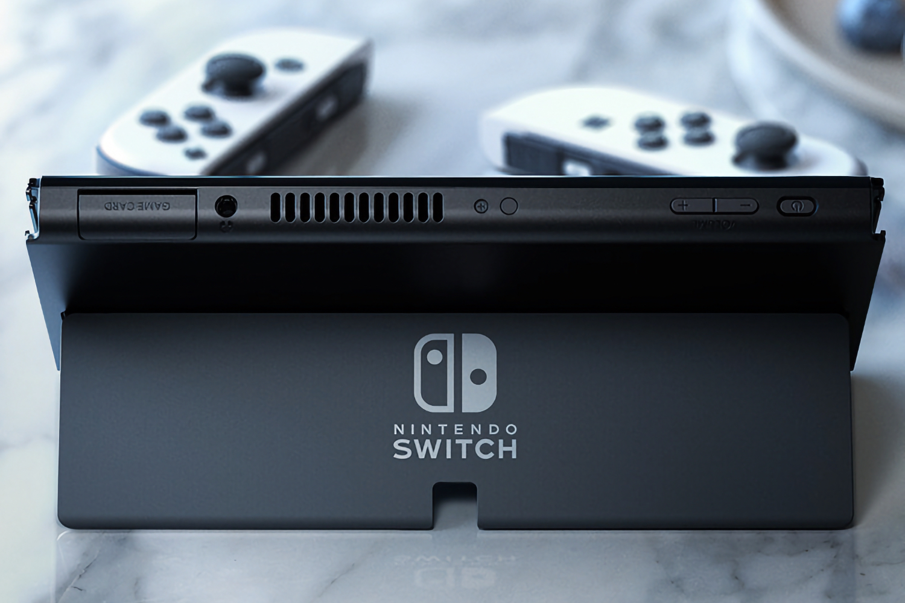

+++
title = "Nintendo annoncera sa nouvelle console avant avril 2025"
date = 2024-05-07T10:47:32+01:00
draft = false
author = "Mickael"
tags = ["Actu"]
image = "https://nostick.fr/articles/2024/mai/0705-nintendo-presentera-sa-nouvelle-console-avant-avril-2025/Switch.jpg"
+++

 

Il y aura une successeure à la Switch, et elle sera annoncée avant la fin de l'année fiscale de Nintendo qui se terminera le 31 mars 2025. Ça n'étonnera personne qui suit les rumeurs depuis des mois, mais cette confirmation vient tout droit de Shuntaro Furukawa, le président du groupe. L'histoire retiendra qu'il a annoncé tout ça… dans un bête tweet. Une manière très Nintendo finalement de faire monter la sauce !



Le dirigeant écrit que l'entreprise écrit que cela fait « *plus de neuf ans depuis que nous avons annoncé l'existence de la Switch, en mars 2015* ». Même lui trouve que ça fait un peu long ! Il ne donne absolument aucune autre information sur cette future console, mais une simple confirmation de son existence suffira à notre bonheur et à celui de millions de joueurs pour aujourd'hui.

Sans surprise non plus, Shuntaro Furukawa annonce la tenue d'un Nintendo Direct en juin pour dévoiler les futurs jeux Switch (la Switch 1…) pour la deuxième partie de l'année. « *Mais veuillez noter qu'il n'y aura aucune mention du successeur de la Nintendo Switch lors de cette présentation* », écrit-il. Oups, c'était trop beau !

Nintendo se prépare à une année plutôt calme aussi bien au niveau des jeux — exception faite des quelques remasters déjà annoncés — qu'au niveau du matos. Les ventes de la Switch actuelle risquent en effet de pâtir de cette annonce, mais il faut bien à un moment donné dévoiler ses cartes avant que les fuites ne prennent le relais. Et avec le lancement probable de la production, on n'a pas fini d'en entendre parler.


