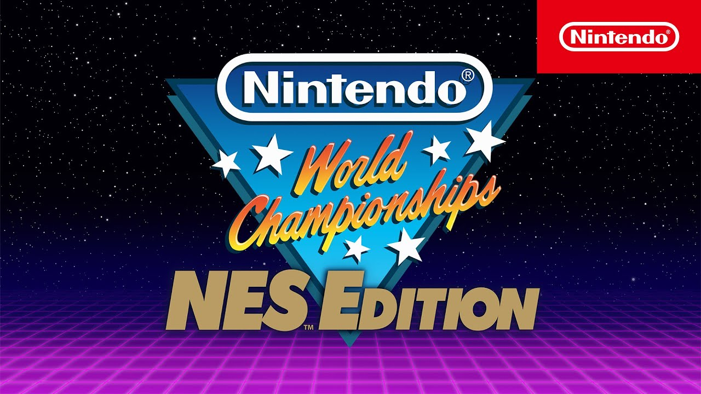
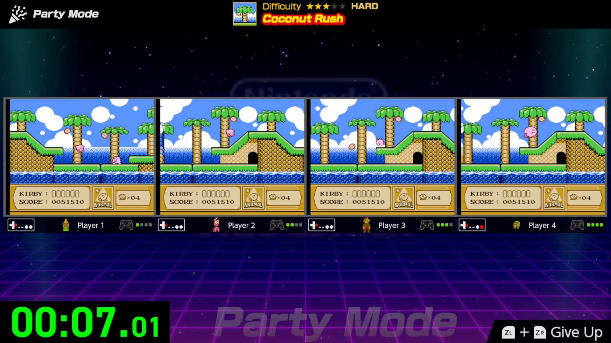
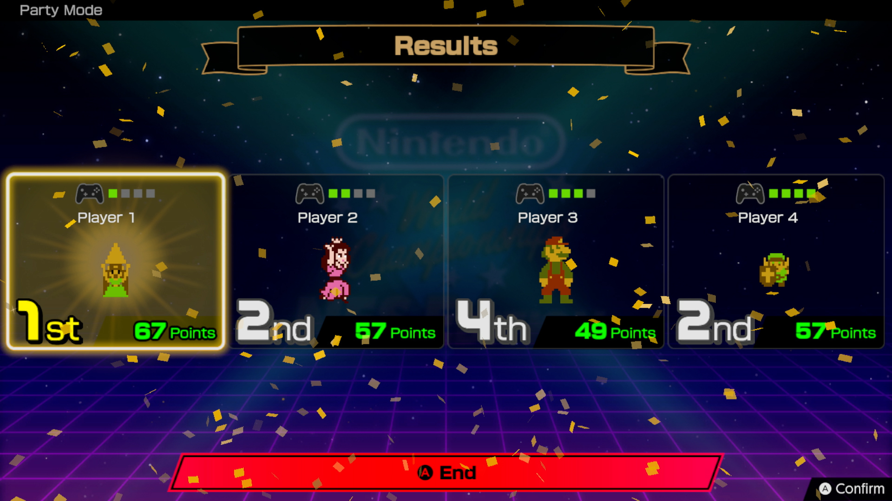
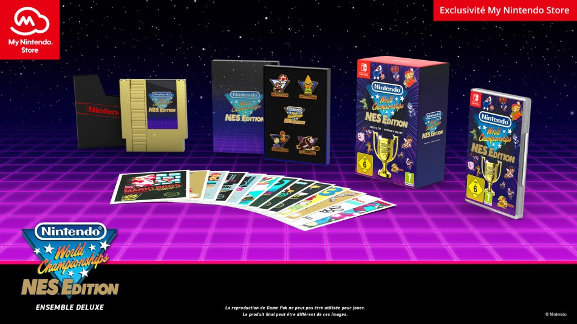

+++
title = "Nintendo recycle les vieilles gloires de la NES pour les amateurs de speedruns"
date = 2024-05-08T15:47:32+01:00
draft = false
author = "Mickael"
tags = ["Trailer"]
type = "articles"
+++

Malgré [une Switch 2 dans les starting-blocks](https://nostick.fr/articles/2024/mai/0705-nintendo-presentera-sa-nouvelle-console-avant-avril-2025/), Nintendo n'oublie pas qu'il y a toujours la Switch 1 dans les parages avec des millions de joueurs avides de se défouler sur de nouveaux jeux. Sans attendre le Direct du mois de juin, le constructeur a présenté aujourd'hui *Nintendo World Championships: NES Edition*, une collection de mini-jeux assez étonnante.

Le principe est diabolique : aller toujours plus vite dans des petits bouts de niveaux tirés de grands jeux de la NES. La sélection comprend des classiques archi-connus comme *Metroid*, *The Legend of Zelda*, *Super Mario Bros.*, *Donkey Kong*, etc. Plus de 150 défis de rapidité attendront le ou les joueurs : en plus du mode solo, il sera possible d'affronter des amis sur son canapé ou en ligne (jusqu'à 8 joueurs).

 

Nintendo proposera aussi des classements mondiaux avec des défis hebdomadaires pour cette version « à la maison » des Nintendo World Championships, un événement organisé de temps à autre par le constructeur. Ce dernier a d'ailleurs demandé à quelques champions de participer à la promo du jeu.

Cette collection est aussi un moyen habile pour Nintendo de recycler des classiques usés jusqu'à la corde qui ne coûtent pas trop cher à réutiliser. On aurait d'ailleurs bien vu le jeu être proposé « gratuitement » aux abonnés Switch Online (les manettes rétro sont d'ailleurs compatibles)… Mais ça ne sera pas le cas : il faudra débourser 30 € sur l'eShop. 

Une version boîte avec des goodies sera aussi commercialisée, avec des pin's, des cartes illustrées et une (fausse) cartouche NES dorée ! Le prix de cet ensemble Deluxe n'a pas été communiqué, mais cela devrait tourner autour d'une soixantaine d'euros. Le jeu sera disponible le 18 juillet.

*Nintendo World Championships: NES Edition* ressemble beaucoup à *NES Remix*, une compilation sortie sur Wii U et Nintendo 3DS en 2013 comprenant 16 jeux NES et 204 défis. Une 2e édition a été lâchée l'année suivante avec 12 jeux supplémentaires et 169 défis.