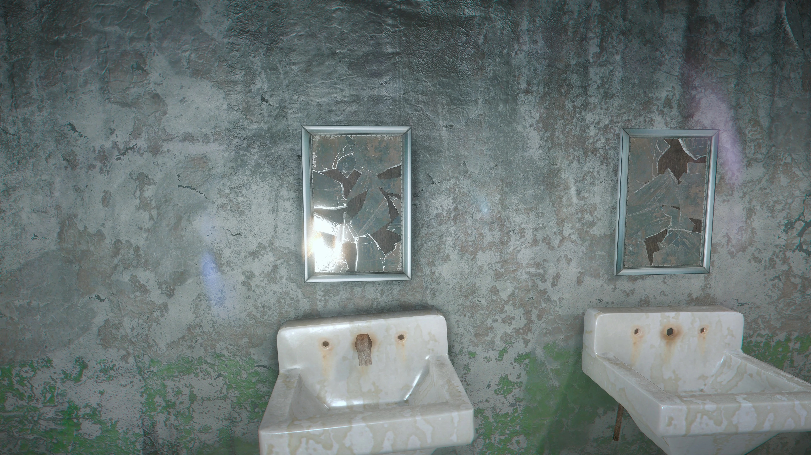

+++
title = "Pourquoi les miroirs des jeux récents sont-ils si moches ?"
date = 2024-05-08T15:00:00+01:00
draft = false
author = "Félix"
tags = ["XXL"]
type = "une"
image = "https://nostick.fr/articles/vignettes/miroir.png"
+++ 

Il y a peu j’ai terminé *Alan Wake 2*, et j’ai été étonné d’un truc : [les miroirs sont moches](https://www.youtube.com/watch?v=g6PYokvYpGw) sans pousser tous les potards à fond. Ce n’est pas vraiment une surprise et cela fait maintenant quelques années que c’est comme ça sur les gros jeux récents, mais pourquoi ? Mario 64 avait une grande salle des miroirs, *[Bully](https://www.youtube.com/watch?v=ldi6N4c6RNU)* en affichait des fonctionnels sur PS2 et on en trouvait encore [de jolis](https://www.youtube.com/watch?v=ldi6N4c6RNU) sur *Hitman 2*, pourtant sorti en 2018. 

Les développeurs ont plus d’un tour dans leur sac pour nous faire oublier que les miroirs ne fonctionnent pas. Glaces brisées, trop sales pour refléter quoi que ce soit, à « activer » à l’aide d’un bouton… Pourtant, il est toujours sympa de passer devant un miroir, surtout dans les FPS : c’est une des rare fois où l’on voit le personnage que l’on incarne. Les programmeurs sont-ils devenus feignants depuis 2010 ? C’est plus compliqué que ça.

Il y a un quart de siècle, il était assez simple de ruser : les « miroirs » n’étaient en fait qu’une reproduction à basse résolution de la pièce en face de lui. On faisait apparaitre une copie du personnage du joueur se déplaçant en même temps, et hop, le tour était joué. L’astuce a par exemple été utilisée dans *Mario 64*, dont vous pouvez voir les coulisses de la salle aux miroirs dans cette vidéo :

 

Cette méthode est devenue de plus en plus gourmande au fil du temps étant donné que les environnements se sont progressivement enrichis de multiples détails. Elle a donc fini par être abandonnée pour une autre astuce nommée « [Planar Reflections](https://docs.unrealengine.com/4.27/en-US/BuildingWorlds/LightingAndShadows/PlanarReflections/) ». Elle consiste en gros à intégrer une caméra virtuelle filmant la scène et la reproduisant de manière inversée sur une surface. Cela permet de gagner du temps, mais l’astuce reste gourmande et peu adaptée à la réflexion de grandes salles vu qu’il faut calculer deux fois la zone filmée. La résolution de l’image n’est pas toujours incroyable, ce qui a poussé les développeurs à trouver des pirouettes (assombrir la pièce, réduire la résolution…). C’est correct pour le miroir d’une petite salle de bain, mais cela ne va pas beaucoup plus loin.

Troisième astuce : les « [Cube maps](https://www.youtube.com/watch?v=xutvBtrG23A) ». En gros, 6 images sont prises de l’environnement du joueur pour créer un cube, un peu comme une [skybox](https://fr.wikipedia.org/wiki/Skybox_(jeu_vidéo)) reproduisant un environnement à 360°. Celles-ci sont statiques, et sont ensuite appliquées sur le miroir (ou la surface réfléchissante) en fonction de sa position. C’est un peu compliqué, mais pour résumer : le miroir ne cherche même pas à refléter quelque chose de réaliste et se contente d’afficher une version floue de la skybox.

.

La technique fait illusion dans une flaque d’eau ou sur le capot d’une voiture, et a l’avantage de ne pas demander beaucoup de ressources. Malheureusement, cela ne peut pas servir à grand chose pour un miroir étant donné que rien n’est dynamique ou précis. Cela peut d’ailleurs mener à certains petit couac dans les jeux open world mélangeants intérieurs et extérieurs, comme [ici](https://www.reddit.com/r/gaming/comments/38yfq8/nice_attention_to_detai_wait_a_minute_im_not_even/) dans The Witcher :

 

Une technique de réflexion pouvant éviter ce type de soucis est le Screen Space Reflections (SSR). Celle-ci se base sur ce qui est affiché à l’écran pour calculer les reflets, ce qui a l’avantage de ne pas demander beaucoup de ressources étant donné qu’il ne faut pas générer un contenu supplémentaire. Cela a comme principal désavantage de ne pas fonctionner avec les miroirs vu que la technologie ne prend pas en compte ce qui est derrière le joueur. Elle est souvent utilisée de concert avec les Cube maps vus précédemment, mais peut mener [à certains bugs](https://www.youtube.com/watch?v=w839gFiJjn4) de réflexion.

Si les miroirs ne sont pas terribles dans les jeux d’aujourd’hui, c’est donc parce que les anciennes ruses de Sioux ne sont plus utilisables tandis qu’il n’y a pas encore de « bonne » technique pour faire un miroir joli et peu gourmand. En l’état, les studios n’ont pas beaucoup de choix. Ils peuvent faire comme les développeurs d'*Hitman* et travailler à fond sur cette partie pour en faire une mécanique de gameplay, les miroirs étant ([presque](https://www.youtube.com/watch?v=B4gjiHrk2CY&t=517s)) réalistes et pouvant trahir l’agent 47 quand un PNJ le repère. Les autres peuvent se contenter de les utiliser dans de petites pièces en diffusant une vidéo de l’environnement de basse qualité, mais c’est un compromis parfois hasardeux qui demande un sacrifice côté performances. Il reste possible de ne pas s’embêter en cassant tous les miroirs, et tant pis pour l’immersion.

 

À l’avenir, les nouvelles technologies de gestion de lumière (ray-tracing/path-tracing) devraient permettre d’obtenir des miroirs corrects et sans aucune pirouette. Ces nouveautés simulent le rendu de la lumière de manière réaliste en lançant des rayons qui rebondissent sur les différentes surfaces, créant des reflets précis en temps réel. Cela peut fonctionner pour un miroir, et c’est d’ailleurs le cas dans *Alan Wake 2*. Cocher la case Path Tracing va « activer » les miroirs, qui reflètent alors la lumière et peuvent alors afficher des détails [assez dingues](https://youtu.be/tXfwvohROPA?si=WimZNQVC1aU2C3XY&t=554). Cependant, il faut une très bonne configuration pour en profiter. Si ce n’est pas demain la veille qu'on aura tous une 4090 dans notre salon, les miroirs devraient s’améliorer au fur et à mesure que la puissance matérielle augmente et que les développeurs adoptent le path-tracing.

 