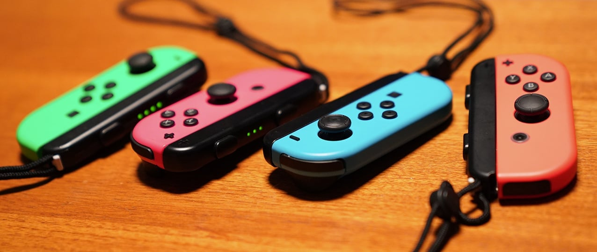
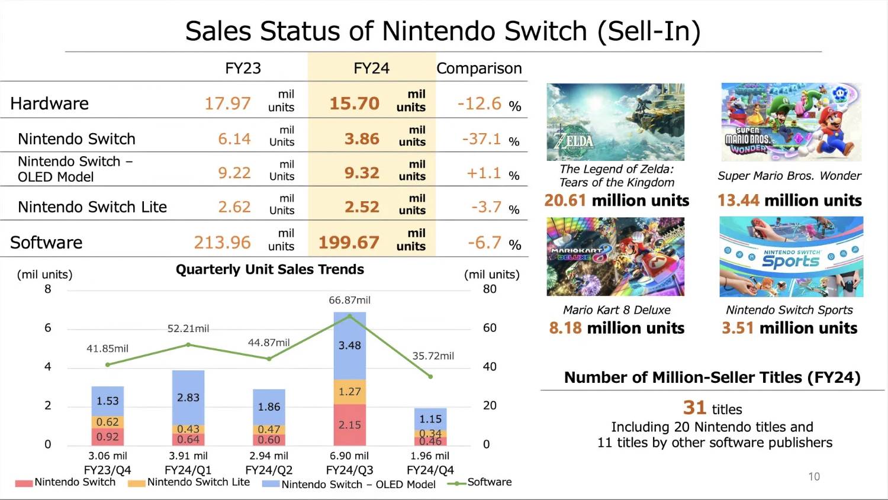

+++
title = "Switch 2, tout ce que l'on sait (ou croit savoir)"
date = 2024-05-09T08:00:32+01:00
draft = false
author = "Mickael"
tags = ["XXL"]
type = "une"
vignette = "https://nostick.fr/articles/vignettes/Switch1.jpg"
+++

")

**Nintendo présentera une nouvelle console avant avril 2025. Ce qui n'était qu'une rumeur a été confirmé par Shuntaro Furukawa, le président du groupe, dans un bête tweet. On ne va pas faire la fine bouche, car la déclaration met un terme à une attente qui devenait de plus en plus insupportable ! Reste à savoir ce qui se cache derrière…**

À quoi va ressembler la successeure de la Switch ? La console hybride aux 140 millions d'unités écoulées a bien vécu, depuis 7 ans qu'elle est sur le marché. Sans surprise, le [tweet](https://twitter.com/NintendoCoLtd/status/178773651876288119) de Shuntaro Furukawa a confirmé que Nintendo préparait activement la suite des opérations, et qu'une annonce allait être faite d'ici fin mars 2025. Il est donc temps de remettre à plat les rumeurs de ces derniers mois !

## D'abord, est-on est bien certain qu'il s'agira d'une « Switch 2 » ?

L'inattendu, voire le bizarre, est toujours certain avec Nintendo. Parfois cela fonctionne — même si le succès de la 3DS a été long à se mettre en place — et parfois pas du tout comme le démontre la Wii U. Néanmoins, avec sa prochaine console le constructeur n'aurait pas l'intention de se lancer dans une petite folie dont il a le secret.

Durant la conférence audio qui a suivi la présentation des derniers résultats financiers, le président Shuntaro Furukawa a [concédé](https://twitter.com/gibbogame/status/1787836562191135212) devant les analystes que la description la plus appropriée pour décrire la future console était « *un nouveau modèle de Switch* ». Bon sang ne saurait mentir.

Cette console serait donc bel et bien une « Switch 2 », avec tout l'héritage que cela implique et sur lequel on revient dans la prochaine question. 

## Est-ce que les accessoires seront compatibles ?

Qui dit Switch, implique un fonctionnement hybride qui est la marque de fabrique de la console depuis son lancement en 2017. Autrement dit, il sera possible d'y jouer aussi bien en mobilité que sur la télé, sans doute en la glissant dans un dock dédié.

La Switch 2 devrait non seulement reprendre l'idée directrice de la première génération, mais aussi s'inspirer pas mal de son design ! Les bons vieux Joy-Con seraient toujours de la partie, avec un système de maintien différent. Exit les rails de part et d'autre de la console, bonjour le magnétisme selon les [indiscrétions](https://vandal.elespanol.com/noticia/1350770848/exclusiva-switch-2-conocemos-en-primicia-nuevos-detalles-de-la-proxima-consola-de-nintendo/) du site *Vandal* !

Les contrôleurs seraient maintenus par des aimants, via une fixation électromagnétique pour s'assurer qu'ils restent bien en place (pas inutile entre les mains de ~~gamins~~ joueurs un peu excités). Est-ce à dire que les Joy-Con actuels ne pourront pas être utilisés avec la Switch 2 ? Cela reste à voir. La nouvelle console pourrait effectivement abandonner les rails, mais ça n'empêcherait pas d'utiliser les petites manettes pour jouer sur la Switch 2. Et il en irait de même pour le Pro Controller ; on croise les doigts pour la compatibilité des manettes rétro du Switch Online.

Les futurs Joy-Con embarqueraient aussi deux boutons métalliques supplémentaires SL et SR sur les côtés des manettes. Pour quel usage ? Mystère, mais Nintendo pourrait en faire un nouvel élément de gameplay pour les jeux de la Switch 2. Un troisième bouton serait aussi présent sous le bouton Accueil du Joy-Con de droite.

Si la console devrait conserver le design général de la Switch, ainsi qu'un port USB-C en dessous, ça ne veut pas dire que l'on pourra la placer sur un dock actuel. Le socle de la Switch 2 ressemblerait certes à son prédécesseur, mais d'une part la console risque d'être plus grande avec son écran de 8 pouces, ce qui impliquera sûrement un redesign du dock. Et d'autre part, le nouveau socle serait plus puissant, capable de diffuser de la 4K[^1].

## Les jeux Switch 1 seront-ils compatibles Switch 2 ?

Le mimétisme entre les deux consoles ne devrait pas s'arrêter là. La Switch 2 devrait ainsi prendre en charge les cartouches des jeux Switch, une rétrocompatibilité qui n'a toujours pas été confirmée mais qui semble de plus en plus probable au fur et à mesure que l'on s'approche de la présentation de l'appareil. Le fabricant d'accessoires Mobapad a tout récemment [craché](https://www.mobapad.com/blogs/the-latest-scoop-on-nintendo-switch-2/the-latest-scoop-on-nintendo-switch-2) le morceau sur la foi d'informations internes en sa possession.

Là aussi, ce ne serait pas si étonnant : tout comme les cartouches de jeux DS sont compatibles avec la 3DS, tout comme les disques GameCube sont pris en charge par la Wii, et tout comme les disques Wii fonctionnent sur la Wii U, les jeux de la Switch devraient donc bien rouler sur la Switch 2 — que ce soit les cartouches ou [les versions dématérialisées](https://www.youtube.com/watch?v=b1McW9Z9Cqo). En revanche et cela parait assez logique, les jeux Switch 2 ne seront pas compatibles avec la Switch 1. 

La Switch 2 devant être (nécessairement, a-t-on envie de dire) plus puissante que le précédent modèle, des jeux seraient bien avisés d'en profiter pour améliorer certaines faiblesses. Et oui, je parle des derniers jeux Pokémon en particulier qui sont des catastrophes techniques et graphiques. Les éditeurs en profiteront-ils pour vendre des patchs ? Même si une telle proposition risque de ne pas être très bien accueillie, ça n'a rien d'impossible. Et franchement, pouvoir jouer à *Tears of the Kingdom* en 1080p et 60 i/s dans le métro, ça vaudra probablement les 10 ou 20 € que Nintendo pourrait réclamer…

Par ailleurs, Nintendo n'a visiblement pas envie de forcer la centaine de millions de joueurs Switch à repartir de zéro. En juin dernier, Shuntaro Furukawa avait [expliqué](https://www.nintendolife.com/news/2023/06/shuntaro-furukawa-switch-successor-will-utilise-the-nintendo-account-system) que la successeure de la Switch utiliserait le « système » des comptes Nintendo : « *En ce qui concerne la transition de la Nintendo Switch vers la machine de nouvelle génération, nous voulons faire tout notre possible pour permettre une transition en douceur pour nos clients, tout en utilisant le compte Nintendo* ». Une pierre de plus sur la route qui nous mènera à la rétrocompatibilité…

## Bon tout ça c'est bien gentil, mais qu'est-ce qu'elle aura dans le ventre la Switch 2 ?

Des années de rumeurs ont permis de brosser la fiche technique — partielle et à prendre avec des pincettes — de la Switch 2. On croit ainsi savoir que la tablette [aura](https://www.bnnbloomberg.ca/nintendo-s-next-switch-coming-this-year-with-lcd-omdia-says-1.2026798) un écran de 8 pouces d'une définition 1080p. À comparer avec la diagonale de 7 pouces 720p de la Switch OLED (6,2 pouces pour la Switch de base). 

Il est malheureusement possible que cette nouvelle console se [contente](https://www.videogameschronicle.com/news/sources-nintendo-switch-2-targets-2024-with-next-gen-console/) d'une dalle LCD au lieu de l'OLED pour des questions de coût de fabrication. Nintendo voudra sûrement, dans un deuxième temps, commercialiser un modèle OLED plus onéreux, mais il faudra réapprendre à vivre avec le LCD pendant un moment.

Sous le capot, Nintendo ferait de nouveau appel à Nvidia. Le système-sur-puce au cœur de la Switch 2, baptisée T239, serait équipé d'un processeur comptant 8 cœurs ARM A78C, une unité graphique basée sur l'architecture Ampere des cartes RTX 30, combinée à des éléments de GPU Ada Lovelace. La T239 serait une version custom, plus petite et moins puissante, de la T234 commercialisée par Nvidia auprès des marchés de la robotique et de l'automobile.

Bobby Kotick, l'ex-boss d'Activision, avait évoqué une puissance au même niveau que la PS4 ou que la Xbox One pour la Switch 2, pendant le procès entre Microsoft et la FTC l'an dernier. Dans les faits, la future console pourrait aller encore plus loin grâce à sa conception plus moderne, ne serait-ce que par l'utilisation de mémoire plus rapide.

 

Une des grosses questions qui se pose, c'est celle du DLSS (Deep Learning Super Sampling), une technologie Nvidia qui améliore la qualité graphique en augmentant la résolution d'image ; les trous sont « comblés » par l'IA. On sent bien que cet upscale pourrait jouer un rôle important dans la Switch 2 : la console afficherait ainsi un 1080p convaincant à partir d'un 720p natif, sans tirer trop fort sur la batterie et avec un framerate honnête. Et ça ne serait pas inutile non plus pour afficher de la 4K sur la télé, à partir d'un 1080p natif, voire d'un 720p. Après tout, on n'exigera pas de la Switch 2 des capacités dignes d'une PS5.

Il reste encore bien des questions en suspens, comme le stockage : la Switch 2 sera mieux dotée de ce côté, mais ça ne vaut pas dire grand chose. La Switch OLED embarque certes le double de la Switch 1, mais ça ne fait toujours que 64 Go en tout. C'est bien simple, une telle pingrerie ne se retrouve que  chez Apple ! 

Outre Nvidia, qui n'a pas vraiment besoin de Nintendo pour s'en mettre plein les poches, l'autre gagnant de la Switch 2 [pourrait](https://m.mk.co.kr/news/business/10999380) bien être Samsung. Le constructeur, qui est aussi un des plus grands fournisseurs de composants électroniques au monde, s'occuperait de livrer les écrans LCD et la mémoire de stockage V-NAND de la machine (et aussi des cartouches). La production de la puce T239 serait aussi à sa charge, même si une autre rumeur [annonçait](https://www.reddit.com/r/GamingLeaksAndRumours/comments/16jzupb/rumored_switch_2_t239_chip_is_rumored_to_be_in/) que TSMC était sur les rangs.

## Pourquoi c'est si long bon sang de bois ?

La longévité remarquable de la Switch pèse de plus en plus sur les joueurs qui doivent se coltiner des graphismes et des performances dignes d'un smartphone de 2017. Mais la situation n'est guère enviable non plus pour les développeurs, d'ailleurs on voit bien que les jeux sortis dernièrement, d'*Another Crab's Treasure* à *Grounded*, souffrent de problèmes de performance.

Même Nintendo a du mal avec ses jeux *first party*, en témoigne  [les ralentissements dans *Princess Peach Showtime*](https://nostick.fr/articles/2024/mars/peach/) qui n'a pourtant pas l'air d'être le titre le plus exigeant. Autant dire qu'il est plus que temps pour le constructeur de lancer une console plus puissante. 

Mais voilà, Nintendo ne sent pas cette pression. Malgré son grand âge, la Switch continue de se vendre : 15,7 millions d'unités durant le dernier exercice fiscal 2024. C'est certes 12,6 % de moins que l'année précédente, mais tout de même.

Contrairement à la période de la Wii U où il a fallu lancer rapidement la Switch en raison des ventes abyssales de la console, Nintendo peut prendre son temps. Les jeux s'écoulent toujours bien, même si là aussi les ventes piquent du nez (-6,7 % par rapport à 2023). Bref, le constructeur a le luxe de continuer à vivre sur la bête pour peaufiner le line-up de la Switch 2.

Ce lancement tardif devrait aussi permettre à Nintendo de faire marcher à pleine turbine ses lignes de production, afin de [couper l'herbe](https://www.nikkei.com/article/DGXZQOUF196OV0Z10C24A2000000/) sous le pied des scalpers. Ils avaient été à la fête lors du lancement en 2017 de la Switch première génération, très difficile à trouver dans le commerce (ça avait été aussi le cas au plus fort de la pandémie).

Personne n'ira se plaindre que Nintendo mette la misère aux escrocs, ni que les jeux de qualité soient au rendez-vous pour le lancement. En revanche, c'est vrai que la dernière année de la Switch s'annonce assez plat. Le Direct de juin donnera à  Nintendo l'occasion de dévoiler de nouveaux jeux pour les prochains mois. Encore plus de remakes au menu ? À moins que la boîte nous sorte enfin la carte *Metroid Prime 4* !

Shuntaro Furukawa a annoncé que Nintendo allait présenter la nouvelle console avant la fin de cette année fiscale, qui s'achèvera le 31 mars 2025. Le constructeur pourrait attendre le bout du bout avant de lever le voile sur l'appareil… Ce qui ne veut pas nécessairement dire qu'elle sera disponible dans le commerce dès le printemps prochain ! Patience et longueur de temps…

[^1]: Techniquement, le dock de la Switch OLED a [tout ce qu'il faut](https://www.videogameschronicle.com/news/more-evidence-suggests-switch-oleds-dock-can-support-4k/) pour diffuser de la 4K HDR à 60 FPS, mais sans la capacité d'upscale 1080p vers 4K. Malheureusement, la console en elle-même n'a pas la puissance suffisante pour cet upscale… La présence dans le dock des composants indispensables au support de la 4K peut laisser penser qu'à un moment donné, Nintendo envisageait de lancer une Switch capable d'améliorer et d'agrandir une image malgré une résolution inférieure — l'hypothétique Switch Pro qu'aurait dû être la Switch OLED ?

 