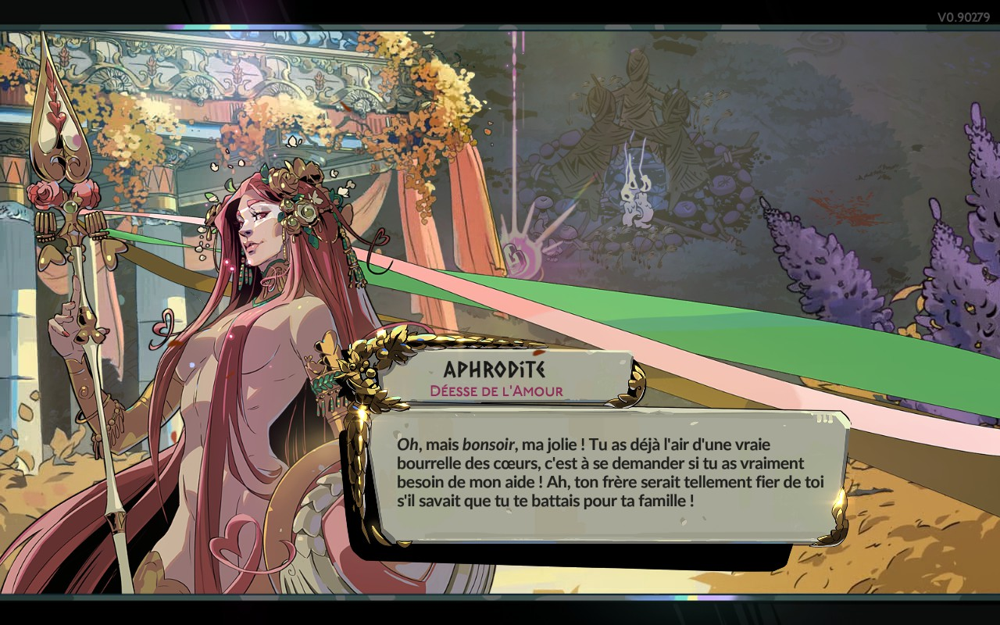

+++
title = "Aperçu de Hades II, à la fois divin et diabolique"
date = 2024-05-10T11:45:00+01:00
draft = false
author = "Mickael"
tags = ["Test"]
type = "une"
image = "https://nostick.fr/articles/vignettes/HadesII.jpg"
+++

**Grosse pression sur les épaules de Supergiant Games. Après le carton de *Hades* premier du nom qui a tout emporté sur son passage en 2020, le studio se devait de frapper un grand coup pour la suite. Et le pari est bien parti pour être gagné.**

C'est à la faveur d'un lundi anonyme du mois de mai que Supergiant a lâché sa bombe : *Hades II* en accès anticipé sur Steam et l'Epic Games Store ! Le jeu, vendu 29 €, n'est pas complet et des bugs peuvent faire leur apparition. Mais cette bêta va permettre aux développeurs de peaufiner la version finale grâce aux retours des joueurs, comme cela avait été le cas pour le premier *Hades*.

Le jeu restera en accès anticipé jusqu'au début de l'année prochaine, mais des mises à jour seront livrées ces prochains mois pour muscler davantage le titre. En l'état, *Hades II* est plus qu'une bêta : c'est une démonstration de savoir faire qui va faire date !

## Hades II, ça parle de quoi ?

Tuer le temps, c'est très littéralement ce que *Hades II* attend de vous. Dans la peau de Melinoé, la princesse des Enfers, le joueur est chargé de trouver Cronos, le Titan du Temps, pour lui mettre la misère. Mais c'est plus facile à dire qu'à faire : il faudra nettoyer les Enfers, encore et encore, mourir encore et encore, et repartir à l'assaut, encore et encore !

*Hades II* est un roguelite en vue isométrique, tout comme le premier opus. Basiquement, il faut tailler sa route à travers des mondes de plus en plus dangereux, remplis d'ennemis aux techniques toujours plus retorses. Fort heureusement, Melinoé a du répondant comme on le verra ci-dessous !

Dans un roguelite, on remet constamment son ouvrage sur le métier. Vous allez mourir, ah ça oui, mais aussi repartir au combat à chaque fois un peu mieux armé. Au fil du jeu, Melinoé va acquérir des compétences permanentes qui va la rendre plus forte et plus aguerrie (et le jeu n'est pas avare en mécanismes de renforcement !) ; elle pourra également déverrouiller de nouvelles armes qui modifieront la manière de se battre. Chacune a ses forces et ses faiblesses.

Et c'est sans compter les bienfaits divins qui améliorent — temporairement, cette fois — les différentes capacités de l'héroïne durant les runs. À l'image du premier opus, *Hades II* est aussi un jeu dans lequel on lit beaucoup, car l'histoire et les personnages sont riches et variés. Et l'humour est omniprésent dans les dialogues, ce serait dommage de vouloir aller trop vite…

## Comment ça se joue ?

Melinoé, qui se trouve être la fille d'Hadès et la sœur cadette de Zagreus (le héros du premier volet), est une sorcière davantage portée sur la magie que sur la baston pure et dure. Ce qui ne l'empêche pas d'exploiter à merveille des armes de mêlée,  mais elle possède dans sa besace d'autres atouts. Le plus gros changement apporté par *Hades II* est la barre de mana qui donne à chacune des armes une possibilité supplémentaire de faire très mal.

Chaque bouton d'attaque peut être maintenu pour remplir la jauge Omega, qui provoque alors un coup spécial dévastateur… mais gare à la gestion du mana ! Si l'envie ne manque pas de balancer sans cesse des super coups, il faut aussi avoir en tête que le laps de temps nécessaire à leur charge vous rend vulnérable. Faire le plein de mana en cours de jeu n'est pas si facile (c'est le cas aussi de la jauge de cœur). C'est donc un équilibre subtil qu'il faut trouver, généralement en plein cœur de l'action.

En plus des armes et des techniques, Melinoé dispose aussi de glyphes, une sorte de défense de zone dans laquelle les ennemis subissent des dommages ou évoluent au ralenti. Là aussi, il est possible d'améliorer l'existant en puisant dans du mana. À l'instar de son frangin, elle peut aussi réaliser des dashs pour se sortir de situation périlleuse, mais sans pouvoir y apporter d'amélioration avec le temps (du moins je ne suis pas encore tombé dessus) contrairement au premier Hades.

*Hades II* est toujours, bien sûr, un jeu d'action, pas de doute là dessus ! Mais par rapport à son prédécesseur, le mana et ses différents effets confèrent au titre un petit côté stratégique pas désagréable. C'est en tout cas une couche supplémentaire qui enrichit le gameplay.

## Qu’est-ce qui est bien ?

Graphiquement, le jeu est une vraie réussite. Si le premier volet était un régal pour les yeux, la suite est du cheesecake. Aussi bien dans les niveaux en eux-mêmes — et les couleurs pètent sur le Steam Deck OLED — que durant les phases de dialogue. La direction artistique s'améliore encore, avec des dieux et des personnages superbement dessinés (vous pouvez voir quelques échantillons dans cet article) et doublés — uniquement en anglais, mais avec des sous-titres en français.

*Hades II* est le genre de jeu qui pousse à faire une dernière petite partie. C'est encore plus vrai qu'on ne sait jamais sur quel bienfait on va tomber au début de chaque run et cela aura une influence sur votre manière de jouer. Bien sûr, au fil de la partie différents dieux vont venir vous donner des coups de main en améliorant telle ou telle capacité. À la fin du run, Melinoé se transformera en véritable tank à la puissance de feu phénoménale ! Mais les ennemis ne seront pas en reste. 

Supergiant a aussi truffé le jeu de rebondissements pour surprendre le joueur et éviter une monotonie qui est un peu le propre du genre. Et puis la Croisée des chemins, autrement dit votre repaire, est bourré d'activités permettant d'améliorer ses armes et sa technique.

## Qu’est-ce qui est moins bien ?

Évidemment, il ne faut pas être allergique à la formule du roguelite, qui par nature force le joueur à recommencer au début. Même si le développeur multiplie les surprises, à tel point qu'un run n'est jamais le même que le précédent, au bout du compte il faut à chaque fois se remotiver pour repasser par les mêmes endroits, retrouver les mêmes boss… Mais c'est le genre qui veut ça, et puis Supergiant fait tout ce qui est en son pouvoir pour rendre chaque run original.

À partir du troisième monde, les niveaux s'agrandissent au point se donner des petits airs « open-world ». Je ne sais pas si c'est une bonne idée ou pas, dans mes runs j'ai surtout trouvé que ces niveaux étaient un peu vides et longs à parcourir. Néanmoins, ils s'accompagnent d'ennemis plus complexes dont les attaques nécessitent plus de place que dans les petits niveaux des premiers mondes.

Autre souci (mineur, je chipote), le jeu est bourré d'icônes en tout genre pour caractériser les nombreux consommables et bienfaits. Bon, on s'y fait au bout d'un moment, mais c'est vrai qu'une description via une info-bulle ou quoi ne serait pas une mauvaise idée.

## C’est oui ou c’est non ?

La version finale de *Hades II* ne sortira peut-être qu'en 2025, mais d'ores et déjà la version en accès anticipé est très propre, adapté aussi bien aux PC traditionnels qu'au Steam Deck, et je n'ai pas vu de gros bugs gênants. Les différents mécanismes d'amélioration sont simples à comprendre et faciles à utiliser, et le titre prend habilement le joueur par la main tout en le poussant à tester les nouveaux systèmes.

En termes de contenus, le jeu semble ne jamais vouloir s'arrêter, et Supergiant en a gardé sous la pédale ! Attendez-vous à griller plusieurs dizaines d'heures… L'action a ce côté « un dernier pour la route » qui emporte jusqu'au bout de la nuit. 

 

Indéniablement et très logiquement, *Hades II* est la suite directe de *Hades*, et tous ceux qui ont joué au premier opus retrouveront des sensations très proches. Malgré tout, ce nouvel épisode n'est pas un DLC : il va plus loin avec des systèmes renouvelés et une action plus stratégique et plus riche, sans oublier — et c'était une gageure — de faire encore plus beau !

Difficile de donner un avis définitif alors qu'il s'agit d'une version bêta, mais *Hades II* s'annonce d'ores et déjà comme une  suite capable de faire mieux que son prédécesseur, et ça n'est pas un mince exploit.

*Jeu testé sur mon PC de gamerz et sur Steam Deck*