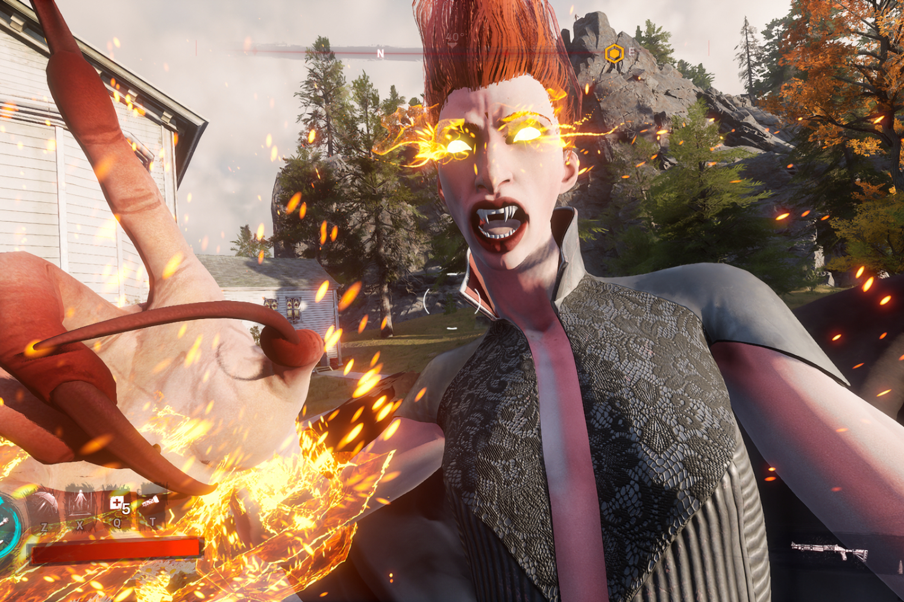

+++
title = "Enthousiaste, iconoclaste, un peu néfaste : la folle semaine du jeu vidéo (11/05)"
date = 2024-05-11T10:47:32+01:00
draft = false
author = "Mickael"
tags = ["Actu"]
+++

L’actualité du jeu vidéo ne s’arrête pas à la poignée d’articles publiés sur *Nostick* ! Histoire de rattraper le retard accumulé, voici un retour rapide sur quelques unes des infos les plus importantes (ou insignifiantes) de la semaine.

## Jouer à Redfall sans connexion, ça n'arrivera pas du coup

Sony a bien failli passer pour le méchant de la semaine, suite [au pataquès de la connexion obligatoire au PSN pour *Helldivers 2*](https://nostick.fr/articles/2024/mai/0505-sony-fait-plonger-helldivers-2-en-enfer/). Mais c'est finalement Microsoft qui a brillamment repris le flambeau avec [l'annonce de la fermeture de plusieurs studios de Bethesda](https://nostick.fr/articles/2024/mai/0705-fin-de-partie-pour-arkane-austin-et-tango-gameworks/), dont Tango Gameworks (*Ghostwire*, *Hi-Fi Rush*) et Arkane Austin (*Prey*, *Redfall*).

Des tas de choses sont incompréhensibles dans ce coup de hache, comme par exemple faire fermer le seul studio japonais détenu par Xbox, malgré les promesses de l'entreprise qui a promis monts et merveilles pour ce marché historiquement très difficile. Mais arrêtons-nous plutôt sur Arkane, qui travaillait d'arrache-pied à l'amélioration de *Redfall*. 

Le jeu est sorti il y a un an, dans un état lamentable. Les mises à jour se sont succédé, dont une apportant le support du 60 FPS. Ce n'était toujours pas la joie et on sentait que le chemin de la rédemption était encore très long, mais enfin le studio y mettait visiblement du cœur.

L'annonce de la fermeture est tombée alors que les développeurs d'Arkane mettaient la touche finale au mode hors connexion de *Redfall*. Réclamé depuis le lancement du jeu, cette option aurait dû être finalement proposée dans le courant du mois, selon *[IGN](https://www.ign.com/articles/arkane-austin-redfall-update-closure-xbox)*. Mais à moins d'une surprise de dernière minute — qui serait d'un goût douteux de la part de Microsoft —, *Redfall* continuera d'exiger une connexion au web pour sa campagne solo. Jusqu'à l'arrêt des serveurs ?

## Le projet Kestrel de Remedy tombe à l'eau

Il n'y aura pas de projet *Kestrel* chez Remedy ! Ce mystérieux titre en développement avec le géant chinois Tencent a en effet été [abandonné](https://investors.remedygames.com/announcements/remedy-entertainment-plc-codename-kestrel-cancelled-as-remedy-focuses-on-existing-franchises/). « *Codename Kestrel montrait des promesses dès le début, mais le projet en était encore à ses premiers stades conceptuels* », explique Tero Virtala, le patron du studio à qui l'on doit *Alan Wake II*. On n'en saura guère plus sur ce jeu dont le développement avait déjà subi un reboot en novembre dernier (il s'appelait alors projet *Vanguard*).

À l'origine, le concept tournait autour d'un jeu free to play, qui s'est transformé en jeu premium « *avec une forte composante multijoueur en coop* ». Pour faire des économies, Kestrel devait réutiliser des assets, des fonctions et des thèmes déjà développés par Remedy. Mais ça n'a visiblement pas suffi et les deux partenaires ont décidé de lâcher l'affaire. 

Cet abandon en rase campagne ne change rien au fait que Tencent a [pris](https://investors.remedygames.com/announcements/remedy-entertainment-plc-tencent-holdings-limiteds-shareholding-in-remedy-has-gone-above-the-10-percent-threshold/) du poids au capital du studio finlandais : depuis fin avril, il pèse désormais près de 15 %, soit 3 fois plus qu'auparavant. Les développeurs attachés à *Codename Kestrel* vont travailler sur les autres projets de Remedy, et il y en a quelques uns au four : les remakes de *Max Payne* 1 et 2, la suite de *Control* et un spin-off, le projet *Condor*, qui sera un jeu multi.

## The Rogue Prince of Persia laisse passer la tornade Hades II

Dur de passer après *Hades II* ! Le roguelite de Supergiant a été lancé cette semaine, à la surprise générale, sous la forme d'un accès anticipé sur Steam et la boutique d'Epic. Et évidemment, ce qui devait arriver arriva : non seulement [le jeu est excellent](https://nostick.fr/articles/2024/mai/1005-hades-ii-divin-et-diabolique/), mais surtout c'est un très gros carton. À tel point qu'il risquait de faire de l'ombre à un autre roguelite très attendu, *The Rogue Prince of Persia*.



Pour se donner une petite chance de réussir, le studio Evil Empire a décidé de repousser le lancement de leur jeu de quelques jours. La version en accès anticipé devait en effet sortir le 14 mai, mais voilà : vu que tout le monde joue à *Hades II* (y compris les développeurs de *The Rogue Prince of Persia* !), l'équipe a décidé de laisser un peu de temps aux joueurs avant de proposer leur titre.

« *Ce n'est pas tous les jours qu'un jeu du même genre que le nôtre, et l'un des jeux les plus attendus de 2024, soit lancé en accès anticipé une semaine avant notre propre sortie* », [explique](https://twitter.com/Studio_Evil/status/1788886708064317943) Evil Empire. Pas de panique pour autant : *The Rogue Prince of Persia* sera bien disponible dans le courant du mois de mai.

## La boutique Xbox mobile ouvrira cet été

L'an dernier, Microsoft faisait un chèque de 69 milliards de dollars pour s'offrir Activision Blizzard… et aussi, on l'oublie parfois, King. On parle beaucoup de l'avenir de *Call of Duty* et des autres franchises AAA du studio, mais ce qui intéresse beaucoup — et peut-être même plus — Microsoft, c'est le marché mobile ultra populaire, où Xbox est quasiment absent.

Au travers de cette acquisition maousse costaud, l'éditeur de Windows est en effet devenu propriétaire de *Candy Crush*, de *Call of Duty Mobile* et d'un tas d'autres jeux pour smartphones. Et il va falloir les rentabiliser ! Cela passera par une nouvelle boutique mobile qui prendra la forme d'un site web, a [annoncé](https://www.bloomberg.com/news/articles/2024-05-09/microsoft-to-launch-mobile-game-store-vying-with-apple-google) Sarah Bond, la présidente de Xbox.

Sur ce site web, les joueurs ne pourront peut-être pas télécharger leurs jeux préférés (ce n'est pas très clair), en revanche ils auront la possibilité de claquer leurs sous dans des consommables pour les titres mobiles de Microsoft. Des gemmes et autres babioles vendues moins cher que sur l'App Store ou le Play Store, et pour cause : elles ne seront pas soumises aux commissions d'Apple et de Google, qui prennent 30 % sur les achats intégrés dans leurs boutiques.

Reste à voir comment les objets achetés dans l'échoppe web de Xbox pourront être consommés dans les jeux téléchargés sur les stores officiels. Il faudra peut-être s'y connecter avec un compte. Quoi qu'il en soit, cette boutique en ligne ouvrira ses portes au mois de juillet, partout dans le monde.

## Ghost of Tsushima privé des mêmes territoires que Helldivers 2

Si Sony adapte ses blockbusters PlayStation sur PC, c'est parce que le marché de la console de salon est finalement assez restreint, trop en tout cas pour rentabiliser des jeux AAA aux budgets toujours plus imposants. Il faut donc aller chercher les joueurs là où ils sont et, qu'on l'apprécie ou pas, beaucoup d'entre eux jouent sur des PC ! Aucun joueur PC n'ira se plaindre de trouver des hits comme *God of War*, *Horizon* ou *Helldivers 2* pour leur machine, alors comme on dit dans les écoles de commerce, c'est gagnant-gagnant.

Mais Sony a une forte tête et d'étranges pratiques commerciales.  Il a fallu que toute la communauté de *Helldivers 2* se dresse comme un seul homme pour que [l'entreprise abandonne la connexion obligatoire entre un compte Steam et un compte PSN](https://nostick.fr/articles/2024/mai/0505-sony-fait-plonger-helldivers-2-en-enfer/). Avant de lâcher prise, Sony (ou Steam ?) a retiré le jeu de la vente dans les 177 pays et territoires où il est impossible de créer un compte PSN.

Beaucoup espéraient que le TPS coop allait revenir partout dans le monde, mais en fait pas du tout. Plusieurs pays des Baltiques ont même été [ajoutés](https://twitter.com/SteamDB/status/1788981898108182681) à la liste… et maintenant *Ghost of Tsushima* n'est plus proposé dans ces mêmes [territoires](https://steamdb.info/sub/962153/info/) ! Après la cagade *Helldivers 2*, il a pourtant été confirmé que le jeu développé par Sucker Punch n'aurait pas besoin d'un compte PSN pour la campagne solo — en revanche, il en faudra un pour le mode multi Legends.

Il y a donc tout lieu de craindre que *Ghost* fera l'impasse sur  de nombreux joueurs, dont plusieurs territoires français comme Mayotte, la Guadeloupe ou encore la Guyane. Le jeu sera disponible le 16 mai.