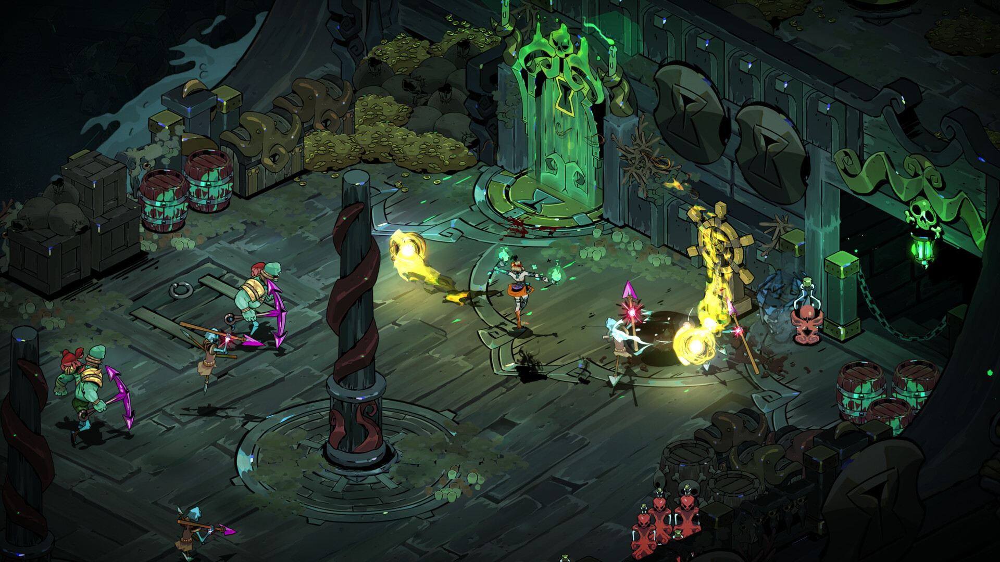
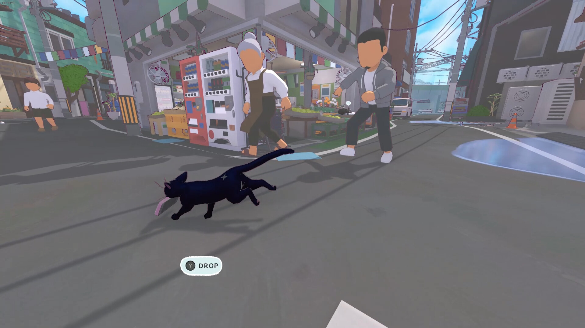

+++
title = "Les sorties de la semaine (12/05)"
date = 2024-05-12T07:15:00+01:00
draft = false
author = "Félix"
tags = ["C’est dispo"]
image = "https://nostick.fr/articles/2024/mai/120524-sorties-de-la-semaine/hades.jpg"
+++ 

*Entre le boulot, les courses et ce week-end de cinq jours qui n’en finit plus, vous n’avez peut-être pas eu le temps de vous intéresser aux nouveautés du moment. Qu’à cela ne tienne : voici les sorties de ces derniers jours qui ont retenu notre attention.*

## Rogue dur à mettre entre toutes les mains

La grosse surprise de la semaine était évidemment la sortie en accès anticipé de *Hades 2*, *shadow-droppé* sans autre forme de procès lundi dernier. Et comme vous le savez puisque vous avez lu [l’excellent test de Mickael](https://nostick.fr/articles/2024/mai/1005-hades-ii-divin-et-diabolique/), c’est de la bonne : comme le premier en mieux et en plus généreux. On ne change pas une équipe qui gagne et la formule reste la même, mais a été peaufinée avec l’apparition d’une barre de mana ou de certains niveaux plus grands. Si le jeu restera en accès anticipé jusqu’au début de l’année prochaine, il fait déjà un carton avec un pic de plus de 100 000 joueurs en simultanés : vous pouvez passer à la caisse sans crainte. Rappelons si ça vous intrigue mais que vous ne voulez pas lourder [les 29 boules demandées](https://store.steampowered.com/app/1145350/Hades_II/) (ou que vous attendez la version finale) que le premier est [dispo sur iOS](https://apps.apple.com/fr/app/hades-netflix/id6450063142) gratuitement pour les abonnés Netflix ou [à seulement 8 €](https://store.steampowered.com/app/1145360/Hades/) jusqu’à ce soir sur Steam.

## Petit chat, grosse poilade

*Stray* a laissé un grand vide dans votre petit cœur d’amoureux des chats ? Vous aimeriez adopter un matou mais n’avez pas la place dans votre T1 merdique de banlieue ? Bonne nouvelle : *Little Kitty, Big City* est sorti cette semaine et ça a l’air plutôt sympa. Le jeu propose d’incarner un chat dans une petite ville japonaise en monde ouvert, lâché avec pour seule mission de retrouver le chemin de la maison. S’il est possible de plier le jeu en quelques heures en fonçant en ligne droite, il y a apparemment tout un tas de petites missions secondaires impliquant d’aider des animaux (tanuki, Shiba Inu…) et de chapeaux à débloquer. Ça a l’air un peut léger dit comme ça, mais les retours sont tous unanimes et le jeu affiche des avis « très positifs » sur Steam. Sans doute pas le GOTY, mais si vous cherchez un jeu d’exploration relax avec un chat, eh bien pourquoi pas. Notons tout de même que c’est facturé 25 € [sur Steam](https://store.steampowered.com/app/1177980/Little_Kitty_Big_City/) et consoles (même Switch). À mon avis la surprise sera encore meilleure à 10 balles en promo dans quelques mois, mais vous faites bien ce que vous voulez, par contre il ne faudra pas venir piouner la semaine prochaine que vous n’avez plus un rond pour *Homeworld 3* ou *Rogue Prince of Persia*.

## À fond les ballons sur l’autoroute du fun ?

*‌Heading Out* est sorti cette semaine. Si ce nom vous dit quelque chose, c’est peut-être parce que j’avais fait un petit article dessus [au mois de mars](https://nostick.fr/articles/2024/mars/headingout/) (et que vous lisez tous mes articles avec ferveur et attention, je vous connais). Bref, *Heading Out* est un jeu de bagnole qui comporte également des éléments de visual novel et de rogue like. Ce curieux mélange est plutôt réussi d’après les quelques tests que j’ai lu, même si certains regrettent que ça ne soit pas un jeu 100 % conduite mais plutôt un concept indé narratif mettant l’accent sur l’histoire. Dans l’idée on alterne entre de petites séquences de courses poursuites avec des moments de gestions de ressources pour choisir son chemin. Cette pérégrination vers l'Ouest américain est l’occasion de rencontrer tout un tas de personnages et de faire face à des situations inattendues. Les graphismes sont très stylisés et la bande son soignée, mais ne vous attendez pas à un clone de *Driver* ou de *GTA*. 20 balles [sur Steam](https://store.steampowered.com/app/1640630/Heading_Out/).

 

## Puits sans fond

Une autre sensation de cette semaine a été *Animal Well*, un metroidvania blindé de puzzles entièrement réalisé par un seul mec qui a autant créé les musiques que le moteur graphique. Il va s’agir d’explorer un splendide monde en pixel-art composé de caves remplies d’animaux étranges. Ça a l’air assez particulier avec des énigmes alambiquées et surtout une énorme couche de secrets à découvrir en prenant des notes, des captures d’écrans et en relançant le jeu après le générique de fin. Les premiers tests sont tous très, *très* positifs avec un score de 91 sur Metacritic, donc si le trailer vous intrigue vous pouvez foncer. Attention tout de même, car il faut aimer les jeux où il faut fouiner partout et avancer à tâtons : ça ne sera peut-être pas pour tout le monde. Dispo sur [Steam](https://store.steampowered.com/app/813230/ANIMAL_WELL/), Switch et PS5 pour 24,50 €.

 

## Un peu de rab

Si avec tous ces chouettes jeux il vous reste un peu de temps à tuer (comment faites-vous ?), vous avez de la chance : il y a eu quelques autres sorties sympas cette semaine. Citons par exemple ***Pac-Man Mega Tunnel Battle : Chomp Champs***, le Pac-Man batte-royale initialement paru sur Stadia et désormais dispo sur Steam [pour 20 balles](https://store.steampowered.com/app/2095950/PACMAN_Mega_Tunnel_Battle_Chomp_Champs/). Le studio Bungie, qui a fait des trucs avant *Halo* et *Destiny*, a publié le premier jeu de sa trilogie ***Marathon*** (1994) sur Steam et promis que les deux autres arriveraient par la suite (on peut déjà les télécharger [là](https://alephone.lhowon.org/)). Notons pour terminer que le DLC *Contra* pour Vampire Survivors est dispo sur toutes les plateformes où le jeu est proposé, même sur mobile à 2,50 €.
