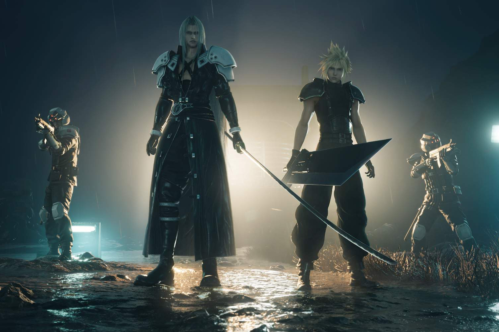

+++
title = "Square Enix plante un clou dans le cercueil des exclusivités"
date = 2024-05-13T10:47:32+01:00
draft = false
author = "Mickael"
tags = ["Actu"]
image = "https://nostick.fr/articles/2024/mai/1305-square-enix-plante-un-clou-dans-le-cercueil-des-exclusivites/FF7.jpg"
+++

Square Enix a vu la lumière. Le temps des exclusivités PlayStation semble bel et bien terminé ! L'éditeur a [établi](https://www.hd.square-enix.com/eng/ir/pdf/20240513_01_en.pdf) une « *stratégie multiplateforme agressive* », autrement dit : les futurs jeux Squeenix vont sortir pour toutes les plateformes, de la Switch ([et sa successeure](https://nostick.fr/articles/2024/mai/0905-switch-2-tout-ce-que-lon-sait/)) en passant par Xbox, PlayStation et le PC !

Mise en face des mauvais résultats enregistrés ces derniers temps (les bénéfices ont chuté de 70 % en un an), l'entreprise japonaise a décidé d'un « *reboot* » et d'un « *réveil* ». Il s'agit d'un plan en trois ans pour relancer la croissance sur le long terme, et parmi les quatre « piliers » on trouve le projet de créer un « *environnement où davantage de clients peuvent apprécier nos titres* ».

Square Enix ne donne aucun coupable, mais la déception commerciale de *Final Fantasy 7 Rebirth* a sans doute joué un grand rôle dans ce pivot. Malgré ses points forts (et il y en a quelques uns), le titre aurait connu un lancement plutôt mou. Le fait qu'il ne soit disponible que sur PS5 n'a probablement pas aidé…

Ce plan annonce-t-il la fin des exclusivités chez Square Enix ? Rien n'est moins sûr, car il doit sans doute rester quelques contrats à respecter (on songe au troisième et dernier volet du remake de *FF7*). En tout cas, les joueurs peuvent se réjouir : à terme, peu importe leur plateforme de prédilection, ils auront leur comptant de *Final Fantasy* !

Ce changement de stratégie pourrait également impliquer la sortie d'anciens titres du catalogue sur de nouvelles plateformes (et pour le coup ce sont les joueurs Xbox qui vont être contents). L'éditeur veut aussi se focaliser sur la qualité, plutôt que la quantité. La liste des jeux sortis rien que ces deux dernières années donne le tournis : qui se rappelle de *Forspoken*, *Paranormasight: The Seven Mysteries of Honjo*, *Valkyrie Elysium*, *The Diofield Chronicle*, *Voice of Cards: The Beasts of Burden*… ?

Bien sûr, Square Enix ne veut pas se réduire à *Final Fantasy* et *Dragon Quest*, et il est salutaire (et vital même) de lancer des nouveautés. Mais il y a clairement un trop plein qui rend difficile d'assurer un niveau de qualité minimal. Le groupe a d'ailleurs inscrit une perte de l'équivalent de 141 millions de dollars en raison d'annulations de jeux. Il cherche désormais à « *lancer des titres qui garantissent l'enthousiasme et renforcent la fidélité à notre marque* », tout en cultivant et en développant une base de joueurs avec de nouveaux titres AAA.