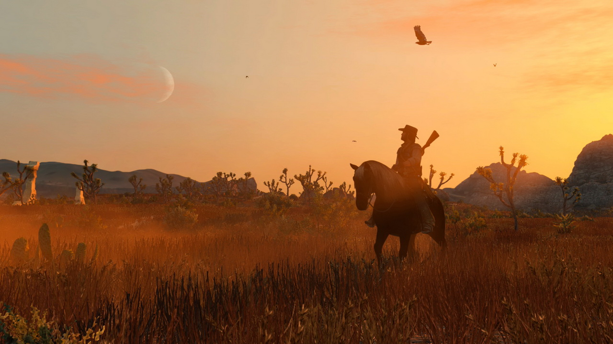

+++
title = "Read Dead Redemption pourrait arriver prochainement sur PC"
date = 2024-05-14T20:00:32+01:00
draft = false
author = "Félix"
tags = ["Actu"]
image = "https://nostick.fr/articles/2024/mai/1405-read-dead-redemption-pourrait-bientot-canarder-sur-pc/RDR0111.jpg"
+++

 

Alors oui c’est très chouette de jouer sur PC, on peut coller des mods, profiter des promos Steam et pimper son clavier RGB en riant allègrement des consoleux qui payent 80 boules leurs jeux à 30 i/s. Mais il y a quand même quelques défauts, comme certaines vieilleries qui n’ont jamais été portées vers nos machines de bourgeois. Prenez *Red Dead Redemption* par exemple : sorti en 2010, le jeu de cow-boy de Rockstar n’a jamais eu droit à un portage Windows. Heureusement pour nous le vent semble en train de tourner, un fouineur ayant [déniché du code](https://twitter.com/TezFunz2/status/1790031522315026508) de Rockstar laissant sous-entendre qu’une réédition PC était dans les starting-blocks.

L'éditeur a récemment mis à jour son launcher pour PC avec différentes lignes de code faisant la retape pour ses jeux et le contenu lié à *GTA V*. L’une d’entre elles est assez évocatrice : « *Voyagez à travers l'Ouest américain et le Mexique dans Red Dead Redemption et son compagnon d’horreur, Undead Nightmare - désormais jouable sur PC* ». La ligne est invisible pour le moment, cachée dans un fichier « *RDR_ProductPromotion_Intro_Body* ». De là à dire que Rockstar s’apprête effectivement à lancer *RDR1* sur PC, il n’y a qu’un pas que nous franchissons allègrement tant l’indice est explicite.

Une version Windows de *Read Dead 1* ne serait pas très surprenante. Le jeu a eu droit à une version PS4 et Switch l’été dernier, tout de même vendue [50 balles](https://www.nintendo.com/fr-fr/Jeux/Jeux-Nintendo-Switch/Red-Dead-Redemption-2427365.html) et incluant (heureusement) le très sympathique DLC *Undead Nightmare*. Cette ressortie pourrait permettre d’engranger un peu de cash sans trop se fouler en attendant *GTA VI*. Maintenant je retiens ma respiration jusqu’au portage de *[Table Tennis](https://en.wikipedia.org/wiki/Rockstar_Games_Presents_Table_Tennis)*.

