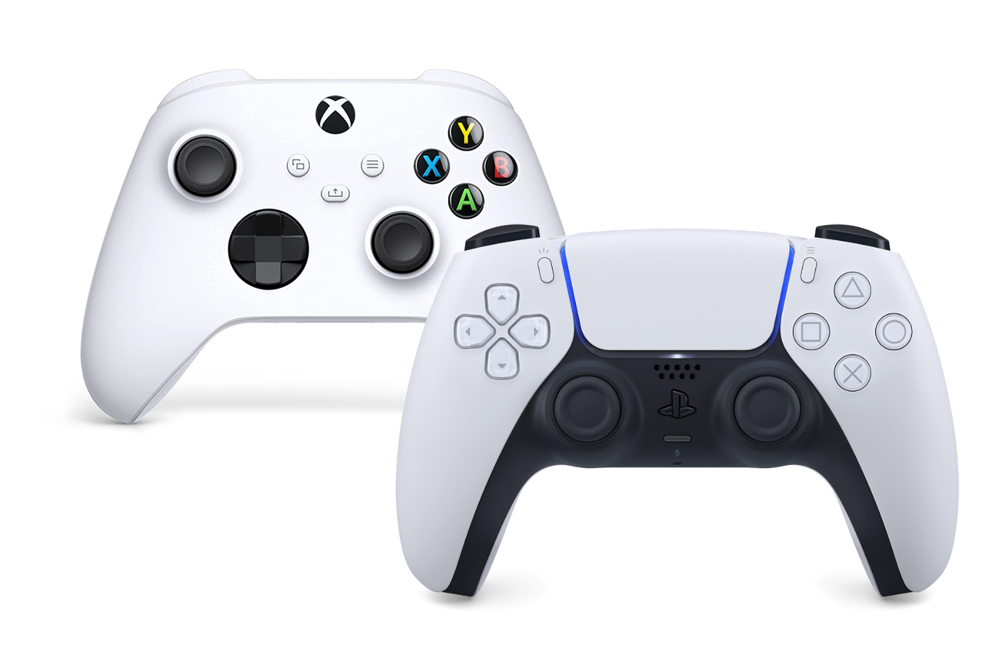

+++
title = "Bonjour tristesse chez Xbox"
date = 2024-05-15T10:47:32+01:00
draft = false
author = "Mickael"
tags = ["XXL"]
+++

 

**Qui achète encore des Xbox ? La question, pas très agréable à entendre pour les fans, mérite pourtant d'être posée : selon les informations remontées par Niko Partners, l'écart entre la PS5 et les Series S/X ressemble désormais à un gouffre.**

Sony a vendu 4,5 millions de PlayStation durant le premier trimestre, ce qui représente déjà un recul de quasiment 29 % par rapport à l'an dernier. Sur l'ensemble de l'année fiscale qui s'achève le 31 mars chez Sony, le constructeur a écoulé un total de 20,8 millions d'unités. C'est moins que la prévision de 21 millions, qui elle même avait été réduite en février dernier ; à l'origine, l'entreprise espérait en effet vendre un total de 25 millions de PS5.

Si ce volume reste un record pour les ventes de PS5, il faut se rendre à l'évidence : rater la cible d'aussi peu, c'est une petite déception pour Sony. Depuis le lancement fin 2020, celle-ci a atteint 59,2 millions d'unités vendues — c'est un peu moins que la PS4 sur le même laps de temps (60 millions). Si Sony marche sur la ligne de crête, la PS5 pourrait ne pas battre le volume total atteint par la PS4 sur toute sa carrière, un peu plus de 117 millions. 

Pour l'exercice fiscal en cours, Sony prévoit d'ailleurs de vendre 18 millions de PS5, malgré le lancement attendu de la version Pro sans doute à partir de cet automne. L'absence de gros jeux tirés des franchises PlayStation (*Horizon*, *God of War*, *Spider-Man*) au moins jusqu'en avril prochain ne va pas aider. Sony doit organiser un événement d'ici la fin mai, on verra ce que l'entreprise a dans ses cartons pour occuper le terrain.

 

Si tout n'est pas nécessairement rose pour le constructeur japonais, sa situation demeure bien mieux engagée que chez le concurrent Microsoft. Car la PS5 est, et de loin, la console de salon « next-gen » la plus populaire. Jusqu'à présent, quand Sony vendait 2 PS5, Microsoft écoulait 1 Xbox. Le ratio, déjà pas terrible, s'est encore dégradé en début d'année.

Selon les chiffres de Daniel Ahmad, directeur de recherche chez Niko Partners, Sony a [vendu](https://twitter.com/ZhugeEX/status/1790464370742349967) 5 fois plus de PS5 au premier trimestre que Microsoft de Xbox. Soit moins d'un million d'unités (environ 900 000). Un déclin de la team green qui s'accélère fortement, donc. 

Au mieux, ce sont 29 millions de Series S/X qui ont trouvé preneur depuis le lancement des consoles fin 2020. Contrairement à Sony, Microsoft ne donne pas les volumes, mais l'éditeur a tout de même révélé que l'activité hardware de Xbox avait reculé de 31 % durant le trimestre.

## Péril existentiel pour la Xbox

Microsoft s'est rendu à l'évidence : Xbox a perdu la guerre des consoles. Durant le procès l'ayant opposé à la FTC (le régulateur américain du commerce) l'an dernier, l'entreprise [admettait](https://www.theverge.com/2023/6/22/23769761/microsoft-says-xbox-has-lost-the-console-wars) que sa console se classait « constamment » en troisième place derrière PlayStation et Nintendo au niveau des ventes. Le lancement catastrophique de la Xbox One en 2013 a cristallisé la place de challenger éternel de Microsoft sur le marché. 

Dans une interview à cœur ouvert avec *XCast* , Phil Spencer avait d'ailleurs [expliqué](https://www.youtube.com/watch?v=yKwfEQ1eEyM) en juin 2023 que perdre la bataille de cette génération de consoles était « *la pire bataille à perdre* » car c'est à cette époque que les joueurs ont commencé à se constituer leur bibliothèque numérique de jeux. Et quand on investit dans un écosystème, ce n'est pas pour en changer au gré du vent.

La réponse de Xbox face au déclin annoncée de la plateforme matérielle est de miser sur une stratégie « multi-écrans » : les jeux doivent pouvoir être joués n'importe où, que ce soit sur console, sur PC, sur tablette, sur smartphone, sur les télés connectées, sur les écrans des frigos pourquoi pas. Le Game Pass est central, que ce soit pour le téléchargement de jeux sur les appareils qui le permettent, ou pour jouer dans le nuage avec le service Xbox Cloud Gaming.

Le Game Pass va donc bien au-delà des consoles Xbox. Il ne fait d'ailleurs aucun doute que si Microsoft en avait l'opportunité, l'abonnement serait disponible aussi sur PlayStation et Switch… Le service a ses propres problèmes : il faut qu'il soit constamment alimenté en nouveautés, que ce soit des jeux indés ou des triple A. D'où la boulimie d'acquisitions de ces dernières années, engendrant un trop plein de studios impossibles à gérer et des [fermetures parfois incompréhensibles](https://nostick.fr/articles/2024/mai/0705-fin-de-partie-pour-arkane-austin-et-tango-gameworks/).

 Xbox Series X sans lecteur optique. Image : Exputer") 

On aura l'occasion de revenir sur le Game Pass prochainement, mais cette poussée vers un service d'abonnement et la volonté très nette de Microsoft d'adapter ses exclusivités à d'autres plateformes laissent en suspens la question de la console à proprement parler. Autrement dit : se pourrait-il que la Xbox finisse par disparaitre tout simplement ? Ce n'est pas si simple.

Sarah Bond, la présidente de Xbox, a annoncé la couleur en début d'année : « *nous investissons également dans la feuille de route de la prochaine génération* », a-t-elle [déclaré](https://www.youtube.com/watch?v=KGlD9SO3rKU) durant un podcast Xbox en promettant « *le plus grand saut technologique que vous ayez jamais vu dans une génération de matériel* ». Et son patron, Phil Spencer, a clairement laissé entendre qu'[une console PC portable était en réflexion](https://nostick.fr/articles/2024/mars/2503_xboxconsole/).

Le prochain rendez-vous est fixé avant la fin de l'année, Sarah Bond ayant aussi fait miroiter des nouveautés matérielles pour Noël. Il devrait y avoir une nouvelle manette, et potentiellement une Xbox Series X blanche, moins chère, mais sans lecteur optique.

Visiblement, Xbox n'en a donc pas terminé avec les consoles à ses couleurs. Mais en se détachant toujours plus de sa propre plateforme matérielle, Microsoft pourrait finir par la dévitaliser complètement. 

 