+++
title = "Émuler des jeux sur Apple TV : petit guide pour débuter avec RetroArch"
date = 2024-05-17T06:00:00+01:00
draft = false
author = "Mickael"
tags = ["Tuto"]
+++

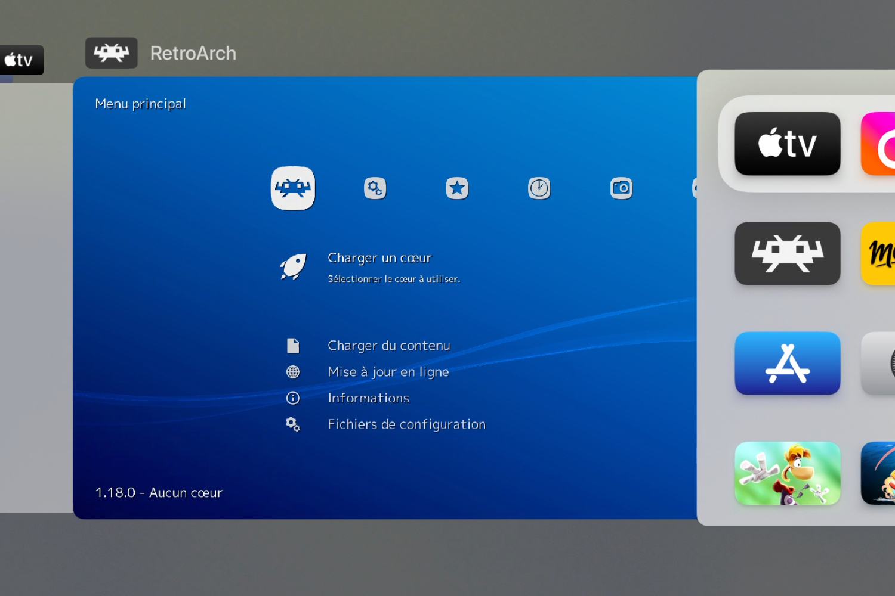

**On l'aura attendu longtemps, mais la voilà enfin la « killer app » de l'Apple TV : RetroArch ! La première plateforme d'émulateurs officielle pour tvOS est en effet disponible depuis quelques jours, elle donne accès à des dizaines de consoles rétro… pour peu qu'on franchisse l'obstacle de la configuration.**

Apple a bien essayé de faire de sa box de streaming une console de jeux, mais les restrictions absurdes imposées par le constructeur et [ses incessants changements de pied](https://nostick.fr/articles/2024/mars/2603_applearcade/) ont fini par faire de l'Apple TV un simple relais pour jeux mobiles sur grand écran. Il y a pourtant du potentiel, après tout l'appareil embarque une puce encore très capable[^1] et on peut y connecter les principales manettes du marché.

L'ouverture de l'App Store aux émulateurs donne à l'Apple TV un second souffle. RetroArch[^2], un des émulateurs les plus populaires dans la communauté du rétrogaming, est le premier du genre à être proposé dans la [boutique tvOS](https://apps.apple.com/fr/app/retroarch/id6499539433) et comme prévu, c'est une véritable killer app ! Imaginez, ce sont près d'une cinquantaine de consoles[^3] qui vous tendent les bras dans ce tout petit boîtier relié à l'immense télé du salon.

Mais voilà, avant de se plonger dans ces délices vintage, il va falloir donner un peu du sien. RetroArch, même avec une interface localisée en français, n'a rien de franchement intuitif. Et ça ne s'arrange pas dès l'ouverture : une notification explique qu'il faudra utiliser le navigateur web de son ordinateur pour transférer les ROMs ! L'absence d'app Fichiers pour tvOS exige en effet un peu de gymnastique.

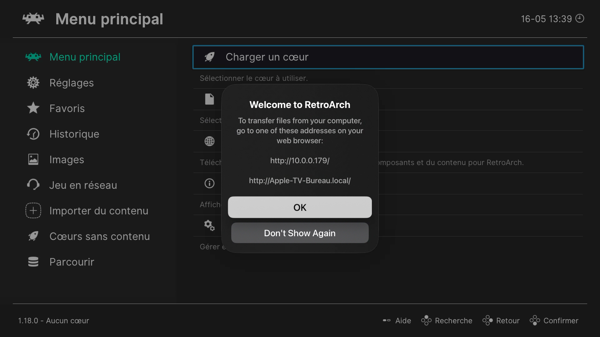

La première étape, c'est donc d'ouvrir un navigateur (ça peut se faire depuis un smartphone, si les ROMs sont dessus) à l'adresse  indiquée du réseau local. Dans l'interface qui s'affiche, il suffit de créer un dossier, par exemple « roms », au premier niveau du dossier « RetroArch ».

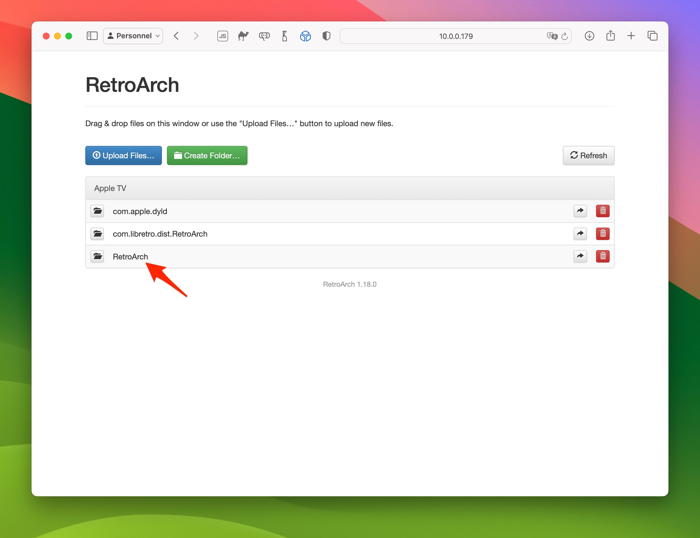

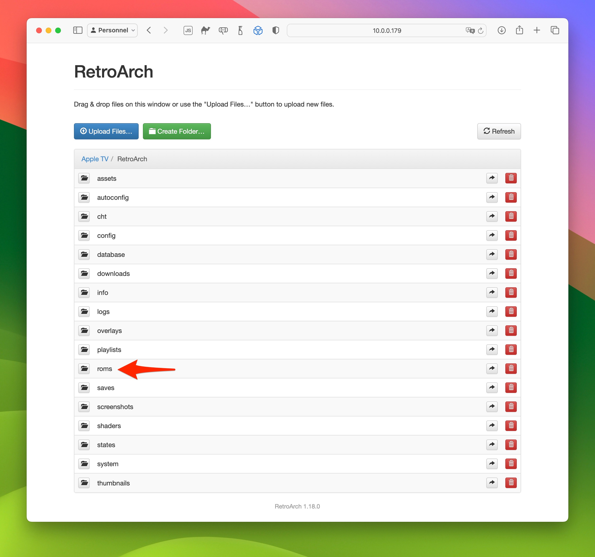

Vous pouvez organiser vos fichiers comme vous le souhaitez, le plus logique étant évidemment de ranger chaque jeu dans un dossier au nom de la console. Rendez-vous ensuite dans RetroArch, et cliquez sur l'option *Charger du contenu* depuis le menu principal. À partir de maintenant, je vous recommande chaudement de connecter votre manette, ça va vous faciliter la vie ne serait-ce que pour naviguer dans l'interface de l'app.

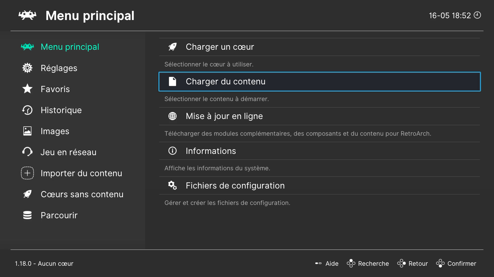

Si tout va bien, RetroArch aura créé un dossier « Téléchargements ». Attention, ça n'est pas forcément immédiat : en ce qui me concerne, j'ai tourné en rond dix bonnes minutes avant de voir apparaitre ce fichu dossier ! Une fois que l'app a fait son petit bazar, cliquez donc dessus, puis sur l'option *Dossier parent*. Vous devriez voir la même liste de dossiers que dans le navigateur web plus haut… y compris « roms ».

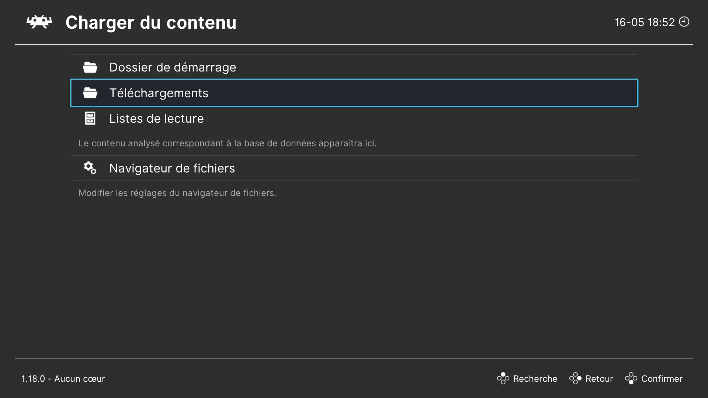

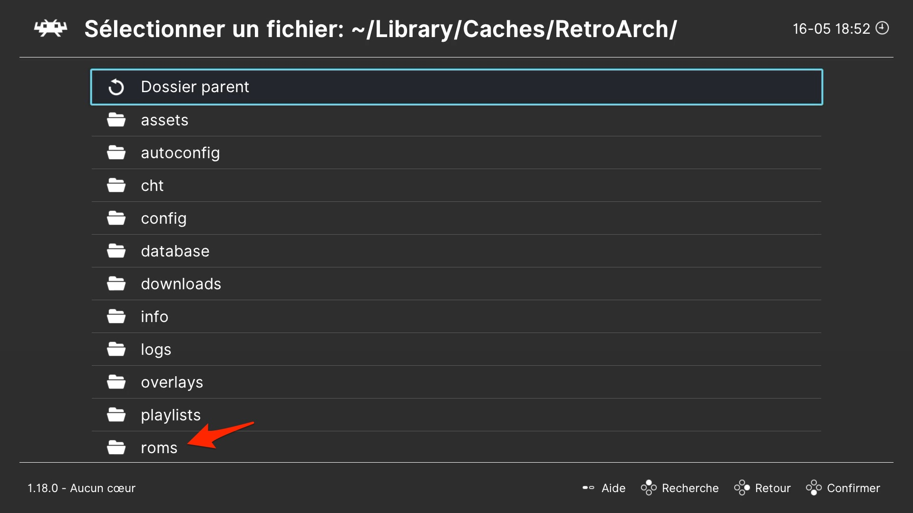

RetroArch doit analyser le contenu des dossiers des ROMs. Le plus simple est encore de se placer sur un dossier, puis d'appuyer sur le bouton gauche du D-pad de la manette.

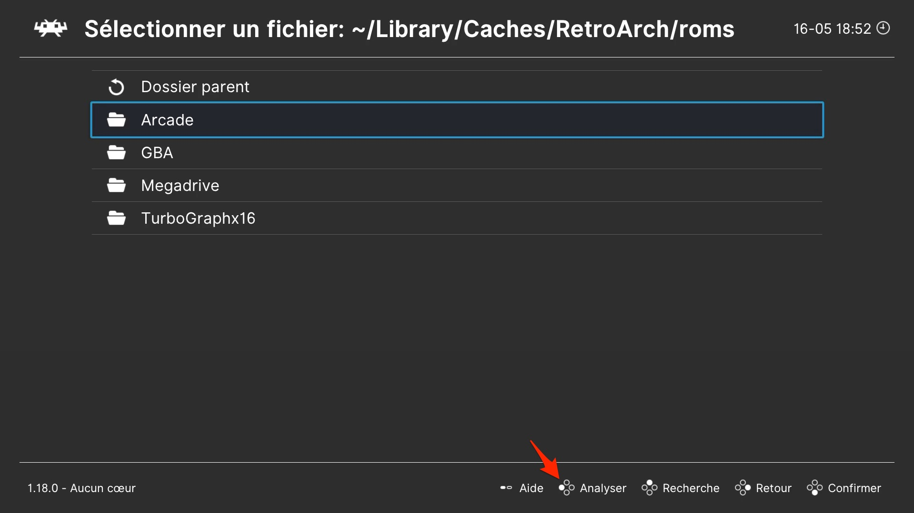

Une fois l'analyse de tous les dossiers terminés, retournez sur l'écran d'accueil de l'application. En bas du panneau latéral de gauche, les consoles ainsi que les jeux analysés sont disponibles !

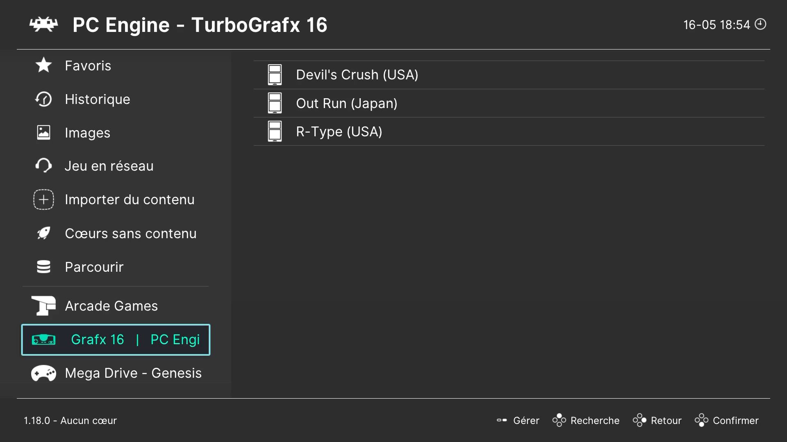

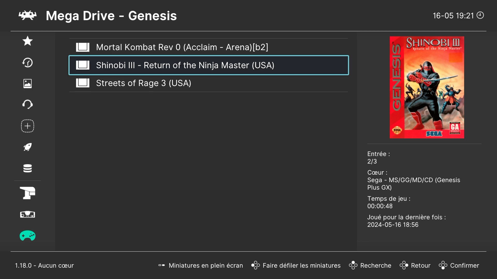

Deux recommandations importantes avant de lancer votre premier jeu. D'une, il faut associer un cœur à chaque jeu, au risque sinon de faire planter RetroArch. Sélectionnez l'option qui va bien, puis déroulez la liste des cœurs disponibles ; le logiciel va vous faciliter la tâche en suggérant les cœurs susceptibles de coller au mieux, mais la sélection reste parfois assez maousse. 

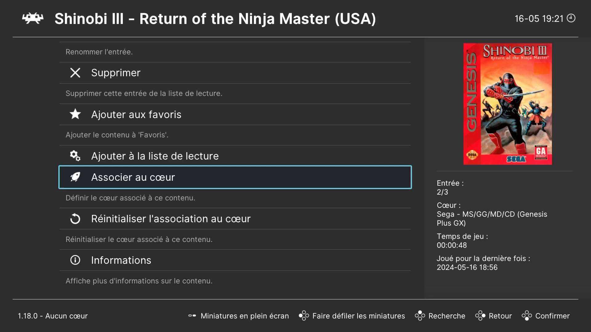

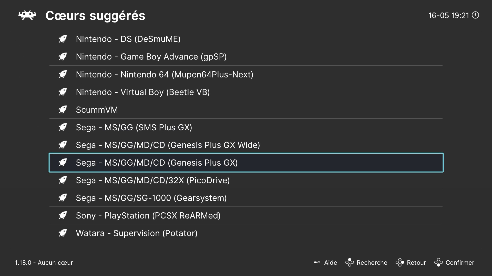

Les cœurs de RetroArch, ce sont les émulateurs des consoles à proprement parler. En un sens, RetroArch n'est qu'une vitrine pour tous ces cœurs, il vous revient de télécharger ceux qui vous intéressent. Vous trouverez davantage d'informations directement sur [le site de l'app](https://www.retroarch.com/?page=cores).

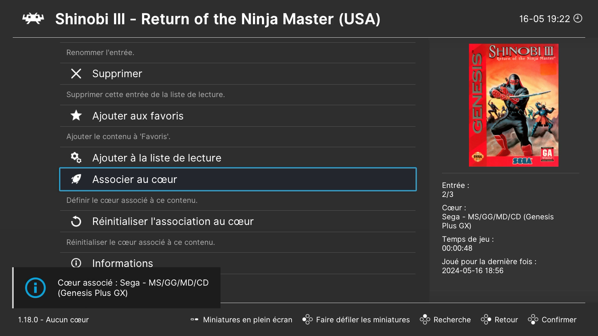

Une fois que le cœur est associé au jeu, plus rien ne vous empêche de vous lancer ! Bonne nouvelle : il est possible de connecter plusieurs manettes pour jouer à deux.

L'autre recommandation est facultative mais bien pratique tout de même : RetroArch permet de modifier le comportement des boutons de la manette. À moins d'aimer « tuer » l'application à tout bout de champ, il est utile d'assigner un bouton pour fermer un jeu et revenir à RetroArch, une option qui n'existe pas par défaut. Dans le menu *Réglages* > *Entrées*, sélectionnez le menu *Raccourcis*, puis *Fermer le contenu*. 

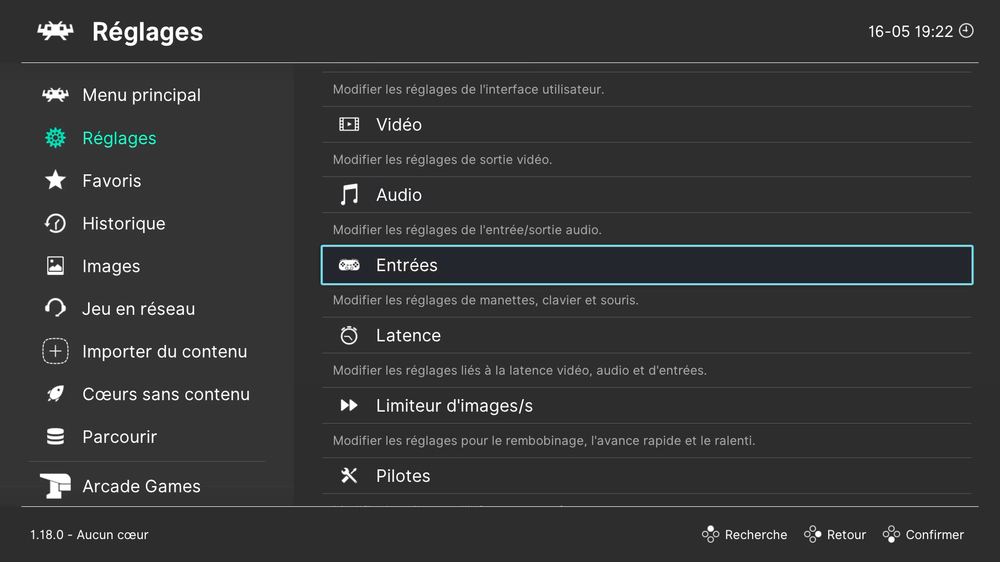

.")

RetroArch est un sacré phénomène qui va bien au-delà des fonctions de base décrites ci-dessus. Les réglages sont très riches, parfois confus, mais c'est ça aussi la joie de l'émulation. Tout comme les bugs de cette version tvOS (impossible de faire fonctionner un jeu PSP). À vous de vous y noyer, en un rien de temps vous nagerez avec aisance ! 

Une dernière chose pour la route : oui, l'interface est affreuse, mais il est possible d'obtenir quelque chose d'un peu plus stylé qui rappelle les anciennes interfaces PlayStation.

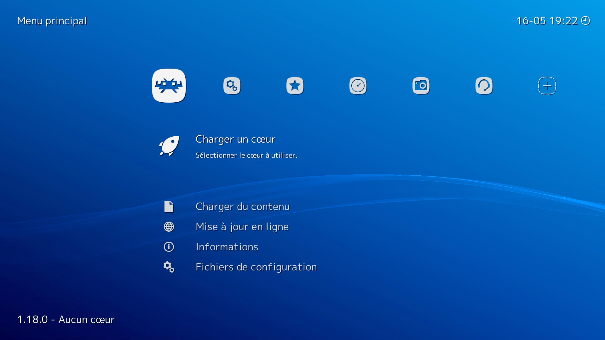

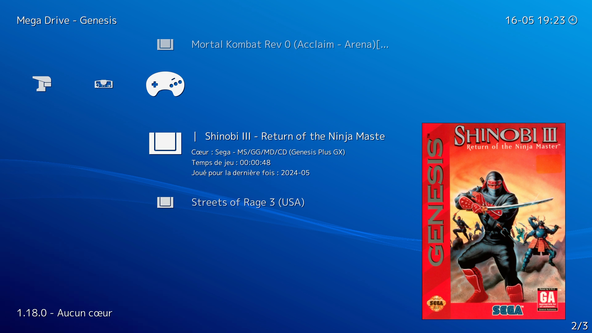

Rendez-vous dans *Réglages* > *Interface utilisateur* > *Apparence*, puis tout en bas sélectionnez *Menu*. Trois choix s'offrent à vous : *ozone* (l'interface par défaut), *rgui* (vraiment old school) et *xmb*. Choisissez *xmb*, puis redémarrez RetroArch — cela peut se faire en « tuant » l'app : double clic sur le bouton « TV » de la télécommande, puis balayez l'application vers le haut. Surprise !

[^1]: Les Apple TV actuelles intègrent une puce A15, la même que l'iPhone 13 de 2021.

[^2]: RetroArch est un *frontend* gratuit, [open-source](https://github.com/libretro/RetroArch) et multiplateforme développé par l'organisation Libretro, à l'origine de l'API du même nom et de nombreux cœurs. D'abord connu sous le nom SSNES en 2010, l'application a été rebaptisée RetroArch deux ans plus tard (la version 1.0.0.0 remonte à janvier 2014).

[^3]: Sur tvOS, RetroArch prend en charge les cœurs permettant d'émuler (entre autres) l'Amstrad CPC, l'Atari 2600/5200/7800 et la Lynx, la WonderSwan de Bandai (rappelez-vous !), la quasi-totalité des modèles Commodore (du VIC-20 au C128), la ColecoVision, l'Intellivision de Mattel, la SuperGrafx, les consoles 8/16 bits de Nintendo ([y compris le Virtual Boy !](https://nostick.fr/articles/2024/mai/0205-apercu-de-lemulateur-virtual-boy-pour-apple-vision-pro/)), la fabuleuse Neo Geo de SNCK, les consoles Sega 8 à 32 bits, la PS1, PSX et la PSP (avec le cœur PPSSPP)…
