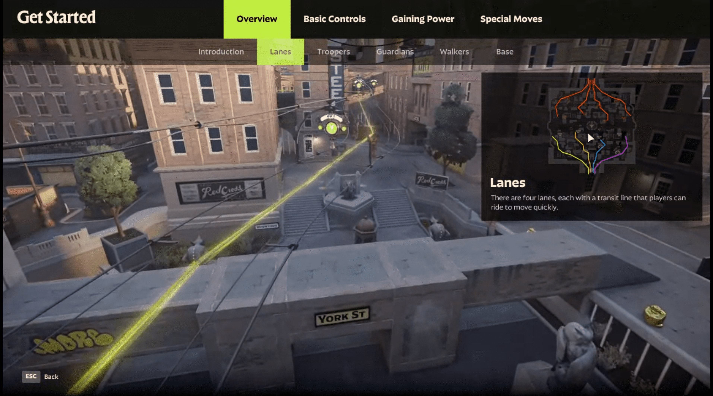

+++
title = "Fantastique, atypique, un peu dramatique : la folle semaine du jeu vidéo (18/05)"
date = 2024-05-18T08:31:00+01:00
draft = false
author = "Mickael"
tags = ["Actu"]
image = "https://nostick.fr/articles/2024/mai/1805-resume-de-la-semaine/indy.jpg"
+++

L’actualité du jeu vidéo ne s’arrête pas à la poignée d’articles publiés sur *Nostick* ! Histoire de rattraper le retard accumulé, voici un retour rapide sur quelques unes des infos les plus importantes (ou insignifiantes) de la semaine.

## Valve en plein test de son futur jeu Deadlock

Valve ne se réduit pas à Steam ou au Steam Deck, même si c'est déjà pas mal. L'entreprise développe aussi des jeux vidéo, mais oui, et le prochain sur la liste commence à prendre forme. *Deadlock* est même bien [avancé](https://x.com/gabefollower/status/1791311128422748285), à en croire Tyle McVicker qui suit les petites affaires de Valve de très près.

*Deadlock* semble être un titre de tir multi en 6 contre 6, à la manière de ce qu'un *Overwatch* peut proposer. Le titre, qui serait en développement depuis 2018 (!), mixerait des mécanismes de tower defense avec du bourrin sauvage. Les héros, dont le design puise son inspiration dans l'univers de Dota, auraient pu évoluer dans des mondes comprenant davantage d'éléments de science-fiction mais au vu des retours négatifs, Valve aurait préféré se concentrer sur la fantasy steampunk. Autrement dit : « *des magiciens, des créatures bizarres et des robots* », selon le fuiteur ! 

 A priori, une annonce officielle dans les prochains jours/semaines n'est pas à exclure, l'éditeur ayant ouvert le jeu à des centaines de personnes pour le tester.

## Xbox, le drama permanent

Microsoft avait prévenu : *Pentiment*, *Hi-Fi Rush*, *Grounded* et *Sea of Thieves* ne seraient pas les seules exclusivités Xbox à s'adapter aux plateformes concurrentes. Il s'agit pour l'éditeur de tester l'attrait de ses jeux chez PlayStation et Nintendo, et au vu des résultats, il semble que les joueurs de ces consoles aient un certain appétit pour les titres Xbox !

Il faut donc s'attendre à davantage d'adaptations de ce genre. Et peut-être pour des jeux autrement plus importants. Cette stratégie porterait en interne un nom de code, « Latitude », selon les [informations](https://www.windowscentral.com/microsoft/microsofts-quest-for-short-term-dollardollardollar-is-doing-long-term-damage-to-windows-surface-xbox-and-beyond) de Jez Corden, habituellement très bien renseigné. Des jeux seraient déjà en cours de développement pour les autres consoles, croit-il savoir.

L'informateur indique que la direction de Microsoft — on parle du big boss Satya Nadella et de sa directrice financière Amy Hood — pousse pour qu'il n'y ait aucune « ligne rouge », autrement dit : tous les jeux peuvent potentiellement être concernés, y compris donc les gros AAA comme *Halo*, *Gears of War* ou encore *Indiana Jones*. Ce qui ne manquera pas de provoquer une levée de bouclier de la part des fans Xbox, comme cela avait été le cas en début d'année quand la rumeur du portage d'exclusivités s'était propagée vitesse grand V.

Xbox, [lointain troisième dans le secteur des consoles](https://nostick.fr/articles/2024/mai/1505-bonjour-tristesse-chez-xbox/), a besoin de gagner de l'argent et encore plus depuis l'acquisition d'Activision. Et tant pis si cela revient à démonétiser complètement l'attrait de la plateforme matérielle… Le spectre de Sega, devenu simple éditeur tiers après le flop de la Dreamcast, plane toujours.

## Marvel Rivals : le contrat qui ne passe pas

C'est toujours une mauvaise idée de se mettre sa communauté à dos. *Marvel Rivals* a encore tout à prouver, le jeu n'étant pas encore disponible à l'exception des créateurs de contenus. Le studio NetEase a distribué une première version alpha du titre qui opposera des équipes de superslips et de supervillains de l'univers Marvel (à 6 contre 6).

Mais voilà : le contrat que ces créateurs ont dû [signer](https://twitter.com/A_Seagull/status/1789468582281400792) — une pratique très courante dans le milieu — les empêchent de dire du mal du jeu, tout simplement. Une des clauses interdit à ces joueurs de « *faire des commentaires désobligeants ou satiriques* » sur le contenu du jeu, de faire des « *comparaisons malveillantes avec des concurrents* », de « *dénigrer le gameplay* » et de relever les différences entre *Marvel Rivals* et ses concurrents. *Overwatch* n'est pas cité mais c'est tout comme.

Bon. 

Évidemment, c'était stupide de la part de NetEase, qui face au clash inévitable, a dû [présenter](https://twitter.com/MarvelRivals/status/1789895401723822410) des excuses « *pour toute expérience désagréable ou tout doute causé par une mauvaise communication [des] termes [du contrat]* ». Le studio encourage « *vivement* » les créateurs à partager « *leurs pensées honnêtes, leurs suggestions et leurs critiques* ». Tous les retours sur le jeu, qu'ils soient positifs ou négatifs, aideront à façonner la version finale du jeu.

On se demande encore comment il est possible pour un studio développeur d'un si gros jeu (ou même d'un petit titre indé) de se croire immunisé face à l'effet Streisand. Mais enfin, NetEase a au moins le mérite de s'être excusé assez tôt.

## Proteus, une manette à sa main

On peut reprocher beaucoup de choses à Xbox ([et on ne se prive pas](https://nostick.fr/articles/2024/mai/1505-bonjour-tristesse-chez-xbox/)), mais il faut tout de même reconnaitre que le constructeur est champion en matière d'accessibilité. Tout le monde doit pouvoir jouer, y compris quand on est atteint d'un handicap. En 2018, Microsoft lançait ainsi sa manette Xbox Adaptive, qui permet de se composer son propre contrôleur selon ses besoins. 

Une nouvelle manette modulaire va faire son apparition cet automne, il s'agit du [Proteus Controller](https://www.byowave.com/product/proteus-controller-kit-vip) avec lequel on combine des boules cubiques (si une telle chose peut exister) aux faces interchangeables : pad directionnel, sticks analogiques, boutons… Une centaine de millions de configurations (!) sont possibles et évidemment, le bazar intègre des LED.

L'application compagnon permettra aussi de remapper les boutons. Les joueurs ayant perdu une main ou un bras pourront de la sorte composer une manette qui leur permettront de se plonger à l'aise dans une aventure. Le Proteus, conçu par ByoWave, fonctionne avec les PC sous Windows 10/11 et les Xbox (One, S/X). Le fabricant cherche à rendre la manette compatible avec PlayStation et Switch, il y a un petit espoir.

Seul hic, et c'est le problème avec ces manettes adaptées au handicap : ça douille. Le Proteus revient à 299 $ (-15 % pendant les précos). Pour ce prix, on repart avec 4 cubes et tout le nécessaire pour commencer à jouer.

## L'émulateur Delta menacé d'une plainte, et pas de Nintendo

Après des années à avoir bêtement interdit les émulateurs dans l'App Store, Apple a fini par céder. D'ores et déjà, les utilisateurs d'iPhone et d'iPad ont pas mal de choix ([et même l'Apple TV avec RetroArch !](https://nostick.fr/articles/2024/mai/1705-apple-tv-retroarch/)). Le champion toutes catégories, c'est évidemment Delta qui permet d'émuler les anciennes consoles Nintendo.

En Europe, [l'installation de Delta passe par la boutique alternative AltStore](https://nostick.fr/articles/2024/avril/1904-comment-installer-et-utiliser-delta/), mais dans le reste du monde, l'application est simplement distribuée sur l'App Store. Le succès est stratosphérique : Delta est resté au sommet des classements pendant des semaines, ridiculisant au passage tous les belles âmes qui affirmaient que les émulateurs n'intéressaient personne.

Cette popularité n'est cependant pas tombée dans l'oreille d'un sourd. Non pas celle de Nintendo, mais d'Adobe, qui a menacé Delta d'une plainte en raison du logo de l'app — aux yeux de l'éditeur de logiciels d'édition graphique, il ressemble en effet un peu trop à son propre logo. Et… bin c'est difficile de dire le contraire. Pour éviter les embêtements, Delta a donc [décidé](https://fosstodon.org/@altstore/112457898141250024) de modifier son logo :

Pas sûr qu'on y gagne au change, mais enfin on comprend que Riley Testut, le développeur de Delta, n'ait pas voulu tenter le diable.