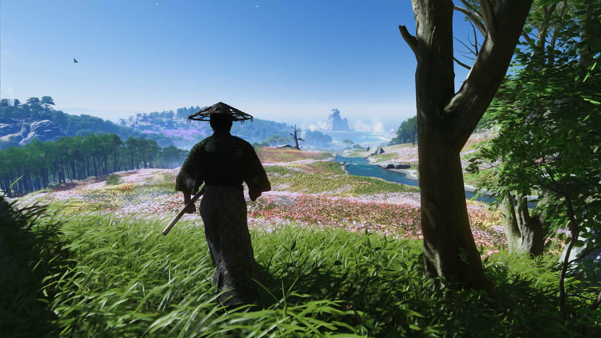
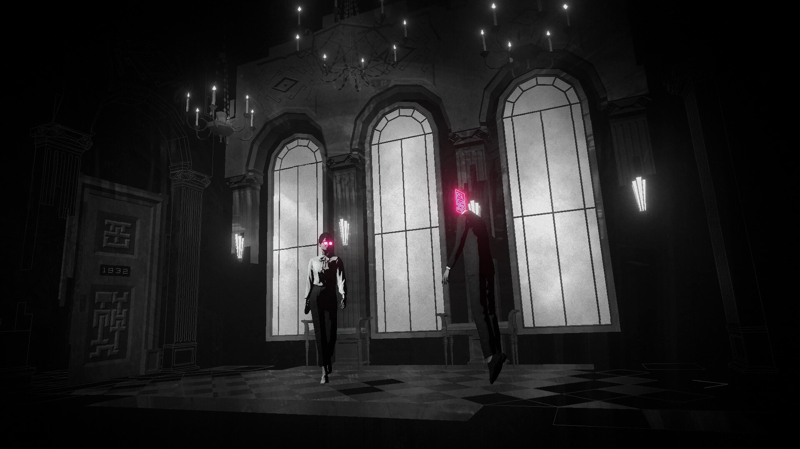
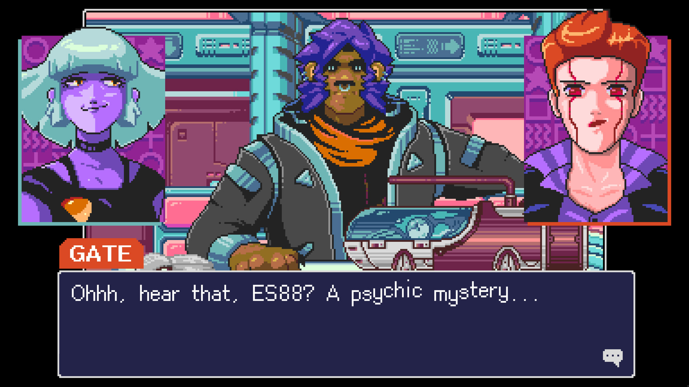

+++
title = "Les sorties de la semaine (18/05)"
date = 2024-05-19T08:00:01+01:00
draft = false
author = "Félix"
tags = ["C’est dispo"]
+++ 

*Entre le boulot, les courses et les préparatifs du lundi de Pentecôte (je sais nos lecteurs très pieux), vous n’avez peut-être pas eu le temps de vous intéresser aux nouveautés du moment. Qu’à cela ne tienne : voici les sorties de ces derniers jours qui ont retenu notre attention.*

## Ghost of Sushimen

Bonne nouvelle pour les pécéistes : l’exclu PS5 ***Ghost of Tsushima*** est désormais disponible dans son édition Director’s Cut pour 60 € sur [Steam](https://store.steampowered.com/agecheck/app/2215430/) (ou l’[EGS](https://store.epicgames.com/fr/p/ghost-of-tsushima) pour les masochistes). Le jeu, très bien accueilli par la critique lors de sa sortie en 2021, propose d’incarner le dernier samurai de son clan prenant les armes pour défendre son peuple. Ce portage est [visiblement réussi](https://www.gamesradar.com/games/action/perfect-the-moment-you-open-it-ghost-of-tsushima-pc-players-praise-sonys-port-after-past-stumbles-with-the-last-of-us/) d’un point de vue technique, ce qui n’était pas gagné quand on se souvient de la catastrophe *The Last of Us* qui a compilé des shaders pendant 2h sur ma 3070Ti avant de me laisser jouer. Les retours sur Steam sont positifs, bien que certains ronchons n’ayant pas digéré [la débâcle *Helldivers 2*](https://nostick.fr/articles/2024/mai/0505-sony-fait-plonger-helldivers-2-en-enfer/) continuent de plomber les critiques. Heureusement, il n’y a pas besoin ici de compte PSN pour la partie solo. Notons que *Ghost of Tsushima* est le premier jeu à embarquer [l’overlay Sony](https://www.theverge.com/2024/5/16/24158246/sony-playstation-pc-overlay-hands-on) sur PC qui permet de synchroniser ses succès et son profil. Bref, vous pouvez foncer les yeux fermés si [le premier trailer](https://nostick.fr/articles/2024/mai/1505-premier-trailer-pour-assassins-creed-japon-qui-sortira-le-15-novembre/) d’*Assassin’s Creed Shadows* vous a donné une folle envie de parcourir la campagne japonaise.

## Vaisseaux sanguins

***Homeworld 3*** est sorti cette semaine et j’avais hâte de me moquer jusqu’à ce que je réalise que j’avais confondu *Homeworld* avec *[Homefront](https://fr.wikipedia.org/wiki/Homefront_(jeu_vidéo))*, le FPS tout pourri de 2011 dans lequel la Corée du Nord envahit les États-Unis. *Homeworld 3* propose donc un concept beaucoup moins débile étant donné qu’il s’agit d’un jeu de stratégie en temps réel 3D dans un univers de science-fiction. C’est un remake du premier sorti en 1999, et si cette révision a été correctement accueillie par la presse, les joueurs sont plus partagés : ils dénoncent une histoire pas terrible, une interface compliquée et une IA aux fraises. Ce n’est pas un accident industriel, mais ce n’est pas fou non plus. Si vous avez soif de batailles de vaisseaux, vous aurez sans doute mieux fait d’acheter [l’édition remasterisée](https://store.steampowered.com/app/244160/Homeworld_Remastered_Collection/) des deux premiers en espérant que les développeurs corrigent le tir (de blaster) dans les semaines qui viennent. 60 € [sur Steam](https://store.steampowered.com/app/1840080/Homeworld_3/), mais vous pouvez facilement attendre une promo.

 

## Lorelei sébasto cha

Le sympathique studio Simogo (*Device 6, Sayonara Wild Hearts*) a signé son retour cette semaine avec ***Lorelei and the Laser Eyes***. Il s’agit d’un jeu de puzzle narratif assez intrigant : *[The Verge](https://www.theverge.com/24157530/lorelei-and-the-laser-eyes-review-switch-steam)* explique que « *c’est un peu comme si David Lynch avait conçu un escape game* ». Vous contrôlez un personnage qui se retrouve dans un hôtel perdu au milieu de la forêt, et il va s’agir de résoudre différentes énigmes pour faire progresser l’intrigue. Difficile d’en dire plus sans spoiler, mais si vous aimez les casse-tête et prendre des notes, c’est pour vous : les retours sont tous unanimes et les jeux Simogo sont généralement excellents. Je vous recommande d’ailleurs très chaudement *[Device 6](https://apps.apple.com/fr/app/device-6/id680366065?l=fr-FR)* si vous avez un iPhone et que vous lisez l’anglais. *Lorelei and the Laser Eyes* est disponible sur [Switch](https://www.nintendo.com/fr-fr/Jeux/Jeux-a-telecharger-sur-Nintendo-Switch/Lorelei-and-the-Laser-Eyes-2233013.html) et [Steam](https://store.steampowered.com/app/2008920/Lorelei_and_the_Laser_Eyes/) pour 23 €

## Cyperbunk : Anime Edition (＾▽＾)

Plutôt client des visual-novel, j’était assez curieux de voir ce qu’allait donner ***Read Only Memories: NEURODIVER*** et son Neo-San Fransisco cyberpunk. Le joueur y incarne une « *détective psychique* » à la recherche d’une « *mystérieuse entité* » se cachant dans les souvenirs des honnêtes citoyens. On y parcourt un monde coloré avec son lot de personnages surprenants qui devrait attirer l’œil des fans de vieux jeux d’aventures 1bit. Si le tout est présenté comme un « jeu d’aventure », ça reste du visual novel avec un gameplay consistant principalement à appuyer sur A pour lire la suite ou à résoudre un puzzle occasionnel. Les quelques retours que j’ai lus sont globalement positifs même si *[RPS](https://www.rockpapershotgun.com/read-only-memories-neurodiver-review)* regrette une certaine avalanche de clins d’œil pop culture méta visiblement un poil gonflante. Le tarif est honnête (15 € sur [Steam](https://store.steampowered.com/app/1293910/Read_Only_Memories_NEURODIVER/)/Switch) et il y a une démo : ça peut valoir un téléchargement si les captures d’écran vous intriguent et que vous n’êtes pas allergique aux animes.

## Un peu de rab

Il y a eu deux trois autres bricoles cette semaine : ***Braid*** est ressorti en édition anniversaire [sur PC](https://store.steampowered.com/app/499180/Braid_Anniversary_Edition/), consoles, mais aussi iOS/Android pour les abonnés Netflix. Le jeu a eu droit à un coup de polish et s’est enrichi de plus de 12 heures de commentaires audio. Si vous cherchez du puzzle-game coloré et relaxant, vous pouvez jeter à œil à **[Please Fix The Road](https://store.steampowered.com/app/1383250/Please_Fix_The_Road/)**, qui a l’air sympathique. Et sur un tout autre registre, le très mignon ***[Baladins](https://store.steampowered.com/app/1866320/Baladins/)*** mérite peut être le coup d’œil si vous cherchez un RPG accessible et jouable en co-op.