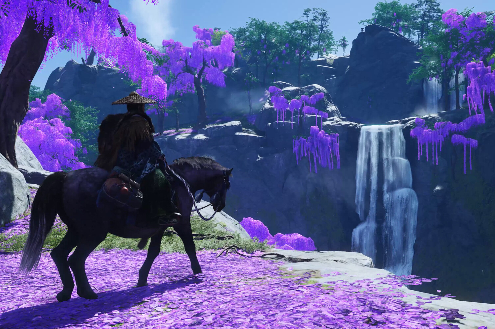
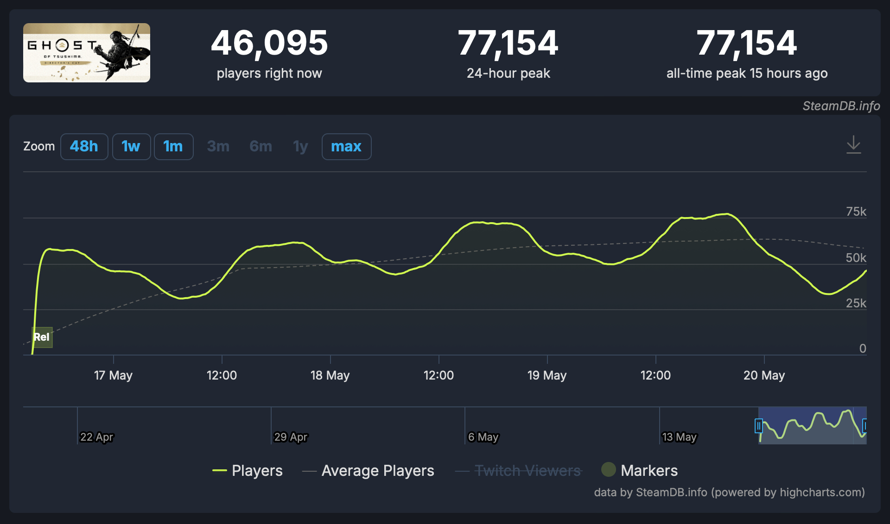

+++
title = "Ghost of Tsushima est le plus gros jeu solo de PlayStation sur Steam"
date = 2024-05-20T10:47:32+01:00
draft = false
author = "Mickael"
tags = ["Actu"]
image = "https://nostick.fr/articles/2024/mai/2005-ghost-of-tsushima-est-le-plus-gros-jeu-solo-de-playstation-sur-steam/Ghost.jpg"
+++

Si Sony voulait se prouver que les jeux PC pouvaient être une planche de salut pendant ces temps difficiles, en voici une nouvelle confirmation. Le Director's Cut de *Ghost of Tsushima*, disponible depuis le 16 mai dernier sur Steam, est très officiellement un carton. Le jeu de Sucker Punch a enregistré hier, dimanche, un pic de [77 154](https://steamdb.info/app/2215430/charts/) joueurs en simultané sur la plateforme de Valve.

Le jeu fait mieux que le pic de God of War (73 529) il y a deux ans. *Ghost of Tsushima* est tout simplement le plus gros lancement PlayStation sur Steam ! Bien sûr, le titre solo demeure très loin de *Helldivers 2*, mais le jeu multi est sorti en même temps sur PlayStation et PC.

Ce succès pour *Ghost* est d'autant plus remarquable que Sony sort tout juste d'une grosse polémique concernant justement *Helldivers 2* et l'obligation de connecter un compte PSN à son compte Steam. [Le constructeur a fait machine arrière](https://nostick.fr/articles/2024/mai/0505-sony-fait-plonger-helldivers-2-en-enfer/) devant la bronca, et manifestement la polémique n'a pas eu d'impact sur le jeu de samouraïs (dont le multi nécessite un compte PSN, au passage).

L'adaptation des exclus PlayStation sur PC semble donc porter de gros fruits juteux — *Ghost of Tsushima* était sorti en 2020 en exclu sur la PS4 (l'année suivante sur PS5 dans sa version Director's Cut). Ce qui valide la stratégie de Sony, qui n'a pas masqué sa volonté d'accélérer dans ce domaine : la PS5 a beau être la console de salon la plus populaire, le nombre de joueurs reste grosso modo le même et surtout, les budgets de développement ont cette fâcheuse tendance à gonfler démesurément. Il faut donc aller chercher les joueurs où ils sont… sur PC.

Les joueurs PC devraient d'ailleurs être à la fête cette année : en plus de *Ghost of Tsushima*, on parle très fort d'une annonce  prochaine concernant le portage de *God of War Ragnarok*. Peut-être dès la prochaine présentation Sony, d'ici fin mai.