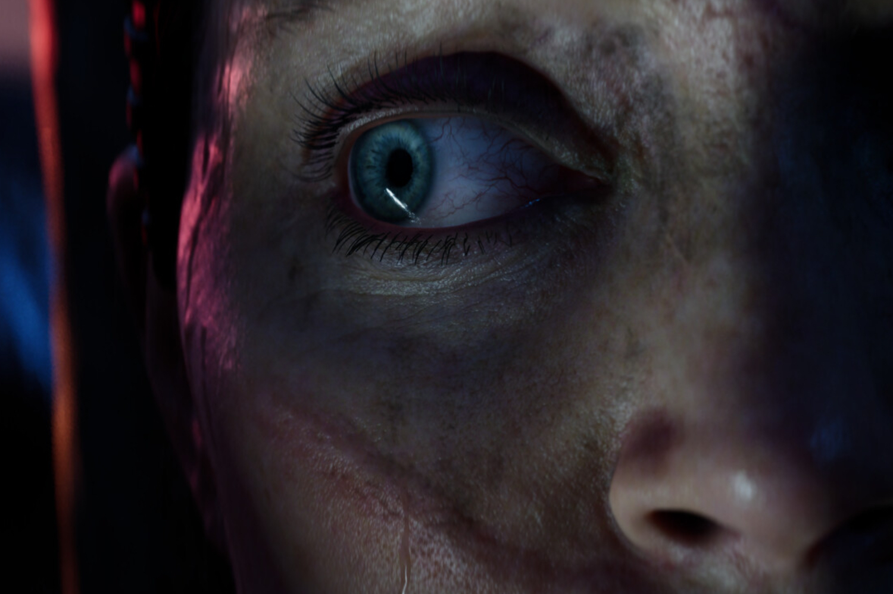

+++
title = "La sortie de Hellblade 2 ne condamne pas Ninja Theory"
date = 2024-05-21T10:47:32+01:00
draft = false
author = "Mickael"
tags = ["Actu"]
image = "https://nostick.fr/articles/2024/mai/2105-la-sortie-de-hellblade-2-ne-condamne-pas-ninja-theory/Senua.jpg"
+++

Ouf ! Microsoft n'a pas l'intention de fermer Ninja Theory, du moins pas tout de suite. Alors que *Senua's Saga: Hellblade 2* sort tout juste du four — sur Xbox et PC —, beaucoup se demandaient si le petit studio anglais allait tenir la rampe alors que la maison mère n'a eu aucun égard pour Tango Gameworks (*Hi-Fi Rush*) et Arkane Austin (*Redfall*), [sur fond de recherche désespérée de rentabilité](https://nostick.fr/articles/2024/mai/1505-bonjour-tristesse-chez-xbox/).

Des craintes justifiées, aux yeux de certains en tout cas, par le récent [tweet](https://x.com/NinjaTheory/status/1792601275550302264) de Dom Matthews, le patron de Ninja Theory. Il remercie les joueurs de leur soutien dans cette aventure qu'a été le développement de *Hellblade 2*. 

« *Faire des jeux vidéo est difficile* », écrit-il. « *Tout comme Senua, notre équipe a été guidée par la conviction de réussir notre quête : créer un jeu qui vous plonge profondément dans le monde de Senua et vous emmène dans un voyage qui vous fera réfléchir (…) Je suis très fier du jeu, très fier de notre équipe et très fier de vous, nos fans, qui nous avez soutenus dans ce voyage magique* ».

Une déclaration sur un fond noir sinistre, qui pouvait aussi être interprété comme un message d'adieu… Fort heureusement, il n'en est rien. Non seulement le projet Mara, annoncé en 2020, est toujours dans les tuyaux, mais Microsoft a donné son feu vert à un second projet encore inconnu, d'après *[Windows Central](https://www.windowscentral.com/gaming/xbox/making-video-games-is-difficult-ninja-theory-studio-head-talks-at-the-fore-of-senuas-saga-hellblade-2s-xbox-and-pc-launch)*. Soulagement donc pour Ninja Theory, qui va donc être bien occupé pendant les prochaines années. 

Dommage que Xbox ait « oublié » de faire la promotion du titre : pour une exclusivité qui a fait partie du line-up de lancement des Series S/X avant de demander quelques années supplémentaires de développement, c'est assez malheureux de voir le peu de soutien marketing pour le lancement.

Néanmoins, que Ninja Theory soit bien occupé pendant les prochaines années est une bonne nouvelle pour l'industrie du jeu vidéo, car elles se comptent sur les doigts d'une main à trois doigts ces derniers temps. Une rumeur indiquait d'ailleurs que la suite des aventures de Senua pouvait faire une bonne candidature pour un portage PS5. Après tout, le premier volet *Hellblade: Senua's Sacrifice* avait été lancé sur PC et PS4 en 2017, avant d'atterrir sur Xbox One l'année suivante.

