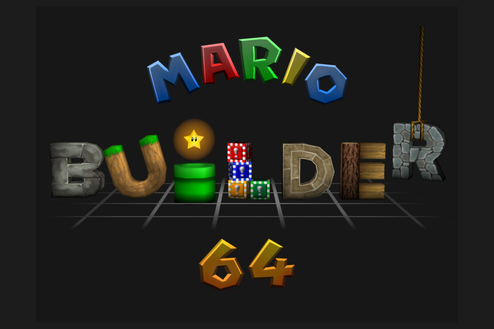

+++
title = "Mario Builder 64 : comme Super Mario Maker, mais en 3D"
date = 2024-05-22T10:47:32+01:00
draft = false
author = "Mickael"
tags = ["Actu"]
+++

*Super Mario Maker*, c'est bien sympathique mais franchement. De la plateforme 2D. Sérieusement. On est en 2024 les gars ! Bientôt il y a aura des voitures volantes dans le ciel ! On se réveille là ! Car ce que veut le peuple, ce sont des niveaux en 3D, bien sûr[^1], et en attendant que Nintendo se décide à sortir un *Super Mario Maker 3D* pour créer des niveaux dignes de *Galaxy* ou d'*Odyssey* (ce qui n'arrivera sans doute jamais), d'autres s'en sont chargés.

Les modders Arthurtilly et Rovertronic ont mis en ligne *Mario Builder 64*, un jeu open-source qui permet comme son nom l'indique de créer des niveaux dans le style de *Super Mario 64*. Sérieusement ? C'est de la balle, mais volumétrique. 

 

De nombreux éléments sont disponibles pour concevoir les fondations d'un niveau (y compris le niveau de l'eau pour les zones inondées) et les garnir avec toutes sortes d'obstacles et d'ennemis. Des thèmes sont aussi disponibles pour modifier d'un coup l'univers d'un niveau.

Et bien évidemment, les joueurs peuvent soumettre leurs propres créations à télécharger directement dans *Mario Builder 64*, ou tout simplement depuis le web ([depuis ce site](https://levelsharesquare.com/levels), par exemple). Attention, c'est le genre d'application qui peut vous faire perdre de nombreuses heures de productivité.

Avant toute chose, il faudra installer le logiciel qui demandera un émulateur comme Parallel Launcher, une ROM dumpée de votre *propre copie* de Super Mario 64 (hum) et le fichier BPS de *Mario Builder 64*. Et si vous avez une N64 qui prend la poussière, sortez-la du grenier : avec une Flashcart il sera possible de jouer aux niveaux que avez créés ! Le mode d'emploi avec tous les liens qui vont bien est à cette [adresse](https://rentry.co/mb64-setup-guide).

[^1]: Sauf dans *Super Mario Bros. Wonder*.