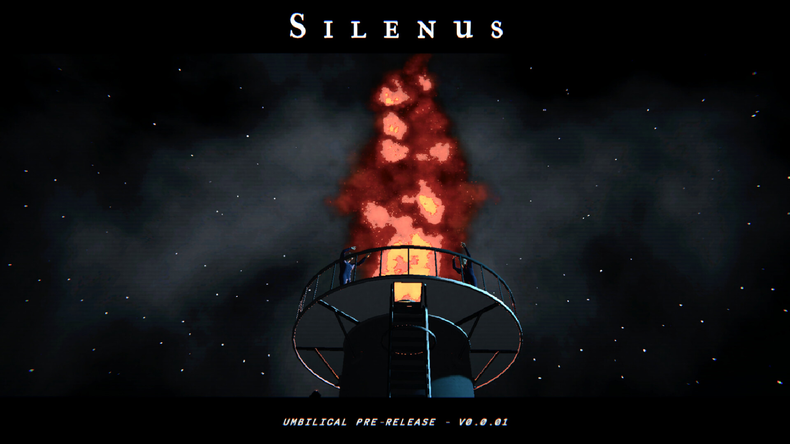

+++
title = "Silenus : du pétrole, des idées et une dystopie"
date = 2024-05-22T09:00:00+01:00
draft = false
author = "Félix"
tags = ["Actu"]
+++ 

Je vous connais, vous êtes des gens de goût : vous n’êtes pas passé à côté du très sympathique *[Norco](https://store.steampowered.com/app/1221250/NORCO/?l=french&snr=1_7_7_151_150_1=)*, un point n’ click invitant à découvrir une sorte de bayou cyberpunk qui avait reçu un très bon accueil de la presse et des joueurs. Les développeurs du studio Geography of Robots viennent de présenter leur nouveau projet, baptisé ***Silenus***. L’approche est complètement différente avec des décors en 3D pour un jeu de moins grosse envergure étant donné qu’il devrait durer moins de 2h30.

Le scénario tournera autour d’une raffinerie gérée par une étrange entreprise implémentant de nouvelles technologies d’automatisation « *cachant quelque chose de mystérieux* ». Il s’agira d’explorer les machines, les réservoirs et les bureaux de la raffinerie à la recherche de différents indices. On y rencontrera au passage différents personnages tandis qu’un lot d’énigme est visiblement au programme. Le pitch n’est pas le plus sexy, mais l’ambiance devrait être au rendez-vous en abordant des thèmes comme l’IA et la dépendance aux énergies fossiles.

Une démo jouable sur PC/Mac/Steam Deck a été mise en ligne à l’occasion de l’arrivée d’un nouvel album du groupe [Thou](https://thou.bandcamp.com), qui a composé la musique de *Norco*. Les développeurs préviennent que différents éléments de la démo pourraient changer d’ici la sortie du jeu, prévue avant la fin 2024. « *Les thèmes généraux, l'esthétique et la jouabilité seront en grande partie les mêmes* », nous explique-t-on. Vous pouvez la télécharger pendant quelques semaines, bien que les développeurs notent qu’il ne s’agit que d’une pré-alpha. 
