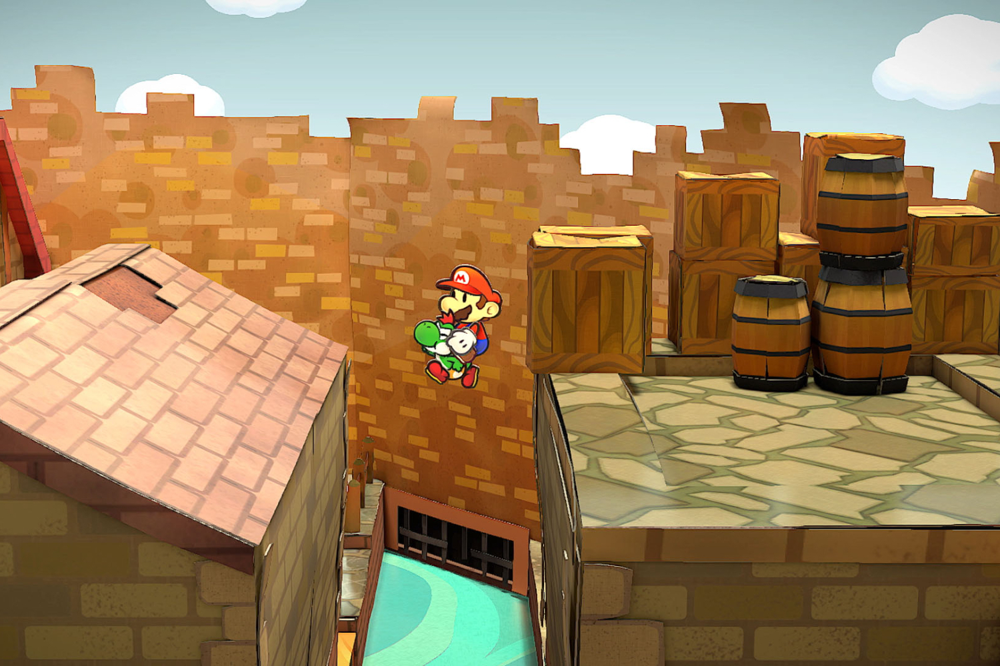

+++
title = "Paper Mario pourrait confirmer que la Switch 2 balancera de la 4K"
date = 2024-05-23T10:47:32+01:00
draft = false
author = "Mickael"
tags = ["Actu"]
image = "https://nostick.fr/articles/2024/mai/2305-paper-mario-pourrait-confirmer-que-la-switch-2-peut-fournir-de-la-4k/paper.jpg"
+++

 

Allez savoir, peut-être que la Switch 2 sera suffisamment puissante pour faire rouler le remake de *Paper Mario : la Porte Millénaire* à 60 FPS ! Comme sur la Game Cube finalement… Malgré les dix ans d'écart entre les deux consoles, la Switch se traîne à 30 FPS. Heureusement que le titre est super mignon et rigolo, ça rattrape les pénibles avanies techniques de Nintendo[^1].

Le code de ce nouveau *Paper Mario* contient une surprise : le *dataminer* RibShark est [tombé](https://x.com/RibShark/status/1793357532729418129) sur des instructions qui permettent au jeu de prendre en charge le rendu en 4K. Il pourrait s'agir pour Nintendo de s'assurer de la parfaite compatibilité du titre avec une future console capable d'afficher de la 4K sur l'écran de la télé ! Et peu importe la méthode choisie : en natif ou en exploitant la technologie DLSS de Nvidia.

Moins sexy mais tout aussi plausible, ce code pourrait aussi servir à des outils internes à Nintendo permettant de produire des captures d'écran destinées à la presse, comme le [rappelle](https://www.nintendolife.com/news/2024/05/paper-mario-the-thousand-year-door-codebase-apparently-contains-references-to-4k-output) *Nintendo Life*. La prudence impose donc de garder la tête froide !
 
Si Nintendo a fini par confirmer qu'une nouvelle console « *de la famille Switch* » sera bien annoncée avant avril prochain, le constructeur n'a bien sûr rien révélé sur les caractéristiques techniques de l'appareil. [Le support de la 4K en externe semble toutefois acquis](https://nostick.fr/articles/2024/mai/0905-switch-2-tout-ce-que-lon-sait/), tout comme la définition 1080p pour l'écran de la Switch 2.

[^1]: Que Nintendo ne s'étonne pas de l'essor du piratage de ses jeux : malgré ses qualités et un ripolinage graphique de bon aloi, ce *Paper Mario* a quand même bien du mal à justifier les 60 € demandés (ce d'autant qu'il n'y a pas de contenu supplémentaire). Le jeu était d'ailleurs largement disponible sur les interwebs interlopes quelques jours avant sa sortie.