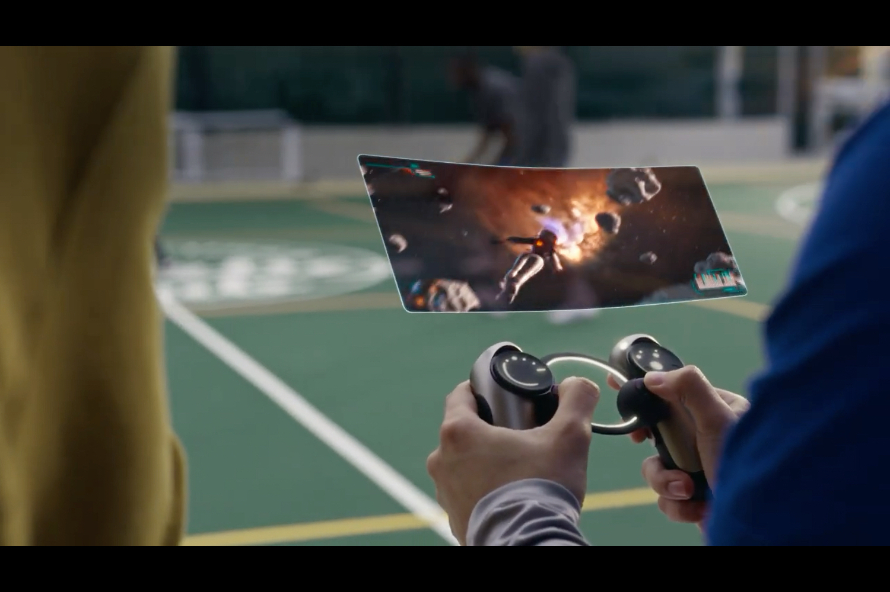
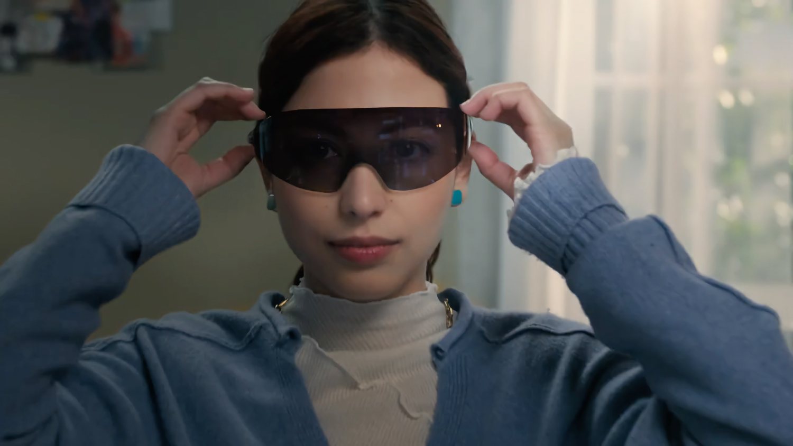
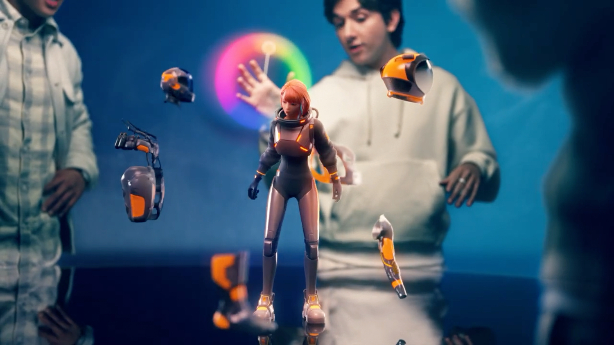

+++
title = "Sony se touche la nouille"
date = 2024-05-24T10:00:00+01:00
draft = false
author = "Mickael"
tags = ["XXL"]
+++

En 2034, le monde sera à feu et à sang, chauffé à blanc entre la crise climatique et la guerre civile. Mais en fait, pas du tout : on portera des lunettes de réalité augmentée pour travailler à distance sur des jeux vidéo super cool, auxquels on jouera sur des écrans flottants comme par magie au-dessus de manettes super stylées, dans des villes traversées par des dinosaures high-tech et des fantômes rigolos.

Ce futur riant, c'est celui imaginé par Sony dans une de ces vidéos corporate qui resteront à la postérité, mais peut-être pas grâce à la vision audacieuse et généreuse d'une entreprise philanthrope. Cette vidéo produite par l'entreprise est présentée comme un « prototype » prospectif : à quoi ressemblera le monde créatif et du divertissement dans dix ans ? 

Lunettes de réalité augmentée, écrans arrondis, projections géantes, manettes PlayStation futuristes, triomphe des franchises (dont *Horizon* et *Ghostbusters*, deux licences maison), tous les poncifs y passent et ce ne sont pas les plus imaginatifs. Mais enfin, jetez un œil :

 

À l'occasion de la réunion annuelle consacrée à la stratégie de l'entreprise, Sony a produit sa « *vision du divertissement créatif* ». Ça vaut le coup d'œil ([ici](https://www.sony.com/en/SonyInfo/creative-entertainment-vision/)) rien que pour mesurer le fossé qui sépare cette vision de notre triste réalité. 

Dans dix ans, nous vivrons donc dans « *des réalités infinies* » où se connecteront « *de manière fluide des mondes multicouches où les réalités physiques et virtuelles se chevauchent pour offrir un Kando[^1] illimité — grâce à la créativité et à la technologie — en collaboration avec les créateurs* ».

Tout cela ressemble beaucoup à du « bullshit PR » pour faire briller les yeux des investisseurs et des cadres intermédiaires de Sony. L'entreprise ne s'est pas contentée d'une vidéo, elle a également fait donner quelques uns de ses meilleurs talents pour faire miroiter la vision du groupe.

On trouve ainsi une [interview](https://www.sony.com/en/SonyInfo/creative-entertainment-vision/interview/2.html) de Neil Druckmann, le patron du studio Naughty Dog et directeur créatif — c'est à lui que revient la paternité de la saga *The Last of Us*, et il a travaillé de près sur l'adaptation en série télé.

Il révèle ainsi que le prochain titre du studio devrait « *redéfinir la perception grand public du jeu vidéo* ». Un sacré défi, mais après tout il a gagné le bénéfice du doute : par sa narration et son gameplay, *The Last of Us* a su largement dépasser la sphère des seuls joueurs. Ce futur jeu avait déjà une grosse pression sur les épaules, voilà qu'elle vient de s'alourdir encore davantage !

Interrogé sur sa vision de la fusion entre la technologie et la mise en récit, Neil Druckmann pense qu'il sera plus facile pour les personnes sans habileté technique de réaliser leurs idées. « *L'élargissement des possibilités est rendue possible par des outils de plus en plus accessibles qui permettent à tout le monde d'utiliser leur imagination et de créer des mondes et des récits selon leur désir* ».

L'intelligence artificielle entre évidemment en scène : « *L'IA va vraiment révolutionner la création de contenu, bien qu'elle soulève certaines questions éthiques que nous devons aborder* ». Il cite aussi l'utilisation de la motion capture « à la maison » qui réduit les coûts et abaisse la barrière technique.

L'IA est très clairement le buzzword à la mode dans le monde du jeu vidéo, et chez Sony en particulier. Asad Qizilbash, le patron produit des studios PlayStation, [donne](https://www.sony.com/en/SonyInfo/creative-entertainment-vision/interview/3.html) aussi son avis tranché : le jeu vidéo du futur, il le voit « *plus personnalisé grâce aux avancées de la technologie et de l'intelligence artificielle, qui permettront des expériences adaptées à chaque joueur* ».

Et… il n'a pas tout à fait tort. Des studios travaillent actuellement avec l'IA pour les NPC, ce qui permettra (probablement) des dialogues plus crédibles et détaillés. Félix avait écrit [un excellent papier sur le sujet, à retrouver ici](https://nostick.fr/articles/2024/avril/0104-comment-la-generative-veut-revolutionner-notre-rapport-aux-pnj/). 



Le dirigeant convoque à la barre les jeunes des générations Z et Alpha pour qui la personnalisation des expériences est importante (c'est aussi les cas de la génération X et des Millenials, je vous rassure !). Mais il se trouve que ce sont « *les premières [générations] à avoir grandi dans un environnement numérique* », alors probablement que je suis recalé.

En revanche, pas sûr qu'Asad soit dans le vrai quand il déclare : « *L'accent va se déplacer des graphismes ou des visuels vers des narrations immersives qui résonneront longtemps après que la manette ait été posée* ». Les graphismes devraient rester un point saillant de l'investissement en temps et en argent des créateurs et des développeurs — et aussi des fabricants de consoles et de PC : on n'a pas fini de voir fleurir les acronymes barbares (HDR, 8K, DLSS, et j'en passe) sur les boîtes pour faire vendre. Surtout à [quelques encablures de la PS5 Pro…](https://nostick.fr/articles/2024/avril/1704-meilleur-gpu-optimisation-ray-tracing-bientot-une-ps5-pour-les-pros/)

L'exercice de communication de Sony est périlleux. Il est facile de se moquer des bouffées délirantes d'une communication d'entreprise en roue libre et très franchement, on peut effectivement ricaner. Mais derrière les mots à la mode et les discours grandiloquents, il y a probablement un fond de vérité.

[^1]: Le [Kando](https://www.sony.co.uk/alphauniverse/stories/kando-attitude) est un concept japonais qui décrit une profonde émotion de satisfaction et d'émerveillement suscité par une expérience esthétique ou artistique exceptionnelle. C'est aussi un des mantras de Sony.