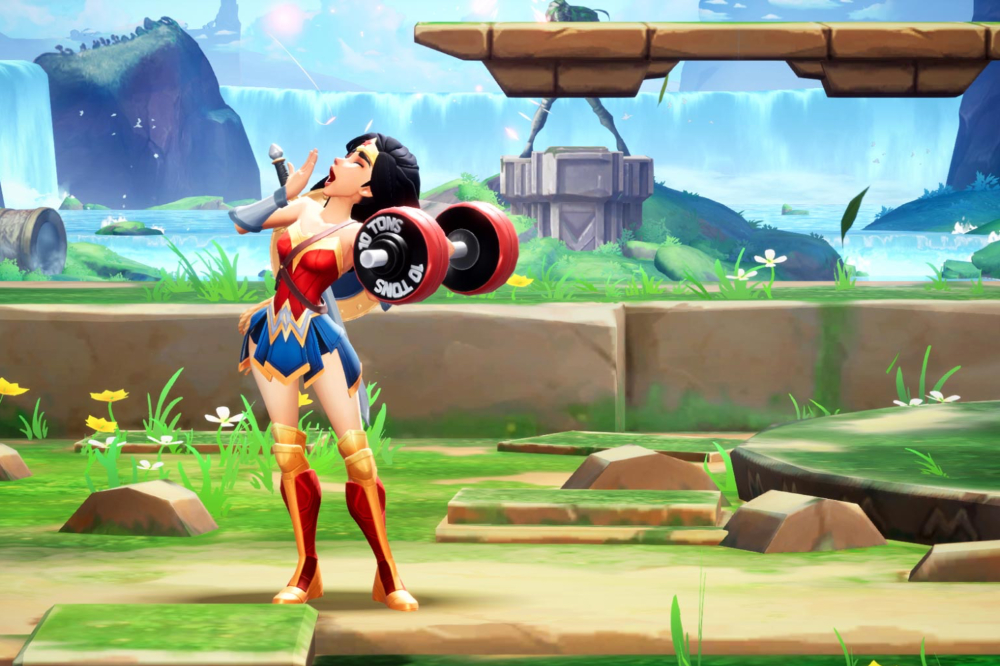
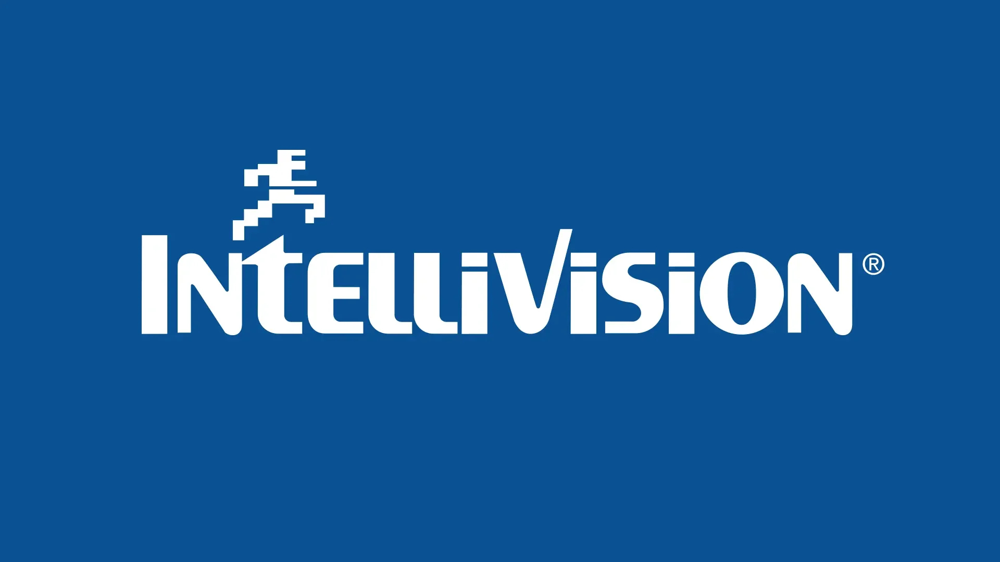

+++
title = "Joyeuse, lumineuse, un peu pinailleuse : la folle semaine du jeu vidéo (25/05)"
date = 2024-05-25T08:00:05+01:00
draft = false
author = "Mickael"
tags = ["Actu"]
+++

L’actualité du jeu vidéo ne s’arrête pas à la poignée d’articles publiés sur *Nostick* ! Histoire de rattraper le retard accumulé, voici un retour rapide sur quelques unes des infos les plus importantes (ou insignifiantes) de la semaine.

## À travers la presse déchaînée

Il n'y a pas que l'industrie du jeu vidéo qui ne va pas très bien. La presse jeu vidéo n'est pas dans sa meilleure forme non plus, et ça ne s'arrange pas. Si vous êtes familier de *Gamekult*, vous avez probablement remarqué que le site n'a plus posté aucun test depuis plus d'un mois ; le dernier en date remonte en fait au 21 mars, c'était pour *Rise of the Ronin*.

Les journalistes ont reçu pour consigne de les remplacer par des « *ultimes bafouilles* », telles que celle consacrée récemment à *Hades II*. Comme l'[explique](https://x.com/cael_presse/status/1792854097088897027) Cael, membre de la rédaction qui n'avait « *pas le droit d'aborder la question auprès du public* », c'est un pas de plus vers la dévitalisation complète du site, propriété de Reworld Media depuis deux ans après être passé entre les mains du groupe TF1.

Plus de test à proprement parler, plus non plus de vidéos, qui sont pourtant des contenus pour lesquels de nombreux lecteurs ont payé un abonnement. « *Je ne sais pas où l'on va* », écrit Cael, « *nous devions faire le point sur cette nouvelle stratégie fin avril, pas de nouvelles* ». Ça ne sentait pas très bon pour *Gamekult* depuis longtemps, ça ne s'arrange donc pas.

De l'autre côté de la Manche, c'est un électrochoc qu'a subi la presse JV. Le groupe américain IGN s'est [offert](https://www.ign.com/articles/ign-entertainment-acquires-eurogamer-gi-vg247-rock-paper-shotgun-and-more) Gamer Network, éditeur britannique de plusieurs grands noms du web dont *Gamesindustry.biz*, *Eurogamer*, *Rock Paper Shotgun*, *VG247*, *Nintendo Life* ou encore la chaîne YouTube de référence *Digital Foundry*.

IGN n'est pas forcément le pire groupe de presse, mais ce genre d'acquisition provoque immanquablement des doublons, synonymes de licenciements. On peut aussi craindre que les sites moins performants (on songe à *PureXbox*) ne fasse les frais d'une stratégie de consolidation.

## Nintendo se paie un spécialiste des portages

Nintendo s'est prudemment tenu à l'écart du tsunami d'acquisitions de ces dernières années, qui s'est terminée par une catastrophe sociale. Mais de temps à autre, l'entreprise ne se refuse pas une petite folie, quand cela sert ses intérêts bien évidemment. Nintendo a donc sorti le carnet de chèques pour acheter Shiver Entertainment, un studio basée en Floride qui appartenait à Embracer (jamais très loin quand on parle de catastrophe).

 

Shiver est peu connu du grand public et même des joueurs, le studio étant un spécialiste des portages, et notamment sur Switch : Warner Bros. lui a ainsi confié *Mortal Kombat 1* et *Hogwarts Legacy*, deux très gros jeux pas forcément bien adaptés à la petite console vieillissante de Nintendo. Malgré tout, les développeurs de Shiver ont acquis avec le temps une précieuse expertise technique et une connaissance profonde du matériel.

Et c'est probablement ce qui intéresse Nintendo. Shiver va poursuivre ses portages et continuer à « *développer du logiciel pour plusieurs plateformes, dont la Switch* », [explique](https://www.nintendo.co.jp/ir/pdf/2024/240521e.pdf) le communiqué de presse. Rien n'interdit de penser que le nouveau proprio à 100 % du studio proposera aux autres éditeurs d'exploiter les talents de Shiver pour porter leurs titres sur la future Switch 2.

## Enfin la fin de la guerre des consoles d'il y a 45 ans

Atari veut devenir le champion de la vague rétro ! Après la relance de la marque Infogrames il y a quelques semaines, le groupe (français, il est basé à Paris) a racheté la pauvre carcasse d'Intellivision ainsi que son catalogue de 200 jeux. Et alors bon, OK, Intellivision, je n'en voudrais à personne de faire des yeux ronds comme des queues de pelle.

Intellivision était une console créée par Mattel en 1979, suite au succès de l'Atari 2600. Les deux entreprises se sont tirées la bourre pendant des années, jusqu'en 1984 et la (première) mort d'Intellivision. Cette période a marqué la première « guerre » des consoles. Il y a ensuite eu plusieurs tentatives pour faire renaitre la marque, sans trop de succès. 

Alors voir Atari acquérir son plus féroce rival, c'est comme si Nintendo s'était offert Sega, ou si Microsoft rachetait Sony (ne leur donnons pas de mauvaise idée). « *C'est une opportunité très rare de réunir d'anciens concurrents et de rassembler les fans d'Atari, d'Intellivision et de l'âge d'or du jeu vidéo*  », a [déclaré](https://atari.com/blogs/newsroom/atari-acquires-intellivision-brand) Wade Rosen, président et PDG d'Atari.

Atari empoche donc non seulement la marque, mais aussi plus de 200 jeux qui ne manqueront pas d'être rentabilisés d'une manière ou d'une autre. En revanche, l'entreprise ne veut pas entendre parler de [la console Amico](https://nostickreloaded.substack.com/i/139146993/lamico-vraie-console-ou-enorme-arnaque), que la direction d'Intellivision tente désespérément de lancer depuis 2020. Une nouvelle marque va prendre le relais pour commercialiser ce qui s'annonce comme un vaporware grand luxe.

## MultiVersus reprend la bagarre

Cette fois, juré-craché, c'est la bonne pour *MultiVersus*, ~~le clone de Smash Bros.~~ le jeu de baston qui oppose les personnages des univers DC et Warner Bros. Le titre, développé par le studio Player First, avait connu une étrange période de bêta-test l'an dernier ; lancé avec pertes et fracas en août 2022, il a rencontré un énorme succès (plus de 150 000 joueurs simultanés sur Steam) avant de se ramasser comme une crêpe industrielle, perdant 99 % de ses joueurs.

 

Sorti de l'arène en juin 2023, *MultiVersus* sera finalement de retour, dans sa version définitive cette fois, le 28 mai sur PC et consoles de salon. Player First a voulu s'assurer que le contenu supplémentaire serait bien au rendez-vous cette fois, c'est ce qui avait plombé la première version. 

 

Le titre garde le même principe bien sûr : des personnages WB qui se mettent sur la tronche, ce qui donnera lieu à des bastons inattendues (Superman vs Sammy de Scooby-Doo, Le Géant de fer contre Arya Stark…). Cette nouvelle version comprend aussi un mode PvE, les Rifts, absent de la bêta. On y enchaînera des bagarres contre l'ordi, ce qui permettra au passage de se faire la main sur chaque combattant. Oh, et puis il y aura aussi rien moins que quatre types de monnaie pour débloquer de nouveaux héros et des capacités. Ah évidemment, c'est du free-to-play…

## La main secourable du Copilot de Microsoft pour les soluces

Les joueurs n'échapperont pas à l'IA générative, qui a déjà commencé à infuser dans le développement des jeux. C'est loin d'être terminé évidemment, et avec Microsoft qui est un des principaux promoteurs de cette technologie — vu les milliards de dollars investis dans OpenAI —, on pouvait être sûr que l'IA allait un jour ou l'autre venir nous casser les pieds.



On y est presque. En début de semaine, Microsoft a montré une démo de *Minecraft* où le joueur peut demander à Copilot, le bot à tout faire de l'éditeur, comment créer une épée. Et l'IA de faire un tour dans l'inventaire pour voir si les matériaux nécessaires sont disponibles. Elle peut aussi recommander d'aller les chercher ici ou là.

Une IA qui fait office de guide ? Ce n'est pas complètement idiot après tout, puisque cela éviterait d'arrêter le jeu pour aller fouiner sur le web à la recherche d'une solution. Même si au passage, les sites qui font commerce de ce genre de guides risquent d'en souffrir. Il faut quand même espérer que le bot n'hallucine pas des soluces ! On a bien vu le Gemini de Google [recommander](https://www.macg.co/services/2024/05/le-nouveau-google-carburant-lia-recommande-aux-internautes-de-manger-de-la-colle-143925) de manger de la pizza à la colle…

## La meilleure façon de jouer à Tetris

Avant qu'Apple devienne ce monstre froid, cynique et peu sympathique qu'elle est devenue aujourd'hui, il fut un temps où le constructeur savait faire plaisir à ses utilisateurs pour le fun. C'était le cas avec l'iPod, oui, le baladeur MP3 avec la molette, qui embarquait des petits jeux parfaits pour passer le temps : il y a d'abord eu le casse-briques *Brick*, qui a ensuite été rejoint par *Solitaire*, *Parachute* et *Music Quiz*.

 

Mais Apple ne s'est pas arrêté en si bon chemin. La chaîne YouTube *Apple Demo* a mis la main sur un prototype d'iPod de 3e génération (celui avec les quatre boutons au-dessus de la molette) avec un jeu inédit, *Stacker*, qui n'est autre qu'un clone de *Tetris* ! Et le tout est jouable, même à la molette.

L'animateur de la chaîne a demandé à Tony Fadell, le « père » de l'iPod, ce qu'il était advenu de *Stacker* et pourquoi le jeu n'était jamais sorti. L'ancien vice président d'Apple lui a indiqué que les jeux n'apparaissaient pas avant d'appliquer une mise à jour logicielle. Peut-être qu'Apple a annulé la version de l'OS qui aurait permis de jouer à *Tetris* sur ces vieux iPod…

Apple a doublé la mise à partir de 2006 en lançant une boutique de « vrais » jeux pour iPod sur l'iTunes Store. Contre 5 €, on pouvait s'acheter la drogue dure *Bejeweled*, *Texas Hold'em* (un des rares jeux développés par Apple), *Ms. Pac Man* ou encore… *Tetris*. La version officielle, cette fois !