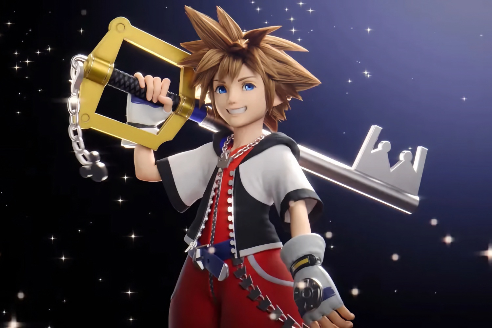

+++
title = "Y a un peu plus d'actus cette semaine, je vous les mets quand même (25/05)"
date = 2024-05-25T10:46:32+01:00
draft = false
author = "Mickael"
tags = ["Actu"]
+++

**Redfall —** L'annonce de la fermeture d'Arkane Austin a déboussolé les développeurs du studio, et pour cause : ils bossaient dur sur une grosse mise à jour de *Redfall*. Si le lancement du FPS à base de vampires a été une catastrophe à tout point de vue, aussi bien Arkane que Xbox avaient promis d'améliorer le bazar — en espérant changer le vilain petit canard en cygne flamboyant au bout d'un moment. Et justement, cette mise à jour était un jalon important dans cette transformation. 

Malgré la mauvaise nouvelle ([toujours incompréhensible](https://nostick.fr/articles/2024/mai/0705-fin-de-partie-pour-arkane-austin-et-tango-gameworks/)) de cette fermeture, Arkane va tout de même [livrer](https://x.com/playRedfall/status/1791491460858020040) cette nouvelle version qui comprend notamment un mode hors ligne ; c'est un soulagement ne serait-ce que pour la préservation du jeu, car on imagine bien que Microsoft débranchera les serveurs assez rapidement. Aucune date n'a été précisée.

 

**Elden Ring —** Encore quelques semaines de patience, et les adeptes d'*Elden Ring* pourront finalement chevaucher et batailler de nouveau dans leur univers préféré : *Shadow of the Erdtree* sortira en effet le 21 juin. Ce DLC, qui sera le seul et unique du jeu, s'offre en attendant une bande annonce dévoilant la tyrannie de Messmer. De nouveaux challenges attendent les fans du *Souls*-like qui a tout cartonné en 2022.

**Absurd Ventures —** Quand le co-fondateur de Rockstar et ancien producteur de GTA se lance dans un nouveau jeu loin de ses bases, forcément, on est intéressé. À la tête de son studio Absurd Ventures fondé en 2021, Dan Houser et son équipe [planchent](https://www.ign.com/articles/rockstar-co-founder-dan-housers-new-game-details) visiblement sur un jeu d'aventures avec des combats à la troisième personne qui pourrait bien se dérouler dans un monde ouvert de science-fiction !

C'est du moins ce qu'on peut en déduire de la lecture des récentes offres d'emploi d'Absurd Ventures, et du premier podcast audio produit par le studio : *A Better Paradise*, une série de 12 épisodes qui se déroule dans un « futur proche ». Le communiqué de presse indique que des jeux vidéo seront produits dans cet univers… Du coup, pas difficile de connecter les points.

**Dolby Surround —** Masahiro Sakurai comprend les joueurs. Le créateur de *Kirby* et de *Smash Bros.*, légende vivante du jeu vidéo, a [révélé](https://www.youtube.com/watch?v=Kb0rE9Yt8b0) qu'il avait choisi de priver le jeu de course *Kirby Air Ride* (Game Cube) du Dolby Surround. Pas parce qu'il a une dent contre la technologie audio de Dolby, mais parce qu'il ne voulait pas imposer le logo Dolby Surround aux joueurs pendant le lancement du jeu ! « *Je suis désolé de faire attendre l'utilisateur* », explique-t-il. Les quelques secondes grattées en zappant purement et simplement le logo sont en effet précieuses : après tout, quand on lance un jeu, c'est pour y jouer et le plus rapidement possible. Quitte à se passer du Dolby Surround…

 

**Kingdom Hearts —** L'incroyable saga (parfois difficile à suivre et à déchiffrer) *Kingdom Hearts* va finalement être disponible sur Steam, maintenant que l'exclusivité avec l'Epic Games Store s'achève — au bout de trois longues années tout de même. Le 13 juin, trois bundles vont donc faire leur apparition dans la boutique que tout le monde utilise : *Kingdom Hearts 1.5 + 2.5 ReMIX*, *Kingdom Hearts HD 2.8 Final Chapter Prologue* et *Kingdom Hearts III + Re Mind DLC* (moi non plus je ne comprends rien à ces noms). La collection *Integrum Masterpiece*, qui comprend les trois paquets, sera aussi disponible. Square Enix n'a donné aucun tarif.