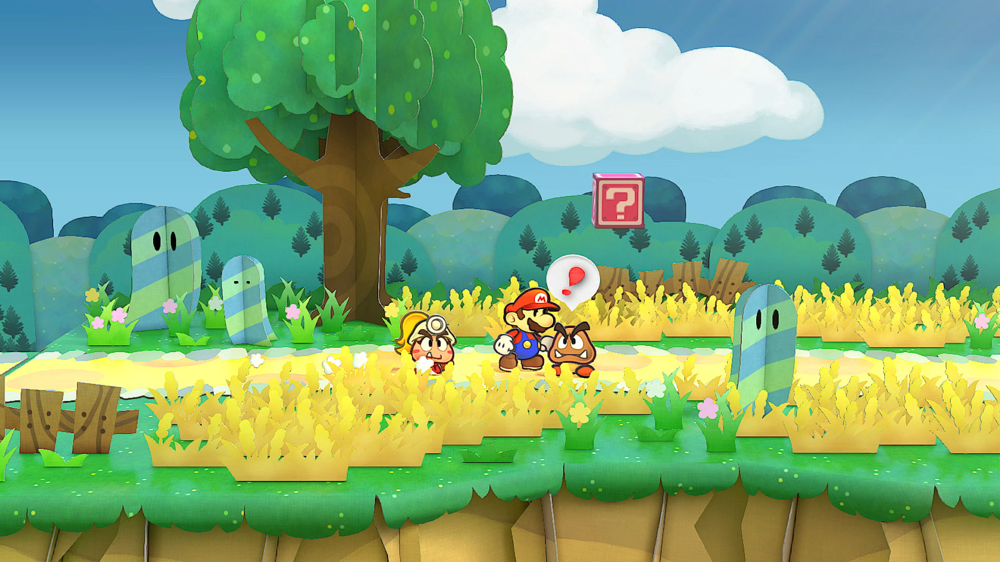
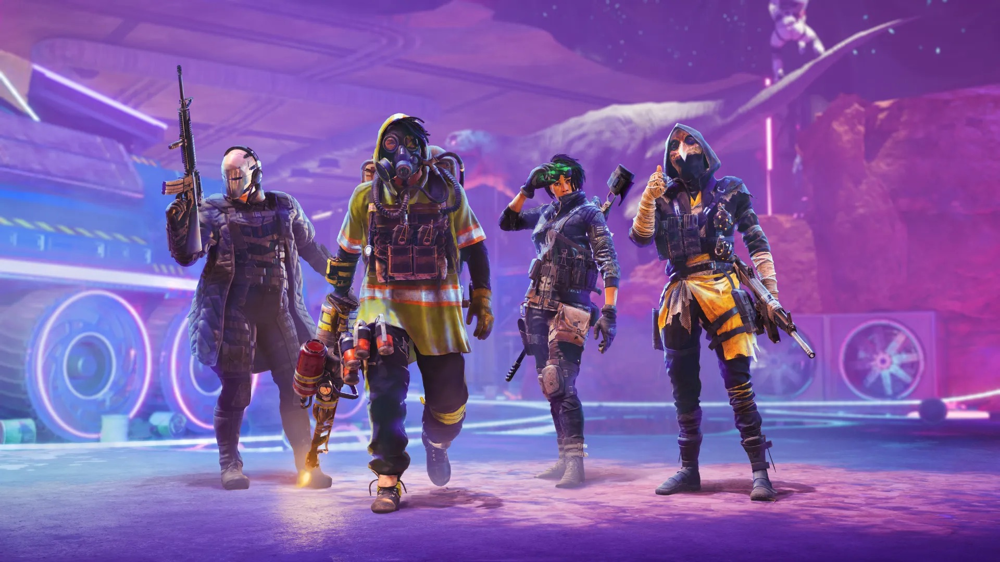

+++
title = "Les sorties de la semaine (26/05)"
date = 2024-05-26T08:00:00+01:00
draft = false
author = "Félix"
tags = ["C’est dispo"]
+++ 

*Entre le boulot, les courses et ce mois de mai bien pluvieux qui repousse vos projets barbecue, vous n’avez peut-être pas eu le temps de vous intéresser aux nouveautés du moment. Qu’à cela ne tienne : voici les sorties de ces derniers jours qui ont retenu notre attention.*

## Mariorigami

Nintendo continue d’accompagner la Switch dans sa fin de vie en faisant ses fonds de tiroir. Son dernier remake à peu de frais est ***Paper Mario : La Porte Millénaire***, initialement sorti sur GameCube en 2004 et souvent considérée comme un des meilleurs de la série. Il s’agit d’un RPG au tour par tour avec une intrigue rigolote se bouclant en une trentaine d’heures, à l’esthétique soignée et au scénario salué par la critique. La partie graphique a eu le droit à une couche de peinture pour des décors beaucoup plus agréables à l’œil, bien qu’on regrettera que tout cela soit bloqué à 30 i/s. Nintendo a pris soin de réorchestrer la bande originale et de moderniser certains aspects : une bonne occasion de vous y mettre si vous n’avez jamais essayé ce classique. Les esprits chagrins ronchonneront sans doute face au manque de contenu exclusif et sur le tarif costaud [de 60 €](https://www.nintendo.com/fr-fr/Jeux/Jeux-Nintendo-Switch/Paper-Mario-La-Porte-Millenaire-2445545.html), mais que voulez-vous ma bonne dame, le yen n’en finit pas de s’effondrer et il faut bien payer la R&D de la Switch 2.

## Coup de froid sur la Xbox

Contrairement à ce que son nom peut laisser penser, ***Hellblade 2*** n’est pas un boomer-shooter à 10 € ou l’adaptation d’un obscur comics, mais bien un gros AAA sorti cette semaine exclusivement sur PC et Xbox. On y incarne une combattante qui entend des voix dans une Islande du 10e siècle rempli de géants. L’ambiance est sombre, les critiques évoquant un « *jeu d’horreur psychologique* » très axé sur l’histoire abordant des thématiques lourdes et avec un gameplay correct. C’est intrigant et visiblement très joli : le testeur de *[The Verge](https://www.theverge.com/24161514/hellblade-2-review-xbox-pc)* décrit « *le jeu le plus beau auquel il a jamais joué* ». Ce ne sera pas pour tout le monde (d’autant plus que la durée de vie oscille entre 6 et 8 h), mais si le trailer vous fait de l’œil, vous ne devriez pas regretter [vos 50 balles](https://store.steampowered.com/app/2461850/Senuas_Saga_Hellblade_II/). Également dispo sur le Game Pass et sur Xbox.



## Call of Ubi

Ubisoft était resté discret depuis le gros fiasco *Skull and Bones* et est revenu à la charge cette semaine avec *‌**XDefiant***, un FPS 6v6 free-to-play avec des personnages inspirés des licences maison (*Splinter Cell, Watch Dogs*…). Oui moi aussi je me disais que ça avait l’air plutôt bancal comme concept, mais figurez-vous que les premiers retours sont plutôt bons. *[Nofrag](https://nofrag.com/xdefiant-est-sorti-et-il-ne-semble-pas-si-mal/)* a fait quelques parties et décrit un jeu au feeling « *plutôt chouette* », un avis partagé par *[PCGamer](https://www.pcgamer.com/games/fps/free-to-play-ubisoft-shooter-xdefiant-launches-with-the-expected-matchmaking-issues-but-im-having-a-good-time/)*. Dans l’idée c’est une copie des *Call of* d’il y a une dizaine d’années avec une touche d’*Overwatch* qui promet des parties pas prises de têtes. Reste à voir si le suivi sera au rendez-vous, mais les bases semblent plutôt bonnes si on excepte le nom tout naze. Ça peut mériter un téléchargement si vous avez envie de vous défouler à grand coup de *headshot* et que vous trouvez le courage d’installer [le launcher Ubi](https://www.ubisoft.com/fr-fr/game/xdefiant). Également dispo sur PS5 et Xbox.

## Vous allez être plié

**Paper Trail** est un puzzle-game aux graphismes mignon qui repose sur un concept sympa : chaque tableau est une feuille que l’on peut plier pour débloquer des chemins ou modifier des éléments. On y incarne une héroïne appelée Paige (ha, ha) qui quitte son village pour partir à la découverte du monde, ce qui passe par tout un tas de puzzles. Les décors façon aquarelle et la bande-son laissent à penser qu’il s’agit d’un jeu abordable, mais malgré son ambiance cozy, *Paper Trail* est visiblement assez difficile. À voir si vous aimez vraiment vous creuser la cervelle, mais si c’est le cas, ce n’est sans doute pas une mauvaise pioche. 19,50 € sur [Steam](https://store.steampowered.com/app/1889740/Paper_Trail/), également dispo sur Switch, consoles et smartphone pour les abonnés Netflix. 



## En rab

On reste dans le thème du papier avec ***Duck Detective***, qui puise son inspiration du côté de *Paper Mario* avec un jeu d’enquête rigolo dans lequel on incarne un canard accro au pain qui doit résoudre un mystère. Si vous êtes partant pour les parodies de films noirs, que vous n’avez pas de problème avec l’anglais et que le [trailer](https://www.youtube.com/watch?v=BLhqdpOi7VE) vous plaît, c’est visiblement pas mal. Comptez 9,75 € pour deux heures de jeu sur [Steam](https://store.steampowered.com/app/2637990/Duck_Detective_The_Secret_Salami/) et consoles. Dans un tout autre registre, notons la sortie d’***Artic Eggs***, qui comme son nom l’indique, invite le joueur à faire cuire des œufs au plat dans une dystopie située dans le cercle polaire arctique. Le concept est chelou, les graphismes PS1 moches mais le jeu affiche pourtant des évaluations « extrêmement positives » sur Steam, alors pourquoi pas. 9,75 € sur [Steam](https://store.steampowered.com/app/2763670/Arctic_Eggs/#app_reviews_hash). Enfin, bonne nouvelle pour la team consoles : le remake de ***System Shock*** est désormais disponible sur consoles PS5, PS4 et Xbox, mais pas sur Mac (le portage a été [foutu à la benne](https://www.gamingonlinux.com/2024/05/nightdive-studios-confirm-linux-and-macos-ports-of-system-shock-are-cancelled/), snif).