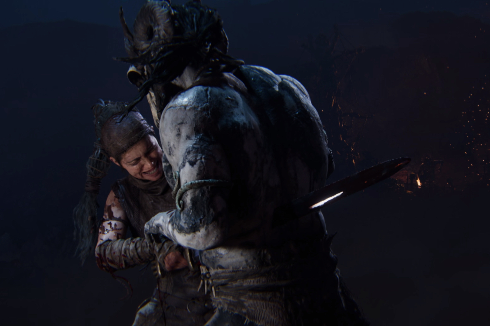

+++
title = "Test de Senua's Saga: Hellblade 2, une aventure qui a oublié d'être un jeu"
date = 2024-05-27T07:30:00+01:00
draft = false
author = "Mickael"
tags = ["Test"]
type = "une"
image = "https://nostick.fr/articles/vignettes/hellblade1.jpg"
+++

**Jeu vidéo, film interactif, démo technique, « expérience »… Comment qualifier *Senua's Saga: Hellblade 2* ? S'il est difficile de se faire une opinion arrêtée sur le nouveau jeu de Ninja Theory, il y a au moins une chose de sûre : le titre marque la rétine et les cages à miel au fer rouge. Pour les doigts, c'est moins sûr.**

*Senua's Saga: Hellblade 2* a un sacré poids sur les épaules. Le jeu de Ninja Theory a eu l'insigne honneur d'être parmi les premières exclusivités annoncées lors de la révélation de la Xbox Series S/X, fin 2019. L'année précédente, Microsoft s'était offert le studio encore auréolé de la réception critique du premier *Hellblade* (2017).

Quatre longues années plus tard, le jeu sort enfin dans un contexte bien différent pour Xbox. La vague du lancement des nouvelles consoles est retombée à plat, la division gaming de Microsoft est en [crise permanente](https://nostick.fr/articles/2024/mai/1505-bonjour-tristesse-chez-xbox/), et les gros titres AAA exclusifs n'ont pas été les éclatantes réussites espérées (*Redfall*, *Starfield*), à quelques exceptions près évidemment.

*Hellblade 2* doit donc redorer le blason d'une plateforme qui peine à trouver sa voie et à séduire des joueurs déboussolés par les changements de pied stratégiques de Microsoft. Mais n'est-ce pas trop lui demander ? Le jeu ne sera probablement pas le sauveur de Xbox, mais ça reste en revanche, un sacré morceau.

## Senua's Saga: Hellblade 2, ça parle de quoi ?

Après avoir fait la paix avec les Furies qui se bousculent dans sa tête, Senua s'est volontairement fait capturer par des esclavagistes qui l'emmènent vers l'Islande, dans l'espoir de pouvoir libérer son peuple de la tyrannie viking. L'esquif est cependant pris dans une tempête et sombre non loin de la côte. Et notre héroïne doit désormais de nouveau se battre contre l'adversité… et contre elle-même.

Senua est une guerrière picte qui, dans le premier volet de *Hellblade*, se considérait comme maudite à cause des voix qu'elle entend sans cesse. Elles peuvent parfois donner de bons conseils, et parfois tenter de décourager la combattante. *Hellblade* aborde sous l'angle vidéo-ludique les problématiques de santé mentale et de psychose, dont Senua est atteinte. 

Au début du jeu, un panneau recommande vivement de porter un casque ou des écouteurs et pour cause : le travail sur le son est remarquable, les Furies pouvant se faire entendre au loin, tout près, à gauche ou à droite du joueur. De quoi s'immerger complètement dans les hallucinations auditives de Senua.

## Comment ça se joue ?

*Hellblade 2* est probablement ce qui se rapproche le plus d'un film interactif. Le titre alterne très habilement, et de manière transparente, les cinématiques et les phases de jeu. Rapidement, on prend le pli du fonctionnement : dès que la caméra se pose dans le dos de Senua, on sait que le jeu nous redonne le volant.

Hélas, en termes de gameplay pur et dur, les premiers problèmes apparaissent : il n'y a pas beaucoup de jeu dans ce jeu. *Hellblade 2* demande essentiellement trois choses au joueur : se rendre d'un point A à un point B, résoudre des puzzles visuels et combattre des méchants. Vous allez me dire, c'est le programme de bon nombre de jeux d'aventure/action, mais le gameplay du titre ne dépasse pas le strict minimum.

Se rendre d'un point A à un point B ? Le chemin est balisé entre des murs virtuels contre lesquels on bute très vite. Les puzzles ? Il suffit généralement de focaliser l'attention de Senua sur un bout de décor pour que la solution apparaisse toute seule. Les bastons ? On est aux antipodes de ce qui se fait de plus engageant.

L'héroïne a la possibilité de parer/bloquer une attaque et d'esquiver, et elle a sa disposition une attaque simple et une attaque forte. À cela s'ajoute très rapidement dans le jeu la capacité de ralentir le temps pour mettre la misère à un ennemi. Pas de combo, pas de système permettant de modifier ou de renforcer une attaque, pas de gestion des armes, c'est le degré zéro de la bagarre.

En fait, les combats sont si peu techniques qu'on finit par y aller en pilotage automatique. Et vu que la difficulté n'évolue pas au long du jeu, c'est avec une certaine lassitude que l'on enchaîne les confrontations. Il arrive cependant que la mort soit au bout du chemin, mais ça n'a rien de grave : le jeu reprend tout simplement au combat précédent, sans conséquence sur la suite de l'aventure.

Pas d'inventaire, pas de crafting (ce que le jeu aurait pu justifier au vu de l'époque et du milieu où se déroule l'action), pas de collectathon ou si peu, des mécanismes magiques ou ésotériques très limités et basiques… Les systèmes de jeu de *Hellblade 2* sont tellement simples qu'ils franchissent allègrement la frontière du simplisme. Mais vous savez quoi ? Ça n'est pas si grave.

## Qu’est-ce qui est bien ?

Vous n'avez jamais vu un tel jeu. Ninja Theory a fait sien le moteur Unreal 5, qui démontre toutes ses capacités avec *Hellblade 2*. Certaines séquences n'auront jamais été aussi proches d'une qualité cinématographique, un effet encore renforcé par la présence de bandes noires en haut et en bas. Les cinématiques ne sont pas des vidéos pré-calculées : le mode photo permet de pénétrer profondément dans n'importe quelle séquence pour en modifier la caméra, la lumière, la position de Senua… 

Par conséquent, il n'est pas étonnant que les séquences « filmées » et les phases de jeu soient si fluides. Epic ne manquera certainement pas de présenter *Hellblade 2* comme une démo des possibilités de son moteur. Mais la technique ne fait pas tout : contrairement à *The Matrix Awakens*, la première démo Unreal 5, le jeu de Ninja Theory a un supplément d'âme. Non seulement par l'attachement que l'on peut ressentir pour Senua, mais aussi par l'aspect humain de l'aventure.

Et par humain, on entend : viscéral. Les combats sont sanglants et font mal aux os, on n'est pas dans la gaudriole *Devil May Cry* ou *Mortal Kombat*, les coups portés ont de l'impact et les nombreuses séquences de mises à mort impressionnent par leur réalisme. Lors des combats, les visages reflètent la douleur et l'effort d'une manière inédite dans un jeu vidéo.

Les animations en mocap des personnages (Melina Juergens, l'actrice qui incarne Senua, méritera toutes les récompenses en fin d'année) sont saisissantes, que ce soit « en jeu » ou durant les cinématiques. 

Les moments plus calmes bénéficient aussi du travail d'orfèvre réalisé par le studio. La balade dans la campagne sauvage islandaise est de toute beauté, que ce soit sous le soleil (rarement), sous la pluie battante (plus souvent) ou la nuit. On s'arrête fréquemment en chemin pour admirer les paysages.

L'enrobage sonore, que ce soit le doublage, les voix intérieures de Senua ou la musique, est rien moins que sensationnel. Alors évidemment, ça perd de sa force si on ne comprend pas l'anglais ou que l'on affiche les sous-titres. Mais ce boulot participe largement de l'ambiance sinistre du jeu ; en tout cas, ça place le joueur dans les galoches de Senua et croyez moi, vous allez faire tout votre possible pour que ça se passe bien.

## Qu’est-ce qui est moins bien ?

*Hellblade* n'est pas l'équivalent Xbox de la saga *God of War*. Les deux licences ont certes des points en commun : une certaine linéarité et bien sûr, un net penchant pour la mythologie, mais les comparaisons s'arrêtent là. Les jeux de Sony Santa Monica ont un gameplay autrement plus riche et varié, et les puzzles y sont parfois assez complexes.

Rien de tout ça dans *Hellblade*, dont le deuxième volet semble même en offrir moins sur ces deux points que son prédécesseur. Pire encore, il y a comme un ventre mou au milieu du jeu, où il s'agit de suivre des indications lumineuses dans une grotte : on est content quand ça se termine. Pas top pour un jeu d'une durée de 6 à 8 heures, dont un peu plus de 3 heures est composé de cinématiques…

*Hellblade 2* ne va guère au-delà des sentiers balisés de son scénario. Les joueurs qui voudraient visiter tranquillement l'Islande sauvage du 9e siècle en seront pour leur frais : la liberté de mouvement est très limitée. Néanmoins, il y a tout de même des petites choses à découvrir et à débloquer dans les recoins, mais ça ne va pas très loin.

Enfin, l'objectif louable d'aborder la question de la psychose — les Furies dans la tête de Senua — se transforme petit à petit en gimmick. Après un début tonitruant où les voix mettent une pression terrible sur l'héroïne et donc sur le joueur, elles finissent par simplement décrire ce qui se passe dans le jeu. Un peu redondant.

## C’est oui ou c’est non ?

*Senua's Saga: Hellblade 2* manque certainement de jeu vidéo. Ce n'est pas un très bon simulateur de marche, les combats ne sont guère excitants au-delà de la réalisation, les énigmes ne posent aucune difficulté, le gameplay est basique. Mais voilà : dans *Hellblade 2*, on ne joue pas beaucoup mais on en prend plein les yeux et les oreilles. La réalisation est rien moins qu'exceptionnelle, c'est du jamais vu sur Xbox ou même sur PC. 

Quant à la qualité graphique, Ninja Theory a définitivement maîtrisé le moteur Unreal. C'est bien simple, la durée du jeu peut être doublée si on commence à jouer avec le mode Photo qui à tous les coups donnera un résultat digne de devenir un fond d'écran.

La réponse à la question que l'on se posait en début d'article dépendra en fait de chacun. Pour ce qui me concerne, *Hellblade 2* a été une expérience interactive fascinante, j'en aurais bien repris quelques heures de plus ! Mais en tant que jeu en lui-même, le titre est clairement une déception. Toutefois, on ne peut s'empêcher d'espérer que pour son prochain projet — [validé par Microsoft](https://nostick.fr/articles/2024/mai/2105-la-sortie-de-hellblade-2-ne-condamne-pas-ninja-theory/) —, Ninja Theory parvienne à mieux équilibrer la claque visuelle et le gameplay.

*Jeu testé sur le Game Pass via GeForce Now Ultimate (ça marche au poil)*

 