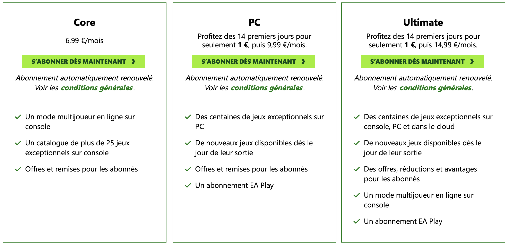

+++
title = "Call of Duty: Black Ops 6 sera sur le Game Pass day one"
date = 2024-05-28T10:47:32+01:00
draft = false
author = "Mickael"
tags = ["Actu"]
image = "https://nostick.fr/articles/2024/mai/2805-call-of-duty-black-ops-6-sera-sur-le-game-pass-day-one/CallOf2.jpg"
+++

 

Allez, ce n'est plus une surprise désormais : *Call of Duty: Black Ops 6* sera bien disponible *day one* sur le Game Pass. Microsoft a fin par cracher sa Valva sur *[Xbox Wire](https://news.xbox.com/en-us/2024/05/28/play-call-of-duty-black-ops-6-day-one-game-pass/)*, le tout accompagné d'un petit trailer qui va bien



Il ne faisait plus guère de doute que le gros jeu de l'année d'Activision allait faire son entrée dans le Game Pass. Sarah Bond, la présidente de Xbox, avait [confirmé](https://www.youtube.com/watch?v=oIpc8VZ3Bnw) lors d'une conférence *Bloomberg* début mai que les abonnés ont accès à tous les jeux des studios Microsoft dès le premier jour. Elle n'a pas cité nommément *Call of*, mais c'est tout comme. Une annonce pourrait même tomber dès aujourd'hui.

Xbox organisera son showcase annuel le 9 juin, un événement qui sera suivi d'un « direct » justement consacré au [jeu développé par le studio Treyarch](https://nostick.fr/articles/2024/mai/2305-call-of-duty-treyarch-revient-en-bombe-avec-black-ops-6/call-of-duty-treyarch-revient-en-bombe/) aux manettes pour ce nouvel opus. On en saura davantage sur le jeu, qui sera comme chaque année le best seller de l'année (sauf en 2023 où *Hogwarts Legacy* lui avait chipé la première place), et surtout sur les changements qui nous pend au nez pour le Game Pass.

Car personne n'imagine un instant que la structure de l'abonnement va rester comme elle est avec l'arrivée du mastodonte *Call of Duty* au catalogue. Microsoft voudra certainement rentabiliser le FPS, qui lui a coûté la bagatelle de 69 milliards de dollars.

 

Reste à savoir comment. Le palier Ultimate actuellement à 15 € peut-il flirter avec les 20 € en intégrant *Call of Duty* ?  La formule PC à 10 € pourrait-elle se passer des jeux *day one*, ce qui provoquerait une levée de boucliers ? Grosse angoisse chez les fans. Selon la rumeur, *Black Ops 6* pourrait être lancé le 25 octobre. Ce qui laisse pas mal de temps à Microsoft pour faire un peu de pédagogie.