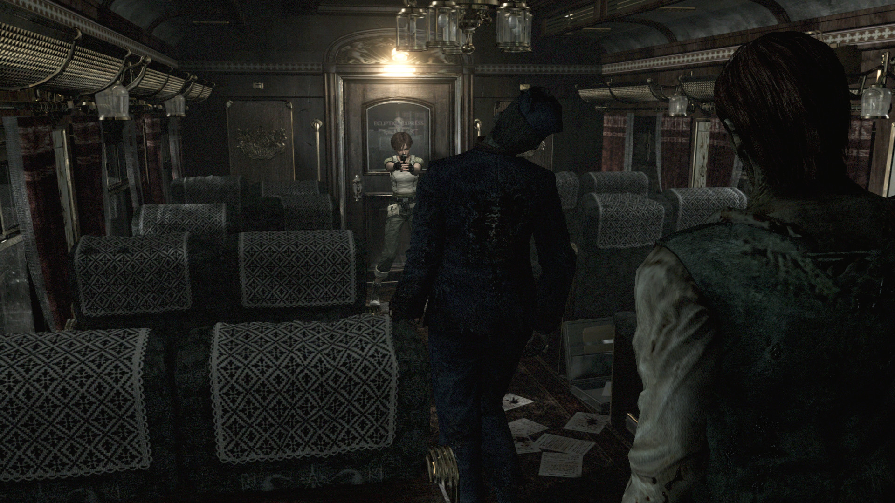

+++
title = "Capcom travaillerait sur un remake de Resident Evil Zero et de Code Veronica"
date = 2024-05-29T09:30:32+01:00
draft = false
author = "Félix"
tags = ["Actu"]
image = "https://nostick.fr/articles/vignettes/nostick.jpg"
+++ 

Capcom est loin d’avoir épuisé le juteux filon des remakes de vieilleries remis aux standards de 2024. Après un *Resident Evil 4* salué par les critiques en début d’année dernière, nombreux sont les joueurs à se demander quel sera le prochain opus de la saga à avoir droit à un coup de polish. Selon le généralement bien informé [DuskGolem](https://x.com/AestheticGamer1/status/1795075373727613065), Capcom serait en train de plancher sur une refonte de *Resident Evil Zero* et de *Code Veronica*, deux jeux moins marquants du début des années 2000. 

*Resident Evil : Code Veronica* est sorti en 2000 sur Dreamcast : il s’agit du quatrième jeu *Resident Evil*. C’est aussi le premier à avoir été lancé sur une console autre que la PlayStation et à utiliser des environnements 3D, là où les précédents faisaient appel à des décors fixes. On y incarne Claire et Chris Redfield qui doivent survivre à une attaque de zombies sur une île-prison. Le jeu a été remastérisé pour la Xbox 360 et la PlayStation 3 en 2011.

De son côté, *Resident Evil Zero* (ou Ø pour les puristes) est une préquelle au premier épisode de la série sorti en 2002 sur GameCube. On y suit des évènements se déroulant la veille de *RE1* en chaussant les bottes de l'agent des S.T.A.R.S. Rebecca Chambers et du criminel condamné à mort Billy Coen. Une version HD a été publiée sur [PC](https://store.steampowered.com/app/339340/Resident_Evil_0/?l=french)/PS4/Xbox One en 2016.

 

Le choix de ces deux titres peut sembler surprenant. Une refonte de *RE : Code Veronica* aurait été plus logique après la sortie des remakes de *RE2* et *RE3*, tandis que *Resident Evil Zero* est parfois considéré comme un des moins bons de la saga. Capcom veut visiblement éviter de se lancer dans un remake de *Resident Evil 5*, un épisode pour le moins [controversé](https://residentevil.fandom.com/wiki/Resident_Evil_5_racism_controversy) se déroulant en Afrique et franchement pas terrible d’un point de vue gameplay. Une nouvelle version demanderait une refonte en profondeur et un énorme travail de réécriture qui ne manquerait pas de relancer les polémiques. Directement passer à un remake du 6 n’est pas vraiment une option étant donné que le jeu est également très moyen et qu’il faudrait là aussi grandement retravailler certains aspects.

La théorie d’un remake pour *Resident Zero* et *Code Veronica*  semble donc assez crédible, d’autant plus qu’elle a été appuyée par *[IGN](https://www.ign.com/articles/resident-evil-zero-and-code-veronica-remakes-reportedly-in-the-works-at-capcom)*. Le fuiteur Desk Golem déclare qu’un remake de *RE5* n’est pas en travaux pour le moment. Il ajoute que les rumeurs récentes évoquant un remaster de *Resident Evil 1* sont des « *conneries* » et estime que la sortie de *Resident Evil 9* se ferait en 2025/2026. Bref, *wait and see* comme on dit quand on ne sait pas trop comment conclure un article.