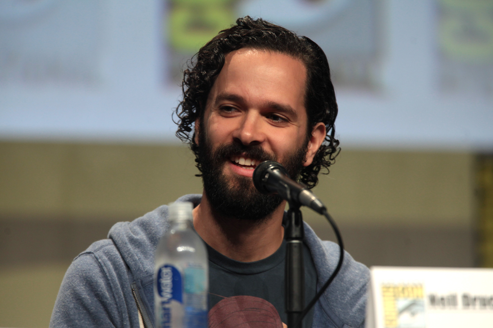

+++
title = "Ivre, Sony invente des déclarations de Neil Druckmann, le créateur de The Last of Us"
date = 2024-05-29T10:47:32+01:00
draft = false
author = "Mickael"
tags = ["Actu"]
image = "https://nostick.fr/articles/vignettes/nostick.jpg"
+++

 

Les « *réalités infinies* » et les « *mondes multi-couches connectés* » que Sony entrevoit pour dans dix ans devront se réaliser sans les fulgurances de Neil Druckmann. Il avait été interrogé pour enrichir la « *vision créative pour le divertissement* » du constructeur, en fait un exercice de prospective un peu vain à destination des investisseurs ([on s'en était gentiment moqué ici](https://nostick.fr/articles/2024/mai/2405-sony-se-touche-la-nouille/)). Les réponses du patron du studio Naughty Dog, créateur de *The Last of Us* ont été purement et simplement retirées du site.

Dans cette interview, le dirigeant révélait que le prochain titre de Naughty Dogs allait rien moins que « *redéfinir la perception grand public du jeu vidéo* ». Il avait également affirmé que les outils d'intelligence artificielle vont permettre de « *créer des dialogues et des personnages nuancés* » et « *révolutionner la manière dont le contenu est créé* ». De grands mots… qui n'ont pas vraiment été prononcés !

Sony est allé un peu vite en besogne en éditant la réponse du dirigeant pour la rendre plus digeste, et probablement aussi plus compatible avec le reste du discours *corporate* imbuvable de toute cette opération. Neil Druckmann s'en est ému sur les réseaux sociaux, et il a [posté](https://x.com/Neil_Druckmann/status/1794187392183898408) le transcript de sa « vraie » réponse. En substance, ce que Sony a mis en ligne « *n'est pas exactement ce que j'ai dit (…) certains de mes mots, du contexte et de mes intentions se sont malheureusement perdus* ».

La version éditée invente même des bouts de phrases et des idées que Druckmann n'a jamais utilisés, comme cette histoire du jeu qui allait redéfinir la perception du grand public. À la décharge de Sony, la réponse originale n'était pas spécialement très structurée, mais tout de même ce n'est pas une raison de reproduire n'importe quoi.

Pour éviter la controverse avec un de ses créateurs vedette, Sony a décidé de retirer purement et simplement l'interview du [site](https://www.sony.com/en/SonyInfo/creative-entertainment-vision/) consacré à cette « vision » : « *Nous avons constaté plusieurs erreurs et inexactitudes importantes qui ne représentent pas [la] perspective [de Neil Druckmann] et ses valeurs (y compris des sujets tels que l'animation, l'écriture, la technologie, l'IA et les projets futurs)* », explique l'entreprise. Sony s'excuse pour avoir « *déformé les propos* » de l'interviewé.

Internet n'oubliant jamais, l'interview est toujours visible sur [archive.org](https://web.archive.org/web/20240525155202/https://www.sony.com/en/SonyInfo/creative-entertainment-vision/interview/2.html).