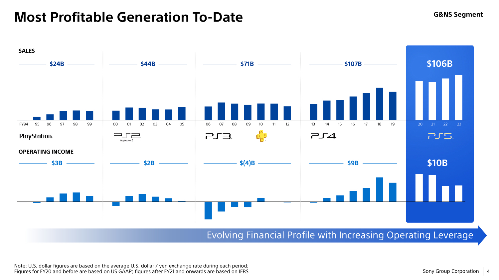

+++
title = "Finalement, ça ne va pas si mal pour PlayStation"
date = 2024-05-30T10:47:32+01:00
draft = false
author = "Mickael"
tags = ["Actu"]
image = "https://nostick.fr/articles/2024/mai/3005-pas-si-mal-pour-playstation/PlayStation.jpg"
+++

 

Alors OK, Sony aurait voulu vendre plus de PlayStation l'an dernier mais tout de même : le constructeur en a écoulé quasiment 21 millions, soit grosso modo dans les clous des prévisions de l'entreprise. Certes, elle espérait à l'origine en vendre 25 millions avant de revoir le chiffre à la baisse.

Quant aux prévisions pour l'exercice fiscal en cours, elles annoncent un volume en retrait à 18 millions, malgré le lancement attendu de la PS5 Pro probablement cet automne. En tout, Sony a fourgué 56 millions de sa console de salon, soit [le double de Xbox Series S/X](https://nostick.fr/articles/2024/mai/1505-bonjour-tristesse-chez-xbox/).

Mais le succès de la PS5 ne se mesure pas uniquement au volume de consoles vendues. Bien sûr, c'est un critère important, mais ce n'est pas le seul. Sony a dévoilé quelques informations supplémentaires confirmant, si besoin était, le succès de la console via une pelletée de diapositives triomphantes.

Partagée à l'occasion des récents résultats trimestriels, cette [présentation](https://www.sony.com/en/SonyInfo/IR/library/presen/business_segment_meeting/pdf/2024/GNS_E.pdf) de l'activité Game & Network Services montre que la PS5 est tout simplement la génération de PlayStation la plus rentable. La gamme a généré un chiffre d'affaires de 106 milliards de dollars depuis son lancement fin 2020, avec un résultat d'exploitation de 10 milliards. C'est supérieur aux chiffres enregistrés par les autres familles de consoles après quatre ans.

 

Vous allez me dire qu'avec 107 milliards, les revenus de la PS4 dépassent ceux de la PS5. Certes, mais il s'agit du chiffre d'affaires total de cette génération sur l'ensemble de sa carrière. La PS5 ne devrait avoir aucun mal à faire mieux, probablement dans le courant de l'année. Il faut aussi avoir en tête que ces 106 milliards représente l'ensemble de l'activité « consoles », ce qui englobe aussi les ventes de jeux PS4 depuis le lancement de la PS5, et elles ne sont pas négligeables. 

Après tout, la PS4 s'est écoulée à 117 millions d'unités et de nombreux joueurs n'ont toujours pas fait la bascule vers le nouveau modèle. La PS5 a cependant un autre atout par rapport à sa prédécesseure : les joueurs dépensent beaucoup plus d'argent ! +34 % pour les périphériques par rapport à la PS4, +57 % pour les services, +176 % pour les contenus supplémentaires (DLC)… Par contre, c'est -12 % pour les jeux en eux-mêmes. En tout, les joueurs ont claqué en moyenne 731 $ pour les jeux, services et accessoires de leur PS5, contre 580 $ pour la PS4 (une différence de 26 %). Des sommes qui *s'ajoutent* à l'achat de la console.

 

PlayStation compte 118 millions d'utilisateurs mensuels actifs (dont 49 millions pour la PS5), à qui Sony compte bien vendre des jeux bien sûr, mais aussi du service à gogo. Le nombre d'abonnés aux formules PS Plus les plus chères (Extra et Premium) a progressé de 5 points entre 2022 et 2023.

Ces joueurs ont aussi passé plus de temps à jouer : 2,4 milliards d'heures sur la PS5, contre 1,4 milliard sur la PS4. Il est probable que la pandémie, avec ses périodes de confinement, a poussé pas mal d'entre eux à tuer le temps devant  la télé. À la lumière de ces chiffres, on comprend un peu mieux la volonté de Sony de se lancer à corps perdu dans les jeux service, qui sont susceptibles de gagner en rentabilité lorsque les joueurs y passent beaucoup de temps.

On n'a pas fini d'entendre parler de Sony : le State of Play estival est en effet prévu pour cette nuit ! Bien sûr, on vous tiendra au courant des principales nouveautés parce qu'on adore se coucher très tard.