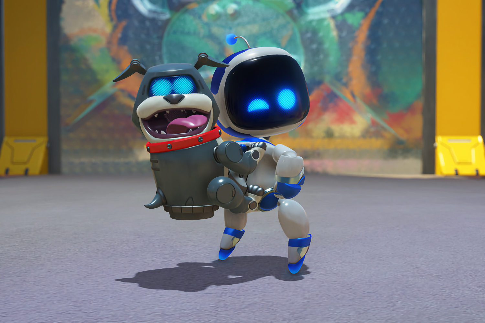
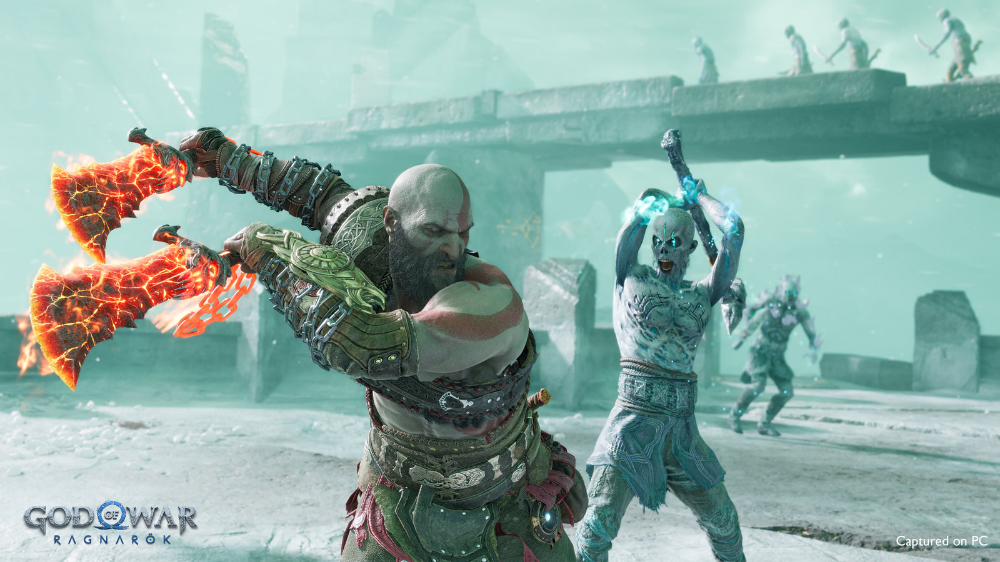

+++
title = "God of War Ragnarök, Concord : PlayStation met le paquet sur le PC"
date = 2024-05-30T23:00:00+01:00
draft = false
author = "Mickael"
tags = ["Actu"]
image = "https://nostick.fr/articles/2024/mai/3105-sony-paquet-pc/astro.jpg"
+++

 

Sony a a inauguré cette nuit la salve estivale de jeux vidéo qui va se poursuivre avec le Summer Game Fest (à partir du 7 juin), le Showcase Xbox (le 9 juin), Ubisoft Forward (10 juin) et une myriade d'autres événements — dont le Direct de Nintendo officiellement prévu pour le mois de juin — qui ne manqueront pas de faire tourner les têtes des joueurs avides de nouveautés. 

Ce State of Play avait pas mal de jeux intéressants, non seulement pour la PS5 mais aussi… pour le PC, puisque PlayStation investit de plus en plus la plateforme et personne ne s'en plaindra. Parmi les grosses nouveautés de l'événement se trouvait d'ailleurs l'annonce officielle de *God of War Ragnarök* qui, après avoir tout défoncé sur PS5, va [débouler sur PC](https://www.youtube.com/watch?v=4mVaKztSoJM) le 19 septembre.

 

Le jeu comprendra le DLC *Valhalla*, un excellent mode roguelite, ainsi que le support des principaux systèmes d'upscaling (DLSS 3.7, FSR 3.1 et XESS 1.3), sans oublier la prise en charge des moniteurs ultrawide.

Toujours au chapitre du PC, Sony a fini par lever le voile sur *Concord*, un gros jeu service dont l'ambiance évoque les *Gardiens de la Galaxie*. Le jeu est un FPS 5v5 dans lequel les joueurs incarnent des mercenaires, les Freegunners (16 persos disponibles). Sony donnera davantage d'infos la semaine prochaine, mais d'ores et déjà on nous promet des cinématiques inédites chaque semaine pour faire connaissance avec les différents membres de l'équipe.

 

*Concord* est un gros pari pour Sony, qui espère refaire le (gros) coup de *Helldivers II*. Les précommandes du jeu débuteront le 6 juin (elles ouvriront une période de bêta test), tandis qu'il sera lâché dans la nature le 23 août, sur PS5, Steam et l'Epic Games Store.

 

Capcom a profité de l'occasion pour montrer un peu plus de *Monster Hunter Wilds*, qui sortira sur PS5 donc, mais aussi sur Xbox Series S/X et PC (Steam). Cet énième opus de la franchise a plutôt bonne allure et le trailer se paie quelques séquences de gameplay intense contre les grosses bébêtes. Sortie prévue en 2025.

Le rayon des jeux d'horreur était bien chargé, avec deux remakes au rendez-vous : *Until Dawn*, qui sortira cet automne sur PS5 et PC avec sa nouvelle livrée Unreal Engine 5, [et *Silent Hill 2*](https://www.youtube.com/watch?v=sU3pyYi5hz0), prévu pour le 8 octobre sur PS5 et PC.

Mais bien sûr, il y a quand même eu quelques jeux exclusifs pour PS5 à commencer par *Astro Bot* qui a enfin droit à une « vraie » aventure rien qu'à lui. Le jeu de plateformes 3D, bourré de références à l'histoire de PlayStation, s'annonce très fun avec ses 50 (!) environnements. Les précos commencent le 7 juin, et le jeu sera dispo le 6 septembre.

 

Un dernier mot concernant le pauvre PSVR2 que Sony se refuse à enterrer définitivement. Les utilisateurs du casque VR seront ravis de le dépoussiérer à Noël pour se payer une petite séquence de frissons avec *Alien : Rogue Incursion*. Le jeu au scénario original — il se déroule sur la planète Purdan — est développé avec l'Unreal Engine 5. Et bien sûr, faites gaffe où vous mettrez les pieds…