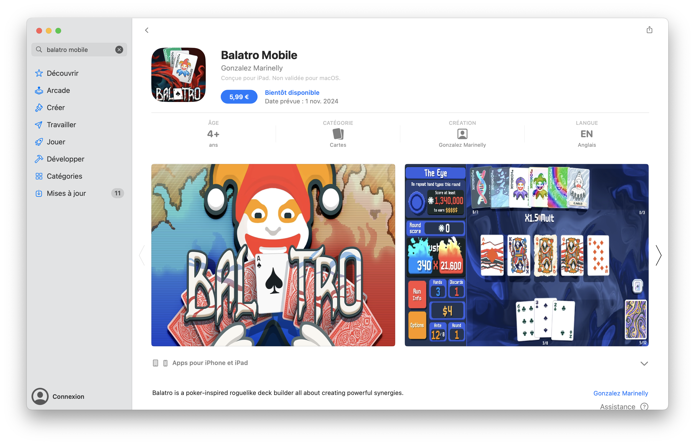

+++
title = "Non, Balatro n’est pas disponible sur l’App Store"
date = 2024-05-31T17:30:00+01:00
draft = false
author = "Félix"
tags = ["Actu"]
image = "https://nostick.fr/articles/2024/mai/3105-non-balatro-nest-pas-sur-mobile/balatrop.png"
+++

 

Vous n’avez pas pu échapper à la vague *Balatro* qui a fait plonger la productivité de bon nombre d’entreprises [en début d’année](https://nostick.fr/articles/2024/mars/balatro/). L’effet de mode est un peu retombé, mais les fans restent nombreux à attendre une version mobile pour se faire un fix tranquillou dans le métro ou à la pause midi. Si une déclinaison iOS/Android de Balatro est bien dans les cartons, elle n’est pas encore en ligne et plusieurs fausses pages sont actuellement trouvables sur les boutiques d’apps. 

« Balatro Mobile » par exemple, que vous pouvez voir sur la capture d’écran au début de cet article, est une arnaque : Localthunk, le développeur du jeu original, a confirmé la contrefaçon sur [Reddit](https://www.reddit.com/r/balatro/comments/1czh5dg/happy_to_see_that_balatro_has_an_official_store/). Un coup d’œil attentif à la page du projet montre plusieurs incohérences, comme le nom du développeur (Gonzalez Marine-qui ?) ou encore la description du jeu qui se limite à une bête phrase. Apple ne se presse pas pour faire le ménage étant donné que l’arnaque a été signalée il y a déjà une semaine… et qu’elle est toujours en ligne à l’heure où j’écris ces lignes. 

Le développeur de Balatro a bien [confirmé](https://toucharcade.com/2024/03/18/balatro-interview-mobile-port-localthunk-dlc-plans-updates-new-jokers-demo-feedback/) qu’une version mobile était dans les tuyaux, sans pour autant s’avancer sur une date de sortie. Le jeu devrait être disponible sur iOS et Android et offrirait une expérience semblable à ce que l’on connait sur PC. D’autres arnaques ont été aperçues sur les boutiques mobiles depuis le mois de mars, mais aucune n’est vraie : on vous préviendra s’il y a du neuf.

