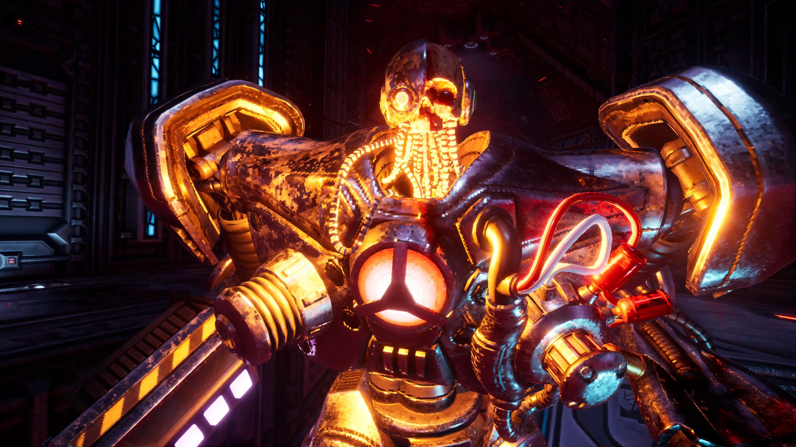

+++
title = "System Shock va se défouler sur les consoles"
date = 2024-03-12T21:00:32+01:00
draft = false
author = "Mickael"
tags = ["Trailer"]
image = "https://nostick.fr/articles/2024/mars/1203_systemshock/SystemShock.jpg"
+++ 

Le remake de *System Shock* n'a pas eu de bol. Lancé sur PC en mai dernier, le titre développé par le studio Nightdive et édité par Prime Matter est sorti durant une période très chargée[^1] d'une année historique pour les jeux vidéo. Malgré sa grande classe, le FPS n'a pas vraiment su trouver sa place.

Le jeu se donne une deuxième chance avec la version pour consoles (PS4, PS5, Xbox One et Series X/S) qui sera disponible le [21 mai](https://presse.plaion.com/ALL-SYSTEMS-ACTIVE). Évidemment, par rapport à l'original de 1994, tout a été revu du sol au plafond, à commencer par des graphismes modernisés bien sûr. 

La version pour consoles apportera la 4K à 60 i/s sur les consoles de la génération actuelle, une nouvelle fin suite à la confrontation avec le vilain Shodan, une héroïne en plus du héros, et des contrôles revus et améliorés. Le jeu PC coûte une quarantaine de dollars, alors on croise les doigts pour que ce soit l'équivalent sur les consoles.

 

Ce remake de *System Shock* revisite un classique du jeu de tir un peu oublié, mais qui a marqué des générations entières de FPS par la suite avec ses petits bouts de RPG et son histoire immersive. Les consoleux ne voudront pas rater ça !

[^1]: Entre mai et juin 2023, les joueurs ont eu droit à *Hogwarts Legacy*, *Tears of the Kingdom*, *Street Fighter 6*, *Diablo IV*, *Final Fantasy XVI*, et *Gollum* (non je rigole).

