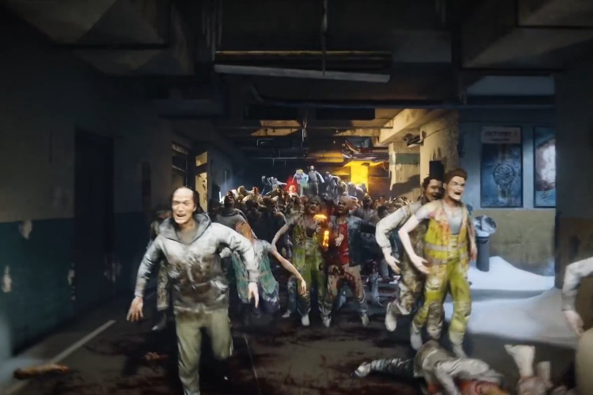

+++
title = "Saber s'évade de la prison Embracer"
date = 2024-03-14T16:47:32+01:00
draft = false
author = "Mickael"
tags = ["Actu"]
+++ 

Les bonnes nouvelles ne sont pas si nombreuses actuellement dans l'industrie du jeu vidéo, alors autant se réjouir de celles qui tombent. Saber Interactive, qui donne aussi bien dans les productions originales (*World War Z*, *Metro*) que dans les remasters (*Crysis*) et les coups de main (à 343 Industries pour *Halo*, notamment), a racheté son indépendance !

Saber a fait partie de la vague — ou plutôt de la boulimie — d'acquisitions du groupe Embracer, en 2020, qui a signé un chèque d'un demi-milliard de dollars pour remporter la timbale. Parti fleur au fusil avec une ambition monstre, Embracer s'est violemment ramassé la tronche sur le gravier de la dure réalité deux ans plus tard, après qu'un fonds d'investissement saoudien a soudainement coupé les vivres. En juin 2023, Embracer [annonçait](https://www.gamesindustry.biz/embracer-announces-restructuring-program-studio-closures-expected) un plan de restructuration.

Ce sont les employés des nombreux studios (plus de 130 !) rachetés par Embracer qui ont salement trinqué, avec près de 1 400 licenciements et des fermetures : Volition Games, les développeurs de la franchise *Saints Row* et Campfire Cabal (les jeux *Expeditions*) ont mis la clé sous la porte. D'autres studios ont plus de chance, ils ont pu s'extirper de la nasse : ça devrait être le cas de Gearbox Entertainment à qui l'on doit *Bordelands*, et donc de Saber Interactive dans une opération [confirmée](https://embracer.com/releases/embracer-group-ceases-all-operations-in-russia-through-the-divestment-of-selected-assets-from-the-operative-group-saber-interactive/) aujourd'hui.

Dans le détail, la transaction a été menée par Beacon Interactive, une structure détenue par Matthew Karch, cofondateur de l'entreprise, qui a mis 247 millions de dollars sur la table. Elle va conserver plusieurs studios qui travaillaient déjà sous sa bannière, dont 3D Realms et Nimble Giant (*Star Trek: Infinite*).

Beacon Interactive a aussi fait une [proposition](https://twitter.com/jasonschreier/status/1768212177888948349) pour reprendre 4A Games (*Metro*) ou encore Zen Studios (spécialiste des flippers), ce qui fera gonfler la facture finale autour des 500 millions de dollars. Point important : Saber repart avec sa propriété intellectuelle sous le bras. La bonne nouvelle, c'est que le remake de *Star Wars: KOTOR* est toujours dans les tuyaux.

Dans cette vente par appartement, Embracer arrache d'anciens studios Saber, comme Aspyr qui sort tout juste des remasters de *Tomb Raider* et de *Star Wars: Battlefront Classic*, Tripwire ou encore Demiurge (*Sega Heroes*). En tout, Beacon comptera 2 950 salariés, Embracer en conservera 800 sur un total d'un peu plus de 14 000.