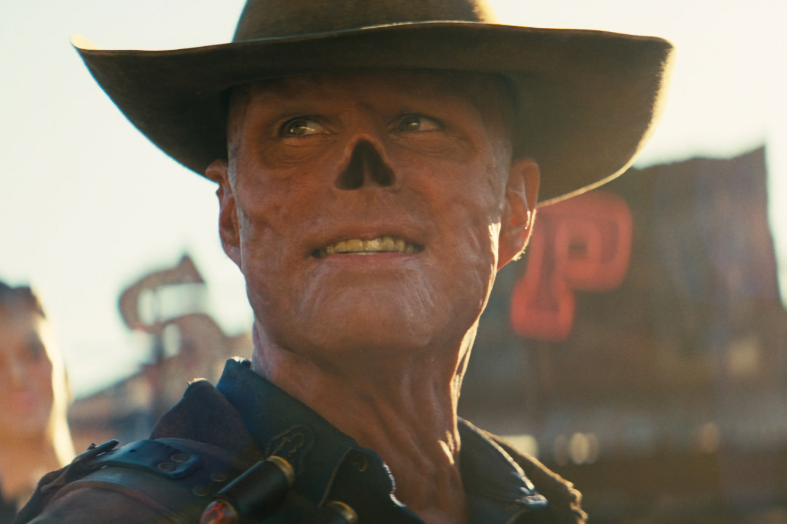

+++
title = "Dans la fureur du petit monde du jeu vidéo (16/03)"
date = 2024-03-16T12:12:32+00:00
draft = false
author = "Mickael"
tags = ["Actu"]
+++

L'actualité du jeu vidéo ne s'arrête pas aux quelques articles sporadiques publiés sur *Nostick* ! Histoire de rattraper le retard accumulé, voici un retour rapide sur quelques unes des grosses (ou insignifiantes) infos de la semaine.

## Sony n'a pas voulu du Spiderverse

Sony a décidément du mal avec sa stratégie du jeu service. Après  la version multi de *The Last of Us*, en développement depuis des années et finalement abandonnée, on a appris à la fois l'existence et la mort de *Spider-Man: The Great Web*. Une bande annonce non finalisée de cette adaptation multijoueur de la saga d'Insomniac exclusive à la PlayStation a fuité cette semaine. 5 joueurs y combattent les méchants de Spidey dans une sorte de ~~multivers~~ Spiderverse.

 

Dans les deux cas, c'est la déception pour les fans respectifs de ces franchises. Sony n'a pas voulu pousser plus loin le développement de ces deux titres, qui entraient pourtant bien dans le moule du jeu service que le constructeur tient absolument à investir.

## La série Fallout ne sera pas Fallout 5

Au petit matin du 12 avril, il est fort probable que les fans de *Fallout* se planteront devant leur télé pour regarder la série Amazon tirée de la franchise de Bethesda. Mais ils ne doivent pas s'attendre à voir *Fallout 5* par procuration !

 

Todd Howard, le big boss du studio, a travaillé de près avec Amazon lors du développement de la série. Et il a fait [bien attention](https://www.denofgeek.com/tv/fallout-tv-series-todd-howard-fallout-5/) à ce que le scénario n'emprunte aucun élément au futur épisode du jeu ! Un *Fallout 5* devenu une légende urbaine (ou un vaporware), tellement cela fait longtemps qu'on l'attend. Mais visiblement, il y a de l'espoir…

## Au boulot les Pokémon

On n'a jamais assez de Pokémon dans notre vie ! Après nos nuits (avec l'app Pokémon Sleep), les petites bestioles pourraient bien envahir aussi nos journées de travail… Enfin, peut-être : la Pokémon Company a en effet [déposé](https://twitter.com/JoeMerrick/status/1767241453200171456) la marque « Pokémon Works », sans qu'on sache ce qui se cache derrière. Comme si les Pokémon n'étaient pas déjà responsables de la chute brutale de la productivité mondiale…

## L'Avengers de Sega

Si Sega a dépensé 776 millions de dollars pour racheter Rovio, ce n'est pas parce que l'éditeur aime les petits oiseaux en colère. Il a ainsi lancé un crossover entre Sonic et Angry Birds dans *Sonic Forces*, *Sonic Dash*, *Angry Birds 2*, *Angry Birds Friends* et *Angry Birds Dream Blast*.

 

Ces jeux ne vous parlent peut-être pas, il s'agit de titres mobiles dans lesquels il est d'ores et déjà possible de débloquer des héros, des niveaux, des power-ups et des défis rattachés aux deux franchises et ce, jusqu'au 21 mars. Ça fait rêver, on a tellement hâte de voir ce que Sega a prévu pour rapprocher encore plus ces univers (#non) !