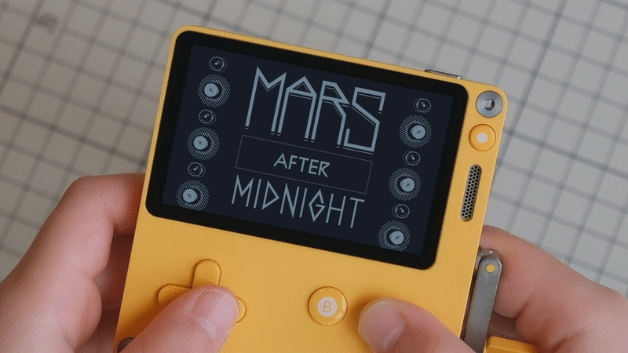
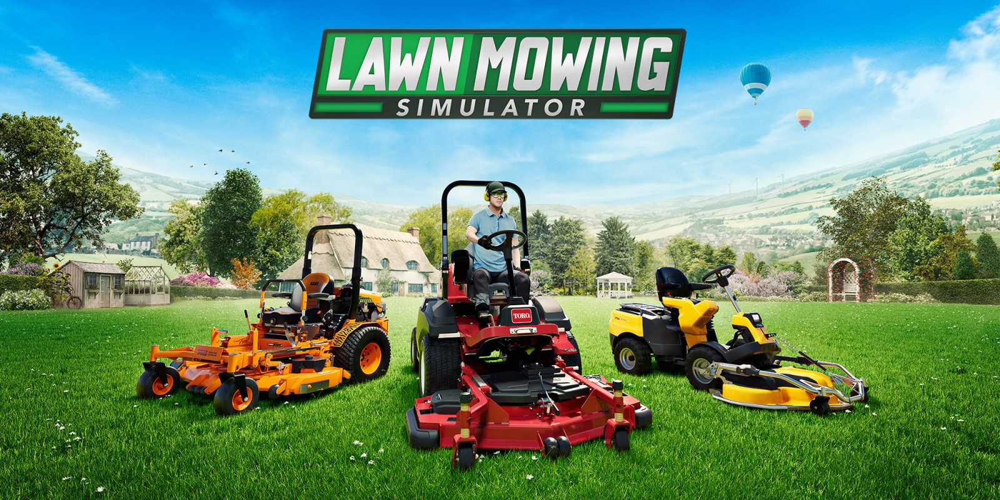

+++
title = "Les sorties de la semaine (17/03)"
date = 2024-03-17T10:47:32+01:00
draft = false
author = "Félix"
tags = ["C’est dispo"]
image = "https://nostick.fr/articles/2024/mars/1703_sortiesdelasemaine/PlayDate.jpeg"
+++

**Entre le boulot, les courses et la contre-visite la Dacia, vous n’avez peut-être pas eu le temps de vous intéresser aux nouveautés du moment. Qu’à cela ne tienne : voici les sorties de ces derniers jours qui ont retenu notre attention.**

## Mon douanier chez les martiens

Lucas Pope, développeur indépendant à qui l’ont doit les très chouettes *Papers, Please* et *Obra Dinn*, a sorti un nouveau titre baptisé *[Mars After Midnight](https://dukope.itch.io/mars-after-midnight)*. Le jeu est décrit comme « *une sorte de Papers Please, sans poste de contrôle aux frontières, sans bureau, sans paperasserie, sur Mars* ». Un concept alléchant mais qui est malheureusement une exclusivité [PlayDate](https://play.date), la petite console de Panic sortie en 2022 sur laquelle il était bien difficile de mettre la main jusqu’à présent. Si vous n’en avez pas, mais que vous lorgniez dessus, c’est le moment de foncer : il est depuis peu possible [d’en commander une](https://play.date) sans attendre des mois. Attention tout de même, car le bidule revient assez cher avec la livraison vers la France et les taxes (environ 250 €).

## Ça va couper, chérie

Si comme moi vous avez moins de 30 ans et perdu tout espoir de devenir un jour propriétaire d’une maison avec jardin, vous serez ravi d’apprendre la sortie de *Lawn Mowing Simulator* [sur Switch](https://www.nintendo.fr/Jeux/Jeux-a-telecharger-sur-Nintendo-Switch/Lawn-Mowing-Simulator-2501923.html) (19,99 €). Comme son nom l’indique, le jeu se concentre sur l’art ancestral de la tonte de gazon en vous laissant prendre le volant et même acheter de nouvelles machines (avec les vraies licences !!). Un volet gestion est présent, et il faudra embaucher des employés tout en gardant un œil sur les finances de la boite. La tonte peut devenir assez technique vu qu’il est nécessaire d’étudier l’état du sol ou la charge sur le moteur, mais un mode « *tonte rapide* » a heureusement été ajouté pour les feignasses qui ne veulent pas prendre 5 minutes à calibrer leurs lames. Pas le jeu de l’année, mais cela vaut sans doute le coup d’œil pour les dégénérés ayant plus de 500 heures sur *[PowerWash Simulator](https://store.steampowered.com/app/1290000/PowerWash_Simulator/)* et autres *[Viscera Cleanup](https://store.steampowered.com/app/246900/Viscera_Cleanup_Detail/)*. Le titre est aussi disponible [pour 6 balles sur Steam](https://store.steampowered.com/app/1480560/Lawn_Mowing_Simulator/) à l’occasion des soldes de printemps.

## piou piou oh non Luke attention un x-wing piou

Je n’ai jamais été un grand fan de Star Wars, mais Aspyr a tout de même réussi à attirer mon attention en lançant cette semaine *STAR WARS: Battlefront Classic Collection*, un remaster de deux sympathiques jeux de tirs sortis en 2004 et 2005 que j’avais bien apprécié à l’époque. Bon, l’intérêt de ce bundle [vendu 35 €](https://store.steampowered.com/app/2446550/STAR_WARS_Battlefront_Classic_Collection/) était déjà discutable sur PC étant donné que les deux jeux d’origine sont déjà dispos sur Steam, mais les potentiels intéressés seront sans doute découragés par les premiers retours : la partie technique est aux fraises et cette révision casse la prise en charge des mods. L’éditeur a rapidement dégainé [un communiqué d’excuse](https://support.aspyr.com/hc/en-us/articles/25019494892429-An-update-on-the-STAR-WARS-Battlefront-Classic-Collection) qui n’a pas empêché les clients mécontents de plomber la note Steam avec des critiques « *plutôt négatives* » à l’heure où j’écris ces lignes. Cette nouvelle sortie a l’avantage d’apporter les titres sur PlayStation, Xbox et Switch, mais il va visiblement falloir attendre un patch. Si vous êtes sur PC, vous aurez sans doute mieux fait de vous tourner vers les versions originales de *[Battlefront 1](https://store.steampowered.com/app/1058020/STAR_WARS_Battlefront_Classic_2004/)* et [2](https://store.steampowered.com/app/6060/STAR_WARS_Battlefront_II_Classic_2005/), facturées 9,75 € unité et qui valent toujours le détour si le mélange *Battlefield/Star Wars* vous intrigue.

## Un peu de culture

Je vous connais : vous êtes du genre à affirmer « *adorer les documentaires d’Arte* » en soirée, mais dès qu’on vous colle devant, vous ne tenez pas 10 minutes avant de cliquer sur la première vidéo de Squeezie venue. Eh bien pourquoi ne pas essayer les reportages à jouer, le bien étrange concept de *The Jeff Minter Story*. Celui-ci vous invite à découvrir l’histoire de ce développeur légendaire sévissant depuis plus de 40 ans sur des machines allant de la ZX Spectrum à l’Atari ST. Une grosse quarantaine de jeux sont disponibles aux côtés d’extraits vidéos et autres morceaux d’interviews. 29 € [sur Steam](https://store.steampowered.com/app/2236680/Llamasoft_The_Jeff_Minter_Story/), également dispo sur consoles et Switch.

 