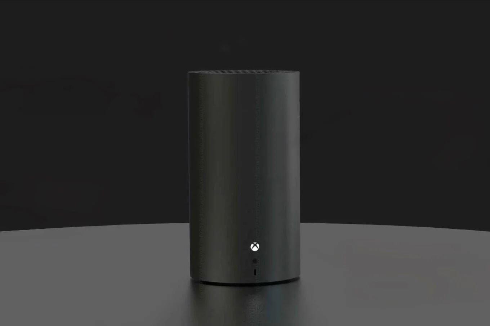
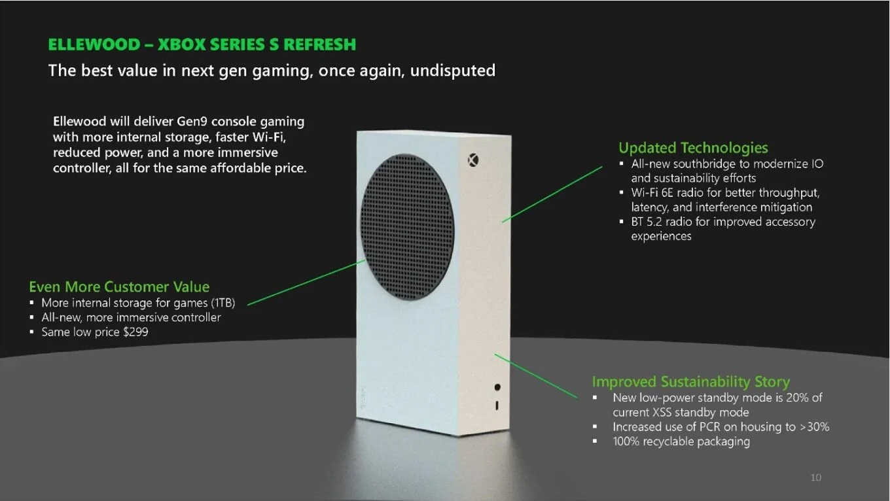
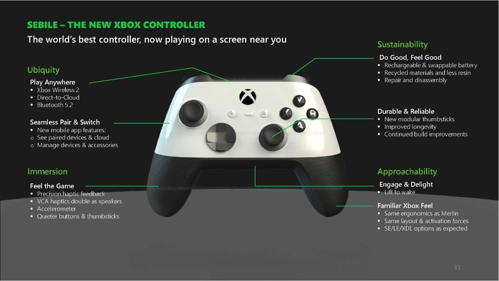

+++
title = "Le grand chamboule-tout des consoles"
date = 2024-03-18T12:12:12+00:00
draft = false
author = "Mickael"
tags = ["XXL"]
+++
")

**Dans un an tout pile, le paysage de la console sera probablement très différent de celui d’aujourd’hui. Les constructeurs s’apprêtent tous à renouveler leur offre matérielle : Nintendo bien sûr, vu que la Switch va sur sa 8e année (!), mais aussi Sony et Microsoft qui se préparent au tsunami *GTA 6*. Petite tour d'horizon de détails.**

## Switch 2 : Nintendo se hâte lentement

En mars 2017, au lancement de la Switch première du nom, le processeur de la console hybride avait déjà un train de retard : le Tegra X1 de Nvidia remonte en effet à 2015. Autant dire que 7 ans plus tard, et malgré une révision à la marge pour le modèle OLED (qui a surtout servi de patch anti-hack), la Switch est complètement dépassée !

Malgré tout, les magiciens de Nintendo parviennent à faire cracher ses poumons à la petite console, avec des jeux graphiquement impressionnants (les deux *Zelda* open world, le remaster de *Metroid Prime*, *Super Mario Bros Wonder*…), ce qui n’est plus le cas des éditeurs tiers. Les catastrophes visuelles que sont les portages de jeux exigeants, comme *Doom Eternal* ou *Mortal Kombat 1* en témoignent.

Au fil des ans, la Switch a vraiment muté en console pour jouer aux jeux Nintendo : pour les autres jeux, mieux vaut une console de salon, un PC, voire un Steam Deck. S’il ne fait aucun doute que Nintendo a développé une Switch 2 pour les besoins de ses équipes de développement, le gain de puissance s’annonce suffisant pour satisfaire aussi les développeurs tiers.

Cette nouvelle console devrait en effet produire une puissance similaire à une PS4 ou à une Xbox One grâce à une [puce T239 ](https://www.eurogamer.net/digitalfoundry-2023-inside-nvidias-latest-hardware-for-nintendo-what-is-the-t239-processor)de Nvidia. Ajoutez à cela un stockage eMMC plus rapide que la mémoire flash actuelle, et cette Switch 2 devrait se montrer tout aussi capable que le Steam Deck. 

L’écran pourrait être un poil plus grand, avec une diagonale attendue de 8 pouces (contre 7 pouces sur l’OLED), ce que tous les presbytes apprécieront. En revanche, Nintendo aurait fait le choix du LCD plutôt que l’OLED pour cette première version. Oui, c’est pourri mais que voulez vous, il faut bien limiter l’inflation sur la facture de composants même si à ce rythme il n’y aura plus guère que Nintendo à utiliser des dalles LCD…

")

On peut par contre croiser les doigts pour une résolution de 1080p, au lieu du 720p actuel — quand la console y parvient —, et même à de la 4K sur un téléviseur. Nintendo ferait un grand usage de la technologie d’upscale DLSS qui troque la puissance brute contre l’intelligence artificielle pour améliorer la qualité visuelle sans trop taper dans les ressources CPU/GPU et la batterie.

La question de la rétro-compatibilité est sur toutes les lèvres : les catalogues de jeux des quelque 120 millions de joueurs Switch pourront-ils trouver une place sur la future console ? On serait tenté d’y croire et tout laisse penser que ce sera bien le cas, mais Nintendo a déjà fait des choses plus bizarres par le passé.

Quant à la sortie de la console, beaucoup espéraient un lancement dès la fin de l’année, mais des rumeurs récentes et crédibles ont plutôt [parié](https://www.nikkei.com/article/DGXZQOUF196OV0Z10C24A2000000/) sur mars 2025, à la toute fin de l’exercice fiscal de l’entreprise. Du côté du verre à moitié plein, Nintendo aura tout le temps nécessaire pour peaufiner son line-up de lancement et faire le plein de consoles dans ses entrepôts pour couper l'herbe sous le pied des scalpers.

## Le casse-tête des consoliers

Les consoles de salon lancées fin 2020 donnent l’impression de ne pas avoir donné tout leur jus — combien de jeux tirent réellement profit de leur puissance ? C’est pourquoi il peut paraitre étonnant de voir Sony et Microsoft préparer dès à présent le lancement des versions « Pro » des PlayStation 5 et Xbox Séries S/X.

C’est pourtant le sort qui nous attend. D’abord parce que le marché de la console de salon stagne : malgré leurs efforts (en particulier les promos désormais régulières), le nombre de joueurs sur consoles — et donc la clientèle – n'évolue guère. La croissance des ventes devrait [tourner](https://www.statista.com/outlook/cmo/consumer-electronics/gaming-equipment/game-consoles/worldwide) autour de 2 % dans les prochaines années, ce qui veut dire que les consoliers vendent leurs appareils aux mêmes clients qui n’ont pas forcément tous besoin de plusieurs PS5 à la maison.

Et puisqu’il est vraiment trop tôt pour une nouvelle génération, la seule solution est de proposer aux joueurs une déclinaison « pro », autrement dit plus puissante des modèles actuels. Une stratégie qui a porté ses fruits avec les précédentes consoles… mais est-ce qu’il en ira de même avec cette génération ?

Du côté de Sony, on semble ne pas se faire trop d’illusion. Les dernières prévisions du constructeur ont été revues à la baisse pour les ventes de consoles cette année : 21 millions d’unités, soit 4 millions de moins qu’espéré — manifestement, une PS5 Pro ne ferait rien à l’affaire. Et pourtant, il faut bien relancer la machine : Naomi Matsuoka, vice-présidente de Sony, a ainsi [annoncé](https://www.bloomberg.com/news/articles/2024-02-14/sony-lowers-sales-outlook-after-underwhelming-ps5-sales) que le modèle actuel était entré dans « *la dernière phase de son cycle de vie* ».

Il y a pourtant matière à espérer. *GTA 6* sera la meilleure vitrine pour les consoles « pro » : le monstre de Rockstar, qui sortira uniquement sur consoles dans un premier temps, devrait redonner un souffle considérable à toute l’industrie. Et nul doute que le jeu donnera la pleine mesure de ses talents sur les consoles les plus puissantes.

 

Et puis le lancement de ces nouvelles consoles permettra d’éclipser encore davantage les générations précédentes. Il se trouve encore des millions de joueurs équipés de PS4 et de Xbox One, qui profitent toujours d’une grande partie des nouveautés. Les jeux réellement exclusifs à la génération actuelle sont finalement peu nombreux, alors à quoi bon investir ?

Les PS5 Pro et Xbox Series Pro pousseront peut-être ces joueurs à renouveler leur matériel de salon, tandis que les éditeurs finiront par embrasser les possibilités des nouvelles consoles en abandonnant finalement les précédents modèles. C’est probablement le calcul que font Microsoft et Sony. Et puisqu’on en parle…

## Le speed bump de la PS5

La véritable bascule technologique entre les 8e et 9e génération de consoles de salon repose bien davantage sur leur stockage SSD NVMe ultra-rapide que sur les capacités de leur processeur ou de leur circuit graphique. Les débits sont autrement plus rapides, les temps de chargement sont quasiment réduits à néant.

C’est pourquoi il ne faut pas s’attendre à un changement drastique entre la PS5 et la PS5 Pro. Les dernières [rumeurs](https://insider-gaming.com/playstation-5-pro-more-specs/) font ainsi état d’un gain de 30 % environ pour la bande passante de la mémoire. Le CPU serait le même, à savoir un AMD RDNA 2 dont la fréquence serait légèrement supérieure de 10 %.

En somme, pas de quoi fouetter un chat : on est en face d’un *speed bump* tout ce qu’il y a de plus classique. Quant au circuit graphique, les dernières indiscrétions évoquent un gain plus intéressant pour le rendu (+45 %) avec des capacités de ray-tracing allant de x2 à x4 ; Sony ajouterait une nouvelle moulinette pour l’upscale PSSR (PlayStation Spectral Super Resolution Upscaling, ça claque) avec le support futur de la 8K !

Pour le reste, la PS5 Pro devrait conserver le système de lecteur optique optionnel déjà vu sur la PS5 Slim, ainsi qu’1 To de stockage. Ce qui laisse espérer un prix aussi contenu que possible…

## Le chemin de traverse de Xbox

Sarah Bond sait comment faire monter la sauce. Lors du « business update event » [organisé](https://news.xbox.com/en-us/2024/02/15/xbox-promise-bring-more-games-to-more-players/) un peu en catastrophe mi-février pour rassurer la communauté des fans sur l’avenir de la plateforme, la présidente de Xbox a fait miroiter une prochaine génération qui offrira tout simplement « *le saut technique le plus important sur une génération matérielle* ». 

Alors évidemment, les mauvaises langues diront que chaque génération représente un « saut technique » important. Mais cette déclaration a au moins eu le mérite de redonner confiance à une « team green » ne sachant plus à quel saint se vouer. 

Sarah Bond a également annoncé que des nouveautés matérielles étaient dans les tuyaux pour Noël. Une nouvelle manette Xbox, reprenant — peut-être ! – la bonne idée des gâchettes haptiques de la DualSense semble sur les bons rails. La rumeur est plus vague concernant un modèle Pro pour la Xbox de cette génération ; une Series S plus costaude et une Series X cylindrique pourraient être annoncées, comme l’ont [révélé](https://www.documentcloud.org/documents/23980673-microsoft-v-ftc) des documents en fuite l’an dernier à l’occasion d’un procès.

, le Wi-Fi 6E, une puce plus fine, mais plus de lecteur optique qui serait proposé en option.")

Plutôt qu’à une console de salon, Microsoft [pourrait](https://www.theverge.com/2024/2/15/24073723/microsoft-xbox-next-gen-hardware-phil-spencer-handheld) s’intéresser davantage au marché des consoles portables. Le Steam Deck de Valve est passé par là, suivi par le ROG Ally, le Legion Go et d’autres qui ont ce défaut de fonctionner sous Windows. Un système d’exploitation peu adapté aux petits écrans… 

Microsoft a toutes les cartes en main pour développer une console parfaitement optimisée pour le Game Pass — et avec un peu de chance, il devrait être assez facile d’y installer des jeux provenant de boutiques rivales. Le futur de la Xbox se passera-t-il du salon ?

 