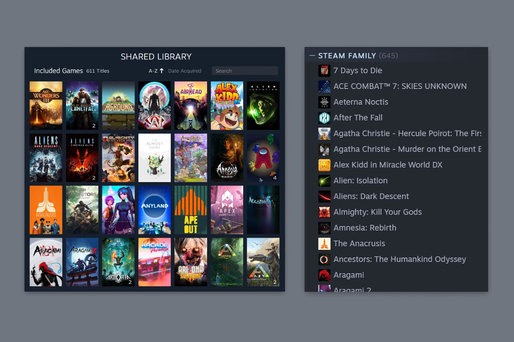

+++
title = "Steam a enfin l’esprit de famille"
date = 2024-03-19T9:12:12+00:00
draft = false
author = "Mickael"
tags = ["Actu"]
+++

Steam a finalement mis en place un système moderne et pas trop frustrant pour partager les jeux de sa bibliothèque avec toute la famille ! Il était plus que temps, les deux mécanismes existants — mode Famille et le partage familial — se révélant à chaque fois mal fichus et contraignants.

Avec les « familles Steam », ce sont jusqu’à 6 personnes d’un même foyer qui pourront verser leur bibliothèque Steam dans un pot commun. Tous les jeux doivent être partagés (à l’exception de ceux dont les développeurs auront décidé de ne pas activer le partage familial, suivez mon regard 🍑). Un nouveau jeu acheté par un membre sera disponible pour tous.

Il y a deux gros changements par rapport au partage familial : d’une part, tout le monde peut accéder aux jeux de la bibliothèque commune et y jouer *en même temps*. Et d’autre part, il n’est plus nécessaire d’être connecté à internet : les jeux sont disponibles hors connexion.

Il faut en revanche savoir qu’il n’est pas possible à deux personnes de la famille de jouer au même jeu simultanément : pour que chacun des membres de la famille puisse s’offrir une partie de *Baldur’s Gate 3* par exemple, il faudra autant de copies du jeu. En revanche, rien n’empêche un joueur d’explorer Faerûn, tandis que les autres joueront à d’autres jeux.

Il est possible de demander à jouer à la copie spécifique d’un jeu d’un membre de la famille (intéressant si ce dernier a acheté un DLC). Les sauvegardes et la progression étant dépendantes du jeu en lui-même, il n’est pas inutile de bien choisir la copie du titre désiré. En revanche, les succès sont sauvegardés dans les comptes Steam individuels.

Ce nouveau système intègre également des outils de contrôle parental pour autoriser l’accès aux jeux appropriés, définir des limites de temps de jeu ou restreindre l’accès à la boutique.Les enfants peuvent également demander aux adultes d’approuver l’achat d’un jeu.

La fonction de famille Steam étant plus complexe qu’il y paraît au premier abord, jetez donc un œil à la [FAQ](https://help.steampowered.com/fr/faqs/view/054C-3167-DD7F-49D4), en français et complète sur le sujet. À l’heure actuelle, pour en profiter, il faut installer la version bêta de Steam et suivre le [mode d’emploi](https://store.steampowered.com/news/app/593110/view/4149575031735702628).