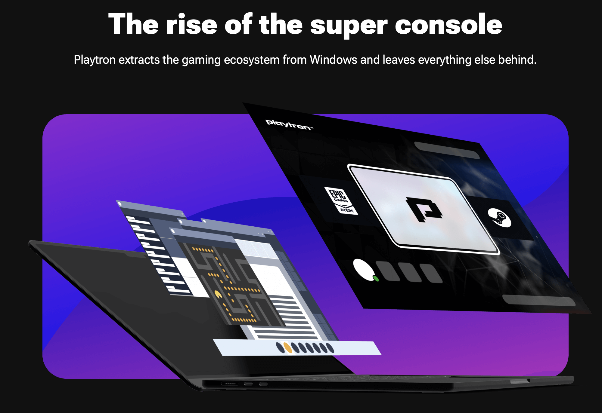

+++
title = "Playtron fait monter la sauce autour de son alternative à SteamOS"
date = 2024-03-20T18:47:32+01:00
draft = false
author = "Félix"
tags = ["Actu"]
image = "https://nostick.fr/articles/2024/mars/2003-playtron/mockup.jpeg"
+++ 

Las de votre vieillissante Switch, vous avez peut-être craqué pour une ROG Ally, une Lenovo Legion Go ou tout autre de ces PC-hybrides qui ont envahi le marché depuis la sortie du Steam Deck. Et comme moi vous ruminez sans doute lorsque la bécane affiche l’interface de Windows, son bouton Copilot et ses avertissements sur les embouteillages du quartier. Les choses pourraient changer d’ici quelques années grâce à un nouveau venu : [PlaytronOS](https://www.playtron.one), qui se présente comme une alternative à SteamOS complètement dé-Valvisée.

L’idée est séduisante et promet d’allier le meilleur des deux mondes, mêlant la légèreté d’un système sous Linux à la possibilité d’installer des jeux Windows provenant de n’importe launcher. *[The Verge](https://www.theverge.com/24090470/playtron-gaming-os-linux-handhelds-exclusive)* a pu voir tourner le bazar et explique qu’il s’agit pour le moment d’une alpha brute de décoffrage. Le journaliste a pu passer quelques heures sur *Death Stranding*, *Dave the diver* ou *Balatro* sans soucis, bien qu’il regrette que tous les jeux de sa bibliothèque ne soient pas compatibles. Si le site officiel de PlaytronOS n’explique pas comment le système peut faire tourner des jeux Windows, on peut imaginer qu’il s’agit d’une couche de compatibilité similaire au [Proton](https://fr.wikipedia.org/wiki/Proton_(logiciel)) de Valve.

Contrairement à un projet comme [ChimeraOS](https://chimeraos.org), PlaytronOS ne sera pas gratuit. Ses développeurs comptent se démarquer par des tarifs abordables, facturant environ 10 $ la licence aux fabricants là ou Microsoft demande plutôt 80 $. La solution a plusieurs avantages selon le patron de la boîte, qui affirme par exemple que les logiciels anti-triche pourraient être mieux pris en charge que sur SteamOS. Playtron n’a pas encore décidé à quel point le code sera open source, et aucun bureau Linux ne sera proposé. Si la partie technique tient la route, ça sera toujours mieux que l’usine à gaz Windows 11 qui arrive livrée avec Teams et Office. Reste à voir si le projet ne se fera pas couper l’herbe sous le pied par Valve, qui travaille depuis peu avec les fabricants pour les laisser construire des machines basées sur son système d’exploitation.

Quelques signaux incitent à la méfiance sur ce projet : le CEO de la boîte est celui qui a plombé la ROM Android [CyanogenMod](https://fr.wikipedia.org/wiki/CyanogenMod), et il nous promet une prise en charge des PC standards et ARM mais aussi des casques XR ou encore des TV connectées « *dans quelques années* ». De belles promesses qui restent bien évasives sur les détails, le site ressemblant pour l'instant à un appât à investisseurs/fabricants. En l’état, Playtron a levé 10 millions de dollars de fonds et compte 18 employés. Une alpha publique devrait arriver dans les semaines qui viennent, et le chinois [Ayaneo](https://www.ayaneo.com) envisage de commercialiser sa première console sous PlaytronOS d’ici la fin de l’année. On garde un œil dessus.
