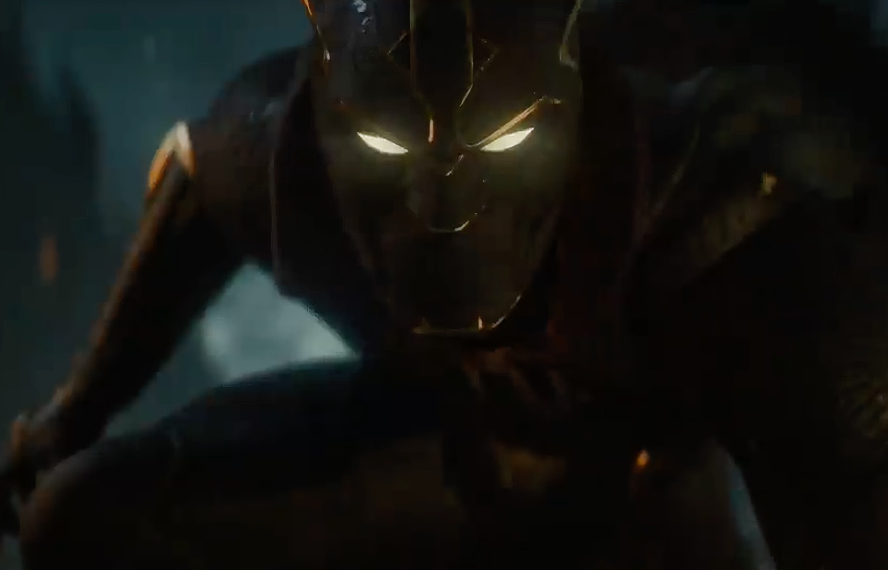

+++
title = "Cap’ et Black Panther vont tabasser des nazis à Paris dans 1943: Rise of Hydra"
date = 2024-03-21T08:29:12+00:00
draft = false
author = "Mickael"
tags = ["Trailer"]
image = "https://nostick.fr/articles/2024/mars/2103_1943riseofhydra/1943.jpg"
+++
 

En 1943, dans Paris occupé par les troupes de Hydra, des héros résistent encore et toujours. Et même des super-héros, puisque Captain America et Black Panther, accompagnés de Gabriel Jones (un soldat US) et Nanali, un espion wakandais, vont tenter de rendre la monnaie de leur pièce aux nazis de Marvel.

C’est le pitch, plutôt excitant, de *1943: Rise of Hydra*, le nouveau jeu supervisé par Amy Hennig, que l’on connait bien pour la saga *Uncharted*. Pas de Nathan Drake ici mais des superslips de l’écurie Marvel que le joueur pourra prendre en main les uns après les autres. Le studio de Hennig est financé par Skydance Media, dont ce sera la première grande production avant un jeu Star Wars prévu dans quelques années. 

 

Le trailer ne révèle pas grand chose du gameplay, en revanche il assure côté spectacle grâce à l’utilisation de la dernière version (5.4) du moteur Unreal. Le résultat, au niveau des visages en particulier, est assez épatant. Espérons que le jeu final sera au même niveau que ces cinématiques. La grosse machine marketing est en train de chauffer, puisque le titre est prévu pour l’année prochaine.